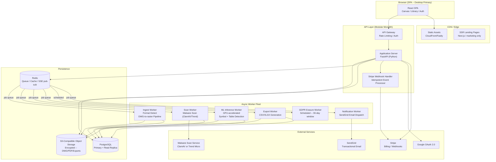
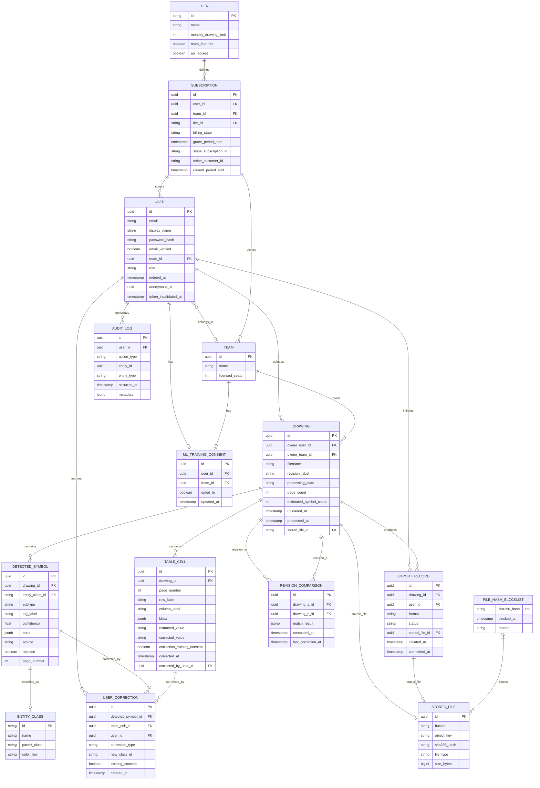

# PID Analyzer — Architecture Specification

## 1. Executive Summary

**Feasibility**: ✅ Feasible — all core capabilities rely on proven engineering patterns. The highest-risk element (ML symbol detection at ≥85% F1) is a pre-launch validation gate, not an architectural unknown.

**Recommended Pattern**: Modular Monolith with dedicated ML Worker fleet. A single deployable FastAPI backend handles all web concerns; ML inference runs in an isolated GPU worker pool communicating via a persistent job queue. This pattern minimizes operational complexity at MVP scale while allowing the ML layer to scale independently.

**Key Cost Drivers**: GPU compute for ML inference dominates at all tiers. Object storage (DWG/PDF files) grows linearly with drawings. Database and API compute are secondary costs at MVP/Growth scale.

**Complexity Drivers**:
- DWG format parsing via server-side pipeline (no client AutoCAD dependency)
- Async multi-stage processing state machine with durable queue
- GDPR erasure pipeline with anonymization-not-deletion for training data
- Pre-storage SHA-256 blocklist enforcement via client-supplied hash with server pre-check before pre-signed URL issuance
- Stripe webhook idempotency and grace period scheduling
- Canvas rendering with <200ms interaction latency on 500-symbol drawings

**Critical Success Factors**: ML accuracy validated against real customer drawings before launch; DWG rendering pipeline prototyped on 50+ files before engineering begins; persistent job queue (never in-memory); all correction consent logic enforced server-side only; blocklist check must gate pre-signed URL issuance, not post-storage scan.

---

## 2. System Architecture



**Component Responsibilities**:
- **React SPA**: Drawing library, canvas review, account/billing settings. Communicates via REST + SSE for live status updates.
- **FastAPI Application Server**: All REST endpoints, auth, subscription enforcement, file ingestion coordination, SSE stream management. Enforces blocklist gate before pre-signed URL issuance.
- **Worker Fleet (Celery on Redis)**: Each worker type is independently scalable. ML workers run on GPU instances; all others on CPU instances.
- **PostgreSQL**: All relational state — drawings, symbols, table cells, corrections, subscriptions, users, audit logs.
- **Redis**: Celery broker + result backend; SSE pub/sub for drawing status push; short-TTL caching of subscription feature flags.
- **S3-Compatible Storage**: Uploaded files, DWG raster conversion outputs, generated export files. Never served directly — pre-signed URLs only.

**Phased Rollout**:
- **Phase 1 (MVP)**: Single API instance, Celery with 3 worker types (Ingest+Scan combined, ML, Export), RDS PostgreSQL single-AZ, S3, Redis on ElastiCache. SSE via Redis pub/sub.
- **Phase 2 (Scale)**: Read replica for library queries; autoscaling ML worker pool; CDN for export file delivery; Redis Cluster; background job monitoring (Flower/Grafana).
- **Phase 3 (Enterprise)**: Multi-AZ PostgreSQL with WAL streaming; cross-region S3 replication for US region option; API rate limiting per key for FR-11 API access; dedicated ML model versioning service.

---

## 3. Technology Stack

**Client / Edge Layer**:
- Option A: React + Vite SPA — Pros: fastest canvas iteration, rich ecosystem (Konva/Fabric for canvas), SSE native; Cons: no SSR for app views (acceptable per NFR-17)
- Option B: Next.js (hybrid) — Pros: SSR for landing pages built-in; Cons: added complexity, app views don't need SSR
- **Selected: React + Vite SPA** — pure SPA is sufficient for authenticated views; Next.js deployed separately for marketing/landing pages only to satisfy NFR-17 SEO requirement. Alternative: Next.js monorepo if marketing and app are managed by the same team.

**Compute / Service Layer**:
- Option A: FastAPI (Python) + Celery — Pros: same language as ML stack, async-native, mature Celery ecosystem for durable jobs; Cons: Python GIL for CPU-bound tasks (mitigated by Celery multi-process)
- Option B: Node.js (NestJS) + BullMQ — Pros: unified JS stack with frontend; Cons: ML workers would require Python subprocess or sidecar, increasing complexity
- **Selected: FastAPI + Celery** — Python unifies the API and ML worker codebase, reducing the interface surface between services. Alternative: NestJS if the team is JS-primary and ML workers are fully containerized as a separate service.

**Persistence / State Layer**:
- Option A: PostgreSQL (RDS/Aurora) — Pros: ACID, rich JSON support for symbol payloads, mature GDPR tooling, row-level security; Cons: vertical scaling ceiling before sharding is needed
- Option B: PostgreSQL + TimescaleDB — Pros: time-series analytics for metrics; Cons: operational overhead not justified at MVP
- **Selected: PostgreSQL** — all entities have clear relational structure; JSONB for symbol bounding box payloads. Alternative: Aurora Serverless v2 if traffic is highly variable and cold-start latency is acceptable.

**Integration / Message Layer**:
- **Selected: Redis (Celery broker)** — persistent job queue with task retry, priority queues for ML vs. export jobs, TTL-based result expiry. Redis pub/sub drives SSE streams for drawing status updates.
- **Deployment**: Docker containers on ECS Fargate (API + workers); GPU ML workers on EC2 G4dn instances with Docker; S3 for object storage; CloudFront for static assets.

**Third-Party Services**:
- **Auth**: Supabase Auth or Auth0 — provides JWT RS256, Google OAuth, email verification, session management out of the box. **Selected: Supabase Auth** (self-hostable, reduces vendor lock-in, Postgres-native). Session invalidation on password reset is handled via Supabase Auth's server-side `admin.signOut(userId)` API, which revokes all active sessions for the user. A lightweight middleware hook checks a `token_invalidated_at` timestamp on the User record as a belt-and-suspenders guard for tokens issued before a reset event; this hook runs on every authenticated request and rejects tokens with an `iat` (issued-at) claim predating the invalidation timestamp. Alternative: Auth0 if managed SLA is preferred.
- **Payments**: Stripe Billing (Checkout + Customer Portal + Webhooks)
- **Email**: SendGrid (transactional — verification, password reset, invitations, payment notifications)
- **Analytics**: PostHog (self-hostable, GDPR-compliant, supports named events with properties)
- **Malware Scanning**: ClamAV (self-hosted sidecar on ingest worker) — avoids per-scan vendor cost; adequate for engineering file types. Alternative: Trend Micro File Security if enterprise compliance certification is required.
- **DWG Parsing**: ODA File Converter (server-side, licensed) for DWG-to-PDF/SVG rasterization. Fallback: LibreCAD/ezdxf for DXF export path.

---

## 4. Database & State Design



**Key Schema Changes from Prior Version**:
- `TABLE_CELL` entity added to support FR-7 table extraction and US-022 real-time cell editing. Stores extracted value, corrected value, bbox coordinates, and per-cell correction consent.
- `USER_CORRECTION` gains a nullable `table_cell_id FK` to link corrections to table cells in addition to detected symbols.
- `REVISION_COMPARISON` gains `last_correction_at` timestamp to surface staleness to the UI (see Section 12b).
- `USER` gains `token_invalidated_at` timestamp for middleware-level token rejection on password reset.
- `USER.anonymous_id` is now populated on first erasure job execution and persisted; retries read this value rather than recomputing.

**Anonymization Strategy (revised)**:
- The anonymous ID is HMAC-SHA256 of `(user_id || server_secret)` only — no timestamp component.
- On first erasure job execution, the computed anonymous ID is written to `USER.anonymous_id` before any records are updated.
- All subsequent erasure job retries (regardless of execution day) read `USER.anonymous_id` directly, ensuring cross-table consistency (FR-14 AC-3).

**Indexing Strategy**:
- `DRAWING`: composite index on `(owner_team_id, processing_state, uploaded_at DESC)` for library queries; index on `owner_user_id`; full-text GIN index on `filename + revision_label` for search.
- `DETECTED_SYMBOL`: index on `(drawing_id, rejected, entity_class_id)` for canvas load; index on `(drawing_id, page_number)` for multi-page navigation.
- `TABLE_CELL`: index on `(drawing_id, page_number)` for table panel load.
- `USER_CORRECTION`: index on `(detected_symbol_id)`; index on `(table_cell_id)`; partial index on `training_consent = true` for ML pipeline queries.
- `AUDIT_LOG`: index on `(user_id, occurred_at DESC)`; partitioned by month for 2-year retention management.
- `FILE_HASH_BLOCKLIST`: primary key on `sha256_hash` (hash lookup at upload request time — before pre-signed URL issuance).

**Schema Migration Strategy**:
- All migrations via Alembic (FastAPI/SQLAlchemy); forward-only at MVP, expand-and-contract for breaking changes post-launch.

---

## 5. API & Integration Architecture

**Style**: REST with JSON. SSE for drawing processing status push. No GraphQL at MVP — query patterns are well-defined and REST endpoints map cleanly to resource operations.

**Upload Protocol (revised for pre-storage blocklist enforcement)**:

The upload flow enforces FR-17 AC-2 (no blocked file byte reaches S3) through a mandatory hash pre-check before pre-signed URL issuance:

1. Client computes SHA-256 of the file locally before initiating upload.
2. Client calls `POST /drawings/hash-check` with `{sha256_hash, filename, size_bytes}`.
3. Server checks `FILE_HASH_BLOCKLIST`. If the hash is present, returns `409 Conflict` — no Drawing record is created, no S3 URL is issued.
4. If hash is not blocked, server creates the Drawing record in `Pending` state and returns a pre-signed S3 PUT URL via `POST /drawings`.
5. Client uploads directly to S3 using the pre-signed URL.
6. Client calls `POST /drawings/{id}/upload-complete` to signal S3 write completion and trigger processing.
7. Ingest Worker performs a server-side SHA-256 verification of the stored object against the client-supplied hash. Mismatch → Drawing transitions to `Failed` (possible corruption in transit); hash is also checked a second time against the blocklist to handle newly-added entries between steps 3 and 7.

This two-gate approach (pre-URL client-side check + post-storage server-side verification) ensures no blocked file reaches S3 in the normal path while guarding against hash race conditions and client-side hash tampering.

**Upload-Complete Idempotency**: `POST /drawings/{id}/upload-complete` is idempotent. If the Drawing record is already in `Queued` or any later processing state, the endpoint returns `200` without re-enqueuing the ingest job. This prevents duplicate Celery jobs from network retries.

**P0 Endpoint Summary**:

| Method | Path | Purpose | Request Body | Response | Auth |
|--------|------|---------|--------------|----------|------|
| POST | `/auth/register` | Register new user | `{email, password, display_name}` | `{user_id, status}` | None |
| POST | `/auth/login` | Email/password login | `{email, password}` | `{access_token, refresh_token}` | None |
| POST | `/auth/oauth/google` | Google OAuth callback | `{code}` | `{access_token, refresh_token}` | None |
| POST | `/auth/refresh` | Refresh access token | `{refresh_token}` | `{access_token}` | None |
| POST | `/auth/logout` | Invalidate session | — | `204` | JWT |
| POST | `/auth/password-reset/request` | Send reset email | `{email}` | `204` | None |
| POST | `/auth/password-reset/confirm` | Apply new password | `{token, new_password}` | `204` | None |
| POST | `/drawings/hash-check` | Blocklist check before upload; gate for pre-signed URL issuance | `{sha256_hash, filename, size_bytes}` | `{allowed: bool, drawing_id?}` | JWT |
| GET | `/drawings` | List drawing library | `?page&status&search&date_from&date_to` | `{items[], total, page}` | JWT |
| POST | `/drawings` | Create Drawing record + issue pre-signed S3 PUT URL (requires prior hash-check pass) | `{drawing_id, filename}` | `{drawing_id, upload_url}` | JWT |
| GET | `/drawings/{id}` | Drawing detail + symbol counts | — | `{drawing, symbol_counts}` | JWT |
| PATCH | `/drawings/{id}` | Update revision label | `{revision_label}` | `{drawing}` | JWT |
| DELETE | `/drawings/{id}` | Delete drawing + cascade | — | `204` | JWT |
| POST | `/drawings/{id}/retry` | Re-queue failed ML job | — | `{drawing}` | JWT |
| GET | `/drawings/{id}/status` | SSE stream for live status | — | SSE event stream | JWT |
| GET | `/drawings/{id}/symbols` | All detected symbols for canvas page, with correction history | `?page_number&limit&offset` | `{symbols[], corrections_by_symbol_id{}}` | JWT |
| PATCH | `/symbols/{id}` | Reclassify or reject symbol | `{entity_class_id?, rejected?}` | `{symbol}` | JWT |
| POST | `/drawings/{id}/symbols` | Manually add symbol | `{bbox, entity_class_id, page_number, tag_label?}` | `{symbol}` | JWT |
| POST | `/drawings/{id}/exports` | Initiate export | `{format: csv\|xlsx}` | `{export_id, status, download_url?}` | JWT |
| GET | `/exports/{id}` | Poll async export status | — | `{status, download_url?}` | JWT |
| GET | `/account` | Get account details | — | `{user}` | JWT |
| PATCH | `/account` | Update name/email | `{display_name?, email?}` | `{user}` | JWT |
| DELETE | `/account` | Initiate account deletion | `{password}` | `204` | JWT |
| GET | `/account/consent` | Get ML training consent | — | `{opted_in}` | JWT |
| PATCH | `/account/consent` | Update ML training consent | `{opted_in}` | `{consent}` | JWT |
| GET | `/subscription` | Get current subscription + usage | — | `{tier, billing_state, usage}` | JWT |
| POST | `/subscription/checkout` | Create Stripe Checkout session | `{tier, seat_count?}` | `{checkout_url}` | JWT |
| POST | `/webhooks/stripe` | Stripe webhook receiver | Stripe payload | `200` | Stripe-sig |
| GET | `/entity-classes` | Fetch classification taxonomy | — | `{classes[]}` | JWT |
| POST | `/drawings/{id}/upload-complete` | Signal S3 upload done; trigger processing (idempotent) | `{stored_file_id}` | `{drawing}` | JWT |

**Notable Endpoint Design Notes**:
- `POST /drawings/hash-check` must be called before `POST /drawings`. The API enforces this by requiring a `drawing_id` returned from `hash-check` to create the Drawing record; a `POST /drawings` without a valid prior hash-check pass returns `400`.
- `GET /drawings/{id}/symbols` accepts optional `limit` and `offset` parameters. Default page size is 200 symbols. The response envelope includes a `total` count so the client can paginate. Correction history keyed by symbol ID is included in the same response to avoid a second round-trip on panel open (NFR-19 <200ms target).
- `POST /drawings/{id}/symbols` accepts an optional `tag_label` field for user-supplied instrument tags on manual annotations. Manually added symbols are flagged with `source = "manual"` in `DETECTED_SYMBOL`; exports render the tag value from the `tag_label` field regardless of source.

**P1 Endpoints** (grouped):
- `GET/POST /teams` — create team, get team details
- `GET/POST/DELETE /teams/{id}/members` — list, invite, remove members
- `GET /teams/{id}/consent`, `PATCH /teams/{id}/consent` — team-level ML consent
- `POST /drawings/compare` — initiate revision comparison `{drawing_a_id, drawing_b_id}`
- `GET /comparisons/{id}` — get comparison result; response includes `stale: bool` derived from `last_correction_at > computed_at`
- `GET /drawings/{id}/tables` — get extracted table cells for a drawing page
- `PATCH /table-cells/{id}` — edit extracted table cell value; records correction with consent flag
- `GET /exports/{id}/comparison-csv` — export comparison result as CSV

**Auth Strategy**: JWT (RS256) access tokens (8hr expiry) + rotating refresh tokens (30-day). Supabase Auth manages issuance and rotation. On password reset, all tokens are invalidated via Supabase Auth's `admin.signOut(userId)` call; `USER.token_invalidated_at` is simultaneously updated. Middleware rejects tokens whose `iat` claim predates `token_invalidated_at`.

**Rate Limiting**: API Gateway enforces 100 req/min per authenticated user; 10 req/min per IP for unauthenticated endpoints; 1,000 req/min per API key for future FR-11. Stripe webhook endpoint exempt from user rate limits.

---

## 6. Security & Compliance Architecture

**Authentication Flow**: Supabase Auth issues RS256 JWTs. Google OAuth account-linking requires password confirmation before merging OAuth identity to existing account. Brute-force: 5 failed attempts → 15-minute server-side lockout (stored in Redis with TTL). Password reset invalidates all active sessions via Supabase Auth `admin.signOut(userId)` and updates `USER.token_invalidated_at`; middleware rejects any token with `iat` before this timestamp.

**Authorization Model**: RBAC with three roles — `user` (personal library), `team_member` (shared library read + upload), `team_admin` (shared library full control + billing). Role evaluated server-side on every request; never derived from JWT claims alone.

**Data Encryption**:
- At rest: AES-256 via S3 SSE-S3 or SSE-KMS; PostgreSQL encrypted EBS volumes.
- In transit: TLS 1.3 required for all external connections; TLS 1.2 minimum for legacy clients.
- DWG parsing sandbox: isolated Docker container with no network egress, read-only filesystem except for temp output directory; process runs as non-root user.

**Security Boundaries**:
- Object storage: never publicly accessible; all access via pre-signed URLs with 15-minute expiry.
- Blocklist enforcement: `POST /drawings/hash-check` gates pre-signed URL issuance; no blocked file hash is ever admitted to the S3 upload flow. Ingest Worker performs a second-pass server-side hash verification post-storage as a defense-in-depth check.
- ML worker: reads from S3 via IAM role; no internet egress; writes results only to PostgreSQL.
- Stripe webhooks: verified via `Stripe-Signature` header before any state mutation.

**GDPR Compliance**:
- EU region default (Frankfurt `eu-central-1`); US region optional (Virginia `us-east-1`).
- Right-to-erasure: 30-day async job; HMAC-based deterministic anonymous ID (`HMAC-SHA256(user_id || server_secret)`); anonymous ID persisted to `USER.anonymous_id` on first job execution and reused on retry, ensuring cross-table consistency.
- UserCorrections anonymized not deleted; training utility preserved post-deletion.
- DPA available for Team tier; consent captured at registration with opt-out default.
- Audit logs append-only; retained 2 years; anonymized on user deletion.

**OWASP Top 10 Mitigations**:
- Injection: SQLAlchemy ORM parameterized queries; no raw SQL construction from user input.
- Broken Access Control: server-side ownership check on every drawing/symbol/table-cell endpoint; team role enforcement in middleware.
- IDOR: all resource IDs are UUIDs; ownership validated before response.
- File Upload: type validation + malware scan + two-gate blocklist check (pre-URL + post-storage verification) before processing; DWG parsed in sandbox.
- Sensitive Data Exposure: PII fields encrypted at column level for email in audit logs; pre-signed URLs short-TTL.

---

## 7. Scalability & Performance

**Critical Data Flow — Drawing Processing**:

```mermaid
sequenceDiagram
    participant U as Browser
    participant API as FastAPI
    participant S3 as Object Storage
    participant Q as Redis Queue
    participant IW as Ingest Worker
    participant SW as Scan Worker
    participant ML as ML Worker
    participant SSE as SSE Stream

    U->>U: Compute SHA-256 of file (client-side)
    U->>API: POST /drawings/hash-check {sha256_hash}
    API->>PG: Check FILE_HASH_BLOCKLIST
    alt Hash blocked
        API-->>U: 409 Conflict -- upload rejected
    else Hash allowed
        API-->>U: {allowed: true, drawing_id}
        U->>API: POST /drawings {drawing_id, filename}
        API->>S3: Generate pre-signed PUT URL
        API-->>U: {drawing_id, upload_url}
        U->>S3: PUT file (direct upload)
        U->>API: POST /drawings/{id}/upload-complete
        API->>PG: Drawing state = Queued (idempotent check)
        API->>Q: Enqueue ingest job
        API-->>U: 202 Accepted
        U->>API: GET /drawings/{id}/status (SSE)
        Q->>IW: Dequeue ingest job
        IW->>S3: Fetch file; verify SHA-256 server-side
        IW->>PG: Second-pass blocklist check; state = Scanning
        SSE-->>U: state: Scanning
        IW->>Q: Enqueue scan job
        Q->>SW: Dequeue scan job
        SW->>SW: ClamAV scan
        SW->>PG: Update state = Processing
        SSE-->>U: state: Processing
        SW->>Q: Enqueue ML job
        Q->>ML: Dequeue ML job
        ML->>S3: Fetch file / raster output
        ML->>ML: GPU inference (symbol + table)
        ML->>PG: Insert DetectedSymbols + TableCells; state = Complete
        SSE-->>U: state: Complete
        API->>Q: Enqueue notification job
    end
```

**Caching Strategy**:
- Redis: subscription feature flags cached per user (5-minute TTL, invalidated on webhook receipt).
- Redis: entity class taxonomy (indefinite TTL, invalidated on admin update).
- CDN: static SPA assets with content-hash cache busting; export files served via pre-signed S3 URLs (no CDN — confidential content).
- PostgreSQL: drawing library queries use read replica at Phase 2.

**Performance Targets**:
- Dashboard load: <2s P95 — achieved via paginated API (25 records), indexed queries.
- Canvas load: <3s P95 — symbol bulk-fetch endpoint returns symbols for a page with default limit of 200; bounding boxes stored as JSONB avoid joins. Correction history co-loaded in the same response; no second round-trip required for panel open.
- Canvas interaction: <200ms P95 — symbol selection and panel open operate entirely from client-side state loaded at canvas initialization; no additional network fetch is required because correction history is pre-loaded with the symbols response.
- Export (<1,000 symbols): <30s P95 — synchronous generation in Export Worker; pre-signed URL returned on job completion poll.

**Symbol Pagination on Canvas**: `GET /drawings/{id}/symbols` accepts `limit` (default 200, max 500) and `offset` parameters. The client loads all symbols for the current page using offset-based pagination on initial canvas open; subsequent pages are loaded on-demand during multi-page navigation. This bounds the initial payload to a predictable size regardless of drawing density.

**Scaling Approach**:
- ML Workers: horizontal autoscaling on GPU instances based on queue depth (CloudWatch metric); minimum 1 instance, scale-out at queue depth >5 jobs.
- API: horizontal scaling behind ALB; stateless (sessions in Redis/Supabase).
- Database: read replica at Phase 2; connection pooling via PgBouncer from Phase 1.

---

## 8. AI & Emerging Tech Assessment

**Proven Capabilities** (safe to commit):
- Vector symbol detection via CNN-based object detection (YOLO-variant or DETR) on P&ID line drawings — well-established in engineering document processing literature.
- Table region detection via layout analysis models (LayoutLM, rule-based geometric detection).
- Confidence score output — native to all object detection frameworks.

**R&D / Risk Items**:
- ≥85% F1 on diverse real-world P&IDs — validated only post-training; must be confirmed by pre-launch experiment (Section 13 of PRD).
- DWG-to-vector fidelity via ODA File Converter — success rate on complex drawings unknown; 50-file prototype required.

**ML Inference Cost Shape**:
- GPU inference: the dominant cost driver. Each A1 drawing consumes 2–8 GPU-minutes on a G4dn instance. At 20 concurrent jobs (NFR-2), minimum 2–3 GPU instances needed at peak. Cost scales directly with processing volume.
- Token costs: N/A — no LLM APIs; all inference is self-hosted model serving.

**Human-in-the-Loop**:
- FR-3 correction canvas is the primary validation layer; every export reflects human-reviewed state.
- Confidence score surfaced per symbol — David's safety use case requires ability to sort/filter by low-confidence detections as a Phase 2 enhancement.
- Fallback if ML service is unavailable: drawing transitions to `Failed` state with retry option; no silent partial results.
- Table cell corrections (FR-7, US-022) feed the same training consent pipeline as symbol corrections, via the `TABLE_CELL.correction_training_consent` field.

**Training Data Flywheel**:
- `UserCorrection` records with `training_consent = true` feed a separate offline training pipeline (not in MVP scope).
- Anonymization preserves training utility post-user-deletion — architecture supports this from day one.
- Model versioning: ML worker loads model from S3 artifact store; version pinned in worker config; new model versions deployable without API downtime.

---

## 9. Cost Drivers & Scaling Factors

**MVP (0–1k drawings/month)**:
- Dominant: GPU EC2 instance (G4dn.xlarge, always-on or on-demand) for ML inference.
- Secondary: RDS PostgreSQL (small general-purpose instance), S3 storage growth, Redis (small cache instance).
- Object storage grows at approximately 50MB average per drawing; at 1k drawings, storage cost is negligible.

**Growth (1k–10k drawings/month)**:
- GPU compute overtakes all other costs — autoscaling pool of 3–10 G4dn instances at peak.
- S3 egress for export file downloads becomes measurable.
- Read replica added to PostgreSQL — DB cost doubles but query latency improves.
- Redis Cluster for queue reliability adds moderate incremental cost.

**Enterprise (10k+ drawings/month)**:
- ML inference is the primary cost driver at this scale — consider reserved GPU instances or Spot instances with job checkpointing.
- S3 storage and egress becomes significant — lifecycle policies to Glacier for drawings older than 90 days.
- Multi-AZ database and WAL streaming add high-availability overhead at moderate incremental cost.

**Scaling Triggers**:
- >5 queued ML jobs sustained for >10 min → add GPU worker instance.
- >500 concurrent users → read replica required for drawing library queries.
- >100GB S3 storage → enable lifecycle archival for files older than 90 days.
- >50 req/s on API → horizontal API scaling (ECS autoscaling on CPU >60%).

**Cost Optimization Levers**:
- GPU Spot instances with Celery task checkpointing for ML jobs longer than 5 minutes — significant GPU cost reduction.
- S3 Intelligent-Tiering for exported files after 30 days; Glacier for source drawings after 90 days.
- ClamAV self-hosted vs. managed scanning service eliminates per-scan cost entirely.
- Pre-signed S3 URLs for downloads bypass API egress charges.

---

## 10. Risk Analysis & Mitigations

**Critical Technical Risks** (stack-ranked by probability × impact):

1. **ML Accuracy Below 85% F1 on Real Customer Drawings**
   - Probability: Medium | Impact: Critical (product has no value proposition)
   - Mitigation: Execute pre-launch validation experiment (Section 13) against 30 real P&IDs from 3+ companies before committing to full feature build. If F1 <70% after 3 iterations, pivot to assisted-digitization mode (PRD Section 16 Pivot Criteria 1).

2. **DWG Rendering Pipeline Failures on Complex Files**
   - Probability: Medium | Impact: High (40–60% of target market unreachable)
   - Mitigation: Prototype ODA File Converter against 50 real customer DWG files (AutoCAD 2010–2024) before engineering begins. Document failure modes as unsupported edge cases. Fallback: PDF-only MVP launch (PRD Pivot Criteria 4).

3. **Canvas Performance Degradation Beyond 200 Symbols**
   - Probability: Medium | Impact: High (NFR-19 — core UX contract broken)
   - Mitigation: Use virtualized canvas rendering (Konva.js with layer isolation); render only symbols within viewport on pan/zoom; benchmark at 500 symbols on reference hardware before beta. Correction history pre-loaded with symbol payload eliminates panel-open network round-trip. Spike required in Phase 1.

4. **Stripe Webhook State Divergence**
   - Probability: Low-Medium | Impact: High (paying users lose access or canceled users retain it)
   - Mitigation: Idempotency enforced via Stripe event ID stored in DB before any state mutation; dead-letter queue for failed webhook processing; reconciliation job runs nightly comparing Stripe subscription state to local DB.

5. **GDPR Erasure Job Partial Failure Leaves PII Exposed**
   - Probability: Low | Impact: High (regulatory violation)
   - Mitigation: Erasure job is idempotent and transactional per entity type; anonymous ID written to `USER.anonymous_id` on first execution and reused on all retries; runs as Celery task with retry-on-failure; completion logged to audit table; 30-day window provides retry buffer. Alert if job has not completed for a given user within 25 days.

**Security Risks**:
- DWG sandbox escape via malicious file: mitigated by network-isolated Docker container with read-only filesystem and non-root process.
- Pre-signed URL leakage: mitigated by 15-minute TTL and no public bucket ACLs.
- Blocklist bypass via hash collision or client-side tampering: mitigated by mandatory server-side SHA-256 re-verification on the stored object by the Ingest Worker.

**Scalability Risks**:
- ML queue starvation if one large drawing monopolizes a worker: mitigated by per-job timeout (20 min) and Celery task soft/hard time limits.

**Operational Risks**:
- ODA File Converter license expiry blocks DWG processing silently: mitigated by license expiry monitoring alert (30-day warning).

---

## 11. Recommendations & Next Steps

**Critical Pre-Engineering Spikes** (must complete before feature build):
1. DWG rendering prototype: ODA File Converter on 50 real DWG files — pass/fail report required before FR-1 engineering begins.
2. Canvas performance spike: Konva.js with 500 bounding box overlays on reference hardware — confirm <200ms interaction target is achievable with correction history co-loaded.
3. ML training data audit: confirm labeled dataset size and quality before committing to ≥85% F1 target timeline.
4. Client-side SHA-256 hash computation performance: validate that browser-side hashing of files up to the maximum upload size completes within acceptable time before upload UX is finalized.

**PRD Modifications Needed**:
- Clarify whether `Complete → Under_Review` transition requires first correction action or just canvas open (US-012 open question) — affects audit log and library status display.
- Define grace period clock start: first Stripe `invoice.payment_failed` event vs. post-Stripe-retry (US-020 open question) — affects billing logic implementation.
- Confirm that `tag_label` is a required or optional user-supplied field when manually annotating symbols (US-014) — affects export schema and annotation panel UI.

**Key Stakeholder Decisions Required**:
- ODA File Converter license procurement (commercial license required for server-side DWG conversion).
- EU vs. US region default for data storage — infrastructure must be provisioned before any user data is collected.
- Supabase Auth (self-hosted) vs. Auth0 (managed) — affects operational complexity and compliance certification path.

**Recommended Implementation Order**:
1. Auth + Drawing upload (including hash-check flow) + Blocklist (US-001–005)
2. Processing state machine + Worker pipeline (US-008–009)
3. ML canvas + Corrections + Consent (US-011–015)
4. Export + Subscription enforcement (US-016–020)
5. Team workspace + Table extraction + Revision comparison (US-021–025)

---

## 12. Design Decisions & Open Questions

**12a. Design Decisions Made**:

- **Pre-Storage Blocklist Enforcement via Client Hash Pre-Check**: FR-17 AC-2 requires that no blocked file byte reaches storage. The pre-signed S3 URL flow cannot interpose on the byte stream between browser and S3, so the hash gate must occur before the URL is issued. Decision: client computes SHA-256 before upload; `POST /drawings/hash-check` validates against `FILE_HASH_BLOCKLIST` and is a mandatory precondition for receiving a pre-signed URL. A second server-side verification by the Ingest Worker defends against client-side hash tampering and newly-added blocklist entries. Trade-off: requires client-side SHA-256 computation (browser SubtleCrypto API), which adds latency for large files; a pre-engineering spike validates this UX impact.

- **Upload-Complete Idempotency**: Network retries on `POST /drawings/{id}/upload-complete` must not produce duplicate ingest jobs. Decision: endpoint checks the Drawing's current `processing_state`; if already `Queued` or later, returns `200` without re-enqueuing. Trade-off: adds a DB read on every call; cost is negligible given the low frequency of this endpoint.

- **TABLE_CELL as a First-Class Entity**: FR-7 table extraction and US-022 cell editing require persistent, correctable table data. Decision: `TABLE_CELL` is a distinct entity with FK to `DRAWING`, `bbox`, `extracted_value`, `corrected_value`, and `correction_training_consent`. `USER_CORRECTION` gains a nullable `table_cell_id` FK to record cell-level corrections uniformly. Trade-off: adds a join for exports that include both symbol and table data, but keeps the correction audit trail unified.

- **Correction History Pre-Loaded with Symbol Fetch**: The canvas panel open must complete within 200ms (NFR-19). A separate server round-trip for correction history breaks this target on any non-trivial network latency. Decision: `GET /drawings/{id}/symbols` returns a `corrections_by_symbol_id` map in the same response. Trade-off: increases payload size, but correction history per symbol is small (typically 0–3 records) and the payload is bounded by the per-page symbol limit.

- **Revision Comparison Staleness Tracking**: The `REVISION_COMPARISON` entity stores a `last_correction_at` timestamp that is updated whenever a correction is submitted for either drawing in the comparison. Decision: the `GET /comparisons/{id}` response includes a `stale` boolean derived from `last_correction_at > computed_at`. The UI uses this to warn users that the comparison predates recent corrections. Trade-off: `last_correction_at` requires a lightweight update on every correction write to any drawing involved in a comparison; acceptable overhead.

- **GDPR Anonymous ID Persistence**: Making the erasure anonymous ID deterministic with only `(user_id || server_secret)` and persisting it to `USER.anonymous_id` on first execution ensures retry consistency. Decision: the erasure job reads the persisted `anonymous_id` on all retries; if not yet set, computes and writes it transactionally before touching any related records. Trade-off: if `server_secret` rotates, the stored `anonymous_id` values remain valid because they are persisted — rotation only affects future deletions.

- **Upload Protocol (Client → S3 Direct)**: Client uploads directly to S3 via pre-signed PUT URL; API receives a completion signal. Trade-off: API server is never a file byte proxy, reducing memory pressure, but requires the hash-check pre-step to enforce blocklist before URL issuance.

- **DWG Parsing Sandbox**: Isolated Docker sidecar with no network egress and non-root process for all DWG parsing (NFR-6 explicit requirement). Trade-off: adds container orchestration complexity but eliminates code-execution attack surface from malicious DWG files.

- **SSE vs. WebSocket for Status Push**: Decision: Server-Sent Events (SSE) via Redis pub/sub, with 10-second polling fallback for proxied connections. Trade-off: SSE is unidirectional (sufficient for status push) and simpler to scale than WebSocket connections; polling fallback handles corporate proxy environments common in the engineering target market.

- **Celery on Redis vs. Dedicated Queue (SQS/RabbitMQ)**: Redis already required for caching and SSE pub/sub. Decision: Celery with Redis broker at MVP. Trade-off: Redis becomes a dependency for three concerns (queue, cache, SSE); SQS migration path available at Phase 3 without changing worker code.

**12b. Open Questions**:

- **`Complete → Under_Review` State Transition Trigger**: Does opening the canvas alone trigger `Under_Review`, or does the first correction action? Impact: If canvas-open triggers it, drawings that are opened but not corrected show `Under_Review` in the library, which may confuse Marcus when auditing drawing states.

- **Grace Period Clock Start**: Does the 7-day grace period begin on the first Stripe `invoice.payment_failed` event, or after Stripe has exhausted its own retry schedule (~3–4 days)? Impact: Billing notification scheduling (day 1 and day 6 emails) cannot be finalized without this decision.

- **Tag Label Entry for Manual Annotations**: Can users type a tag label (e.g., "FT-201") when manually adding a symbol (US-014)? The API and schema now support `tag_label` as an optional field; the remaining question is whether the PRD intends this as a required user input or an optional annotation. Impact: affects annotation panel UI design and export schema documentation.

- **Multi-Tenant Correction Conflict Resolution**: When two team members submit conflicting corrections for the same symbol near-simultaneously, which wins? Last-write-wins (timestamp-based) is simplest but may silently discard a correction; explicit conflict detection requires a `version` field on `DETECTED_SYMBOL`. The PRD defers real-time collaboration but does not define a conflict resolution strategy for near-simultaneous writes.

---