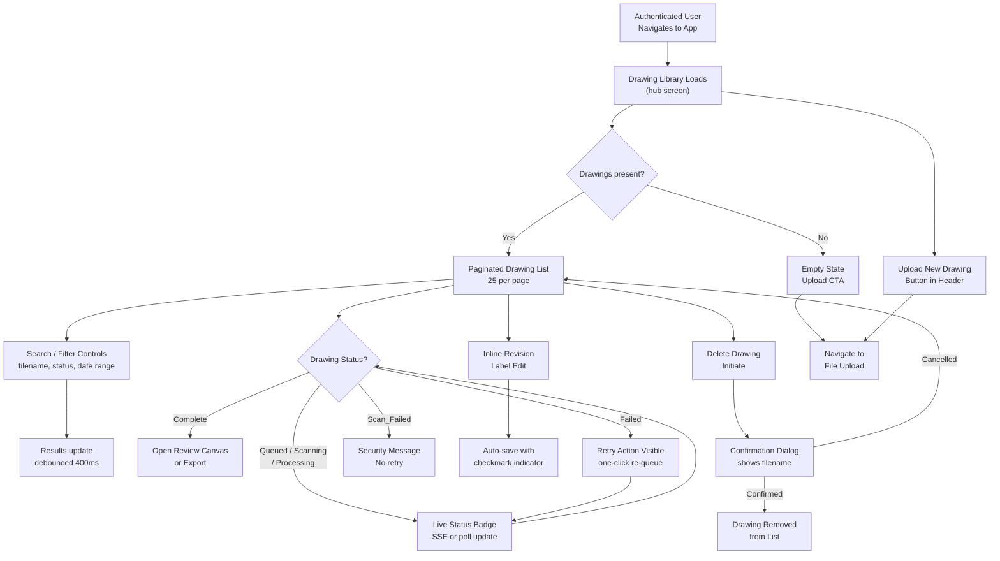
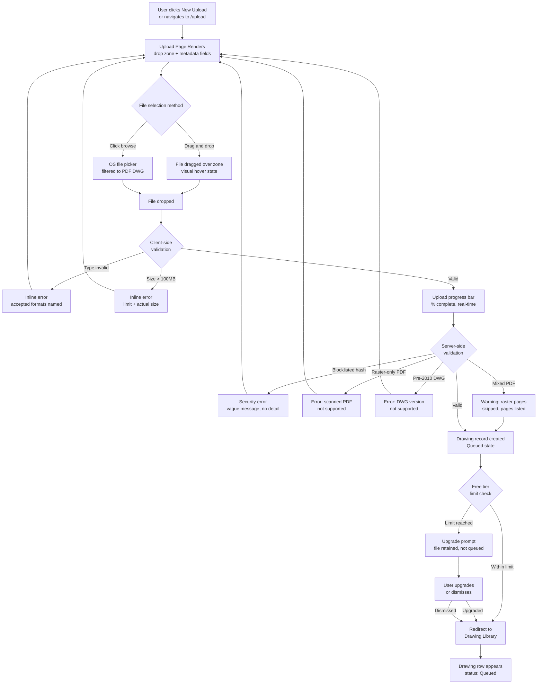
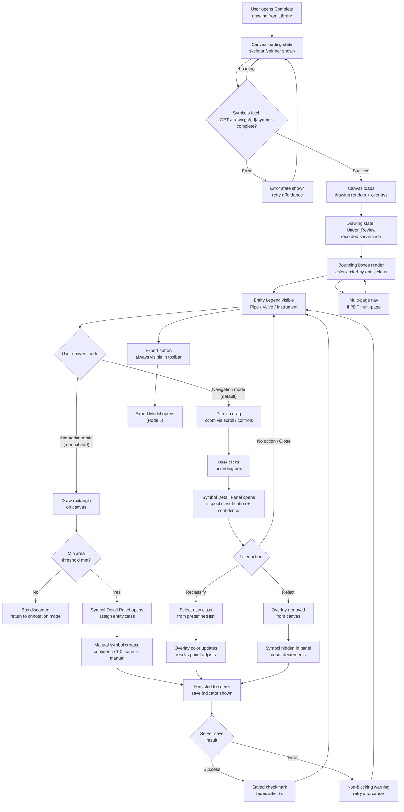
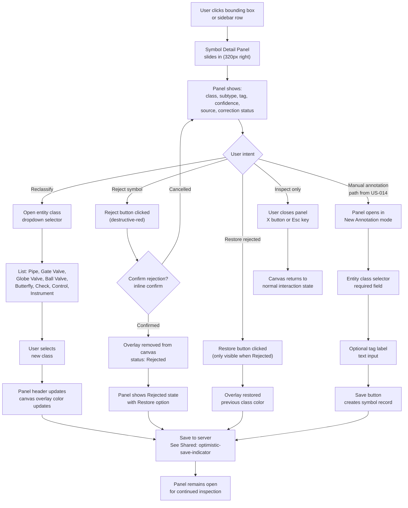
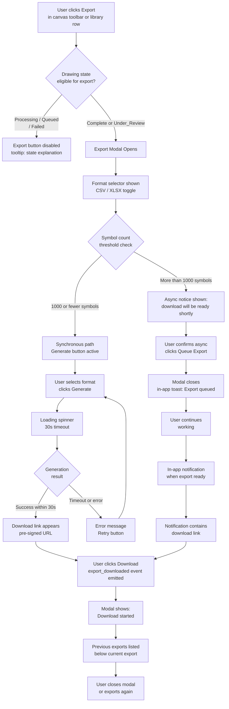
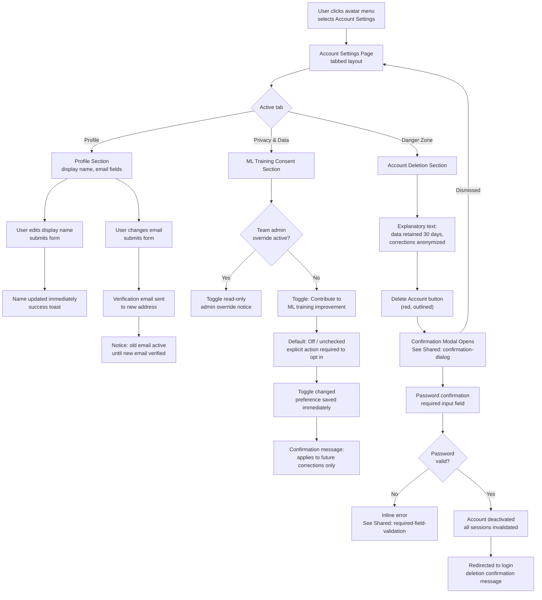
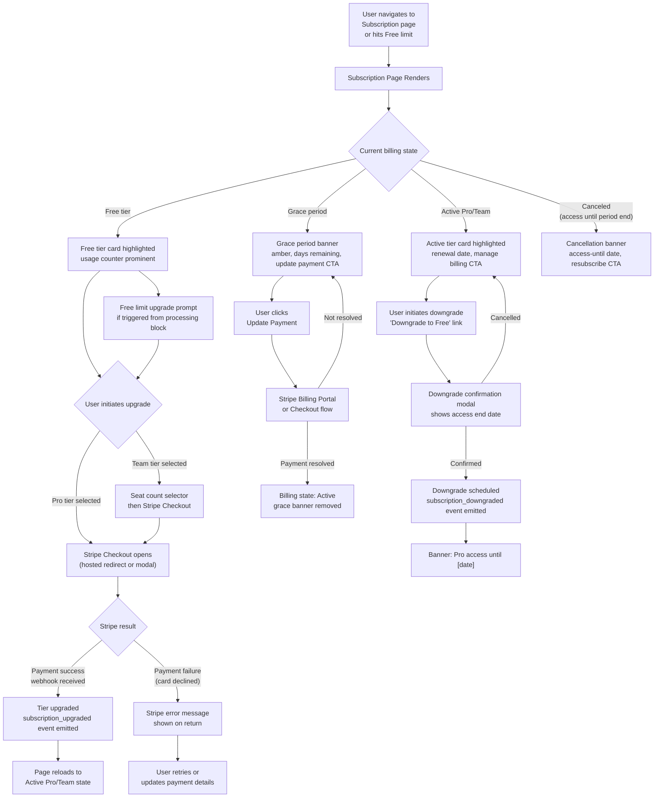

# UX Design: PID Analyzer

## Screen Manifest

```json
{
  "screens": [
    {
      "id": "drawing-library",
      "title": "Drawing Library",
      "filename": "prototype-drawing-library.html",
      "userStories": ["US-006", "US-007", "US-008", "US-009", "US-010"]
    },
    {
      "id": "file-upload",
      "title": "File Upload Drop Zone",
      "filename": "prototype-file-upload.html",
      "userStories": ["US-003", "US-017", "US-018"]
    },
    {
      "id": "review-canvas",
      "title": "Drawing Review Canvas",
      "filename": "prototype-review-canvas.html",
      "userStories": ["US-011", "US-012", "US-013", "US-014", "US-015"]
    },
    {
      "id": "symbol-detail-panel",
      "title": "Symbol Detail & Reclassification Panel",
      "filename": "prototype-symbol-detail-panel.html",
      "userStories": ["US-012", "US-013", "US-014", "US-015"]
    },
    {
      "id": "export-modal",
      "title": "Export Download Modal",
      "filename": "prototype-export-modal.html",
      "userStories": ["US-016", "US-017"]
    },
    {
      "id": "account-settings",
      "title": "Account Settings",
      "filename": "prototype-account-settings.html",
      "userStories": ["US-004", "US-005"]
    },
    {
      "id": "subscription-upgrade",
      "title": "Subscription & Upgrade Prompt",
      "filename": "prototype-subscription-upgrade.html",
      "userStories": ["US-018", "US-019", "US-020"]
    }
  ],
  "deferredScreens": [
    {
      "id": "registration",
      "title": "Registration & Email Verification Form",
      "reason": "Pre-built pattern — excluded from prototype scope",
      "userStories": ["US-001"]
    },
    {
      "id": "login",
      "title": "Login Form",
      "reason": "Pre-built pattern — excluded from prototype scope",
      "userStories": ["US-002"]
    },
    {
      "id": "team-management",
      "title": "Team Management Screen",
      "reason": "P1 — deferred to post-MVP",
      "userStories": ["US-023", "US-024"]
    },
    {
      "id": "team-invitation",
      "title": "Team Invitation Accept Page",
      "reason": "P1 — deferred to post-MVP",
      "userStories": ["US-023"]
    },
    {
      "id": "revision-comparison",
      "title": "Revision Comparison Canvas",
      "reason": "P1 — deferred to post-MVP",
      "userStories": ["US-025"]
    },
    {
      "id": "instrument-table-review",
      "title": "Instrument Table Review Panel",
      "reason": "P1 — deferred to post-MVP",
      "userStories": ["US-021", "US-022"]
    }
  ]
}
```

---

## Overview

PID Analyzer is a desktop-primary web SPA (1280px+ optimized) built for process engineers and document control managers automating P&ID digitization. The interaction paradigm is a **document-processing workspace**: users upload drawings, monitor async ML processing, validate results on an interactive canvas, and export structured data.

The design follows a hub-and-spoke architecture: the **Drawing Library** is the persistent hub; all other screens are spokes accessed from it. The review canvas is the highest-complexity node and the product's core value surface.

**Nodes Designed**: 7
**Priority Focus**: P0 (Must-have) nodes — all 7 nodes address P0 stories
**Design System**: Neutral gray base with blue accent; 4px/8px grid; entity class color-coding for Pipe/Valve/Instrument propagated across Canvas and Library nodes

**Applied Design Standard**: None specified — using neutral defaults

---

## Shared Functional Patterns

### Common Validation Rules
- **required-field-validation**: Field non-empty after trim; red `#EF4444` border + inline error text (`text-sm`, `#EF4444`) below field; on form submit, focus moves to first invalid field; error clears on next valid input
- **file-type-size-validation**: Client-side pre-check before transfer; if file type ≠ PDF/DWG, inline error names accepted formats; if file > 100MB, inline error states limit and actual size; server-side validation is authoritative

### Common State Patterns
- **async-status-polling**: Drawings in transient states (Queued/Scanning/Processing) receive live status updates via SSE/polling (≤10s interval); status badge re-renders in place without full page reload; on reaching terminal state (Complete/Failed/Scan_Failed), an in-app toast notification fires
- **optimistic-save-indicator**: On correction actions, a transient "Saved ✓" indicator (green, fades after 2s) appears near the action point; on server error, a non-blocking inline warning replaces it with a retry affordance
- **confirmation-dialog**: Destructive actions (delete, account deletion) require a modal confirmation displaying the entity name; two buttons: destructive-red primary + neutral secondary Cancel; no action executes until confirmed

### Standard Data Formats
- **confidence-score-display**: Right-aligned numeric, two decimal places (e.g., `0.87`), unit-less, rendered in `#6B7280` tabular-nums font; values < 0.60 rendered in `#F59E0B` (amber warning)
- **processing-status-badge**: Pill badge, 12px font, uppercase label; per-status color defined in Design System token map
- **date-display**: `DD MMM YYYY` format (e.g., `14 Jun 2025`), `#6B7280`, no time shown in library view

---

## Node 1: Drawing Library

### User Stories Covered
- US-006: View Drawing Library with Status, Revision Labels, and Pagination
- US-007: Search and Filter Drawing Library by Filename, Status, and Date Range
- US-008: Track Drawing Through Processing State Machine and Surface Terminal States
- US-009: Retry Failed Processing Job and Delete Drawing with Confirmation
- US-010: Emit and Deliver Structured Analytics Events for All Tracked User Actions

### User Flow (Mermaid)



### Interface Blueprint

**Interaction Pattern**: Master-list dashboard with persistent top navigation and contextual row actions

**Structure & Regions**:

| Region | Dimensions | Contents |
|---|---|---|
| Top Navigation Bar | Full-width, 64px | Logo left; "New Upload" primary button right; user avatar/menu far right; notification bell; **grace period billing warning banner renders here on all authenticated pages when account is in grace period (see Grace Period Banner spec below)** |
| Search & Filter Bar | Full-width, 56px | Text search input (left, 320px wide); Status multi-select dropdown; Date range picker; Active filter count badge |
| Free Tier Banner | Full-width, 32px | Visible only for Free tier users; "X of 3 drawings processed this month" + upgrade link; always visible (not dismissible) |
| Drawing List Table | Full-width, scrollable | Column headers: Filename, Revision, Uploaded, Status, Uploader, Actions |
| Pagination Footer | Full-width, 48px | Page X of Y; Prev/Next arrows; record count label |
| Empty State | Centered in list area | Illustration + headline + "Upload your first drawing" CTA button |

**Component/Data Placement**:
- **Status badge**: Second-to-last column; pill with color per status token; live-updating for transient states
- **Revision label**: Inline editable text field in second column; pencil icon on hover; auto-saves on blur
- **Row actions**: Rightmost column; icon buttons — Open (arrow), Retry (circular arrow, only for Failed), Delete (trash); Scan_Failed rows show only an info icon (no retry, no open)
- **In-app toast notifications**: Bottom-right, stacked; dismissible; appear on processing_complete and processing_failed transitions
- **Free tier usage counter**: Subtle banner below search bar for Free tier users — "X of 3 drawings processed this month"
- **Grace Period Banner** (global): When an authenticated user's account is in billing grace period, a dismissible amber warning banner renders in the top navigation bar on **every authenticated page** (not only the Subscription page). Banner text: "Your payment failed — your account enters read-only mode in X days. [Update billing →]". This satisfies FR-15 and US-020 requirements that users receive in-app billing warnings regardless of which page they visit. The banner persists across page navigations for the duration of the grace period; dismissal state is session-scoped only (re-appears on next session).

**Information Hierarchy**:
- Primary: Filename + Status badge (scanning state of work)
- Secondary: Revision label + Upload date (context for version management)
- Tertiary: Row actions (available on hover/focus)

### Prototype Placeholder

**File**: `prototype-drawing-library.html`

<!-- PROTOTYPE_PLACEHOLDER:drawing-library -->

### Implementation Notes

### Interaction Behaviors
- **Search Input**: Debounced 400ms; filters filename in real-time; preserves results on page
- **Status Filter Dropdown**: Single-select dropdown; re-runs filter on change; shows active filter count badge
- **Date Range Pickers**: Two inputs (start/end); filter is inclusive; re-runs applyFilters on change
- **Revision Label Edit**: Inline editable text field in second column; appears on hover as input; auto-saves on blur or Enter key; shows transient "✓ Saved" checkmark (fades after 2s)
- **Row Action Buttons**: Open (arrow icon) for Complete status; Export (download icon) for Complete; Retry (circular arrow) for Failed; Info icon for Scan_Failed; Delete (trash) available for all rows
- **Confirmation Modal**: Displays filename; two buttons (Cancel/Delete); Escape key dismisses without action
- **Pagination**: Previous/Next buttons; disabled at boundaries; shows "Page X of Y" + record count; clicking changes currentPageNum and re-renders
- **Toast Notifications**: Stack at top-right; auto-dismiss after 5s; manual close via × button; success (green border) and error (red border) variants
- **Free Tier Banner**: Visible only for users with tier='free'; shows current/max count and upgrade link; always visible (not dismissible)
- **Live Status Updates**: Background polling simulates processing→complete transitions every 10 seconds; shows success toast on completion
- **Grace Period Banner (Global)**: Rendered in top navigation; dismissal writes session flag (graceBannerDismissed) that suppresses re-display within same session; amber background with left border accent

### Data Fields & Types
- **id**: integer, unique drawing identifier (1–20 in mock data)
- **filename**: string, e.g. "Reactor_Cooling_Loop_P001.pdf"
- **revision**: string, editable, e.g. "Rev A", "Rev B"
- **uploadedDate**: ISO date string (YYYY-MM-DD), formatted to "DD MMM YYYY" on render (e.g., "14 Jun 2025")
- **status**: enum (queued, processing, complete, failed, scan_failed)
- **uploader**: string, user display name (e.g., "Marcus Chen", "David Kumar", "Priya Sharma")
- **symbolCount**: integer, number of detected symbols; 0 for in-progress/failed drawings
- **userTier**: string, enum (free, pro, team); controls banner visibility
- **drawingsProcessedThisMonth**: integer, current count for free tier users (2 of 3 in mock state)

### Validation Rules
- **Search**: Lowercase comparison, partial matching on filename; no special character escaping
- **Revision Input**: Trimmed; non-empty required; no length limit displayed
- **Date Filters**: ISO date format; start date must be ≤ end date (inclusive filter logic)
- **Delete Confirmation**: Modal focuses on destructive action; requires explicit button click

### State Management
- **filteredDrawings**: Array of drawings matching current search/filter criteria; re-computed on applyFilters() call
- **currentPageNum**: Current page number (1-indexed); reset to 1 when filters change
- **deleteTargetId**: ID of drawing pending deletion; null until initiateDelete() called
- **searchTimeout**: setTimeout ID for debouncing search input (400ms delay)
- **userTier, drawingsProcessedThisMonth**: Set at init; control banner visibility
- **localStorage**: Drawing ID/name stored when opening canvas or export modal
- **sessionStorage**: graceBannerDismissed flag set when user dismisses grace period banner; session-scoped only, resets on new browser session

### Ergonomics / Shortcuts
- **Revision Edit**: Click label to activate input; press Enter or click outside to save
- **Pagination**: Tab+Enter on Previous/Next buttons
- **Delete Flow**: Escape key on confirmation modal closes without action
- **Grace Period Banner**: Includes keyboard-focusable "Update billing →" link and "×" dismiss button; both Tab-reachable

### Visual / Response Specifications
- **Transitions / Latency**: Status badge update instant; revision save indicator appears immediately, fades over 2s; page navigation instant; toast slide-in 0.3s ease; processing→complete simulation every 10–15s
- **Design specifics**: Status badges use color tokens (e.g., var(--color-status-complete) for Complete); revision inputs styled with subtle border, blue focus ring; pagination buttons disabled with opacity 0.5 at boundaries; confirmation modal centered with rgba(0,0,0,0.5) backdrop; free tier banner uses amber left border (4px); grace period banner amber background with left border accent
- **States**: Hover — table row background lightens to #F9FAFB; Focus — input fields show blue ring; Disabled — pagination buttons opacity 0.5, cursor not-allowed; Loading — processing status badge includes animated spinner border (0.8s rotation); Empty state — hidden by default, shown only when filteredDrawings.length === 0
### Data Fields & Types
- **id**: integer, unique drawing identifier
- **filename**: string, e.g. "Reactor_Cooling_Loop_P001.pdf"
- **revision**: string, editable, e.g. "Rev A", "Rev B"
- **uploadedDate**: ISO date string (YYYY-MM-DD), formatted to "DD MMM YYYY" on render
- **status**: enum (queued, processing, complete, failed, scan_failed)
- **uploader**: string, user display name
- **symbolCount**: integer, number of detected symbols; 0 for in-progress/failed drawings
- **userTier**: string, enum (free, pro, team); controls banner visibility and limits
- **drawingsProcessedThisMonth**: integer, current count for free tier users
- **accountGracePeriodEndsAt**: ISO datetime or null; present in user session context; when non-null and current time is before value, grace period banner renders globally across all authenticated pages

### Validation Rules
- **Search**: Lowercase comparison, partial matching on filename; no special character escaping (prototype assumes safe strings)
- **Revision Input**: Trimmed; non-empty required; no length limit displayed; accepts any text
- **Date Filters**: ISO date format; start date must be ≤ end date (no explicit validation enforced; filter logic is inclusive)
- **Delete Confirmation**: Modal focuses on destructive action; requires explicit button click; no undo after confirmation

### State Management
- **filteredDrawings**: Array of drawings matching current search/filter criteria; re-computed on applyFilters() call
- **currentPageNum**: Current page number (1-indexed); reset to 1 when filters change; used to slice pageSize rows from filteredDrawings
- **deleteTargetId**: ID of drawing pending deletion; null until initiateDelete() called; cleared on closeConfirmation()
- **searchTimeout**: setTimeout ID for debouncing search input; cleared and re-set on each keystroke to delay filter execution by 400ms
- **userTier, drawingsProcessedThisMonth**: Set at page init; control banner visibility and messaging
- **localStorage**: Drawing ID/name stored when opening canvas or export modal (used by downstream screens to pre-populate context)
- **graceBannerDismissed** (session flag): Boolean, session-scoped; set to true when user dismisses grace period banner; prevents re-display within same session but resets on new session. Stored in sessionStorage, not localStorage, to ensure it reappears across browser sessions during the full grace period window.

### Ergonomics / Shortcuts
- **Revision Edit**: Tab into input field; press Enter or click outside to save; shows inline checkmark feedback
- **Pagination**: Previous/Next keyboard-accessible via Tab+Enter (buttons are native)
- **Delete Flow**: Escape key on confirmation modal closes without action (standard dialog pattern)
- **Search Focus**: Input field is auto-focusable for power users (no programmatic focus on load; manual Tab navigation available)
- **Grace Period Banner**: Includes a visible keyboard-focusable "Update billing →" link and a "×" dismiss button; both Tab-reachable; dismiss button has aria-label="Dismiss billing warning"

### Visual / Response Specifications
- **Transitions / Latency**: 
  - Status badge update: Instant (no artificial delay)
  - Revision save indicator: Checkmark appears immediately, fades over 2s (CSS animation)
  - Page navigation: Instant table re-render; scroll to top of page
  - Toast notification: 0.3s slide-in animation; 5s display duration; 0.2s fade-out on auto-dismiss
  - Processing to Complete simulation: 10–15s interval (realistic polling window)
- **Design Specifics**: 
  - Status badges use color tokens (e.g., var(--color-status-complete) for Complete state) and include spinner animation for transient states
  - Revision inputs styled with subtle border; blue focus ring per design system
  - Pagination buttons disabled with opacity 0.5 at boundaries
  - Confirmation modal centered with rgba(0,0,0,0.5) backdrop; 480px max-width
  - Free tier banner uses amber left border (4px) matching warning color token
  - **Grace period banner**: Full-width, 40px height, rendered immediately below the 64px top navigation bar; amber background (var(--color-warning-subtle)); left-aligned text with "Update billing →" link styled as inline anchor (not a button); "×" dismiss icon right-aligned; banner slides down from top navigation on first render (0.2s ease-in); does not push page content — overlays with position:sticky so table remains fully scrollable beneath it
- **States**: 
  - Hover: Table row background lightens to #F9FAFB; pencil icon appears
  - Focus: Input fields show blue ring (3px offset); buttons inherit default focus outline or custom styling
  - Disabled: Pagination buttons and disabled actions show opacity 0.5, cursor: not-allowed
  - Loading: Processing status badge includes animated spinner border (0.8s rotation)
  - Empty state: Hidden by default; shown only when filteredDrawings.length === 0

### Entity Icon Map Usage
- **Pipe** (blue horizontal line): Not used in Library (used in Canvas/Panel)
- **Valve** (green diamond): Not used in Library (used in Canvas/Panel)
- **Instrument** (amber circle): Not used in Library (used in Canvas/Panel)
- **Processing/Queued** (clock icon): Implied by status badge visual and spinner animation
- **Complete** (checkmark): Visual feedback in save indicator (`✓ Saved`)
- **File/Document** (page icon): Used in Open/Export action buttons

### Design Rationale

**Hierarchy/Structure**: Table layout chosen over cards because Marcus (document control) scans dozens of rows for status and filename patterns; tabular alignment enables rapid visual scanning across attributes. Columns ordered by workflow priority: what is it → what revision → when → is it ready.

**Accessibility/Ergonomics**: All row actions keyboard-reachable via Tab/Enter; status badges use color + text label (not color alone) for WCAG 2.1 AA compliance; live region (`aria-live="polite"`) for status badge updates so screen readers announce transitions without focus disruption.

**Cognitive Load**: Pagination at 25 rows prevents overwhelming the viewport; search and filter state preserved in URL query string so Marcus can bookmark filtered views; confirmation dialog for delete shows filename to prevent accidental loss of large jobs.

**Patterns Used**: Master-list table (Gmail-inspired); inline editable field (Notion-style); SSE-driven live badge (Jira board column update pattern); toast notification stack (Material Design snackbar).

**Grace Period Banner (Global Placement Rationale)**: FR-15 and US-020 require users to receive billing warnings during the grace period regardless of navigation path. A user who never visits the Subscription page during a 7-day window would otherwise miss all in-app warnings and rely solely on email, materially reducing payment resolution rate. Placing the banner in the top navigation component — which renders on every authenticated page — ensures universal visibility. Amber color token matches warning severity without alarming users; session-scoped dismissal prevents fatigue while guaranteeing daily re-exposure.

---

---

## Node 2: File Upload Drop Zone

### User Stories Covered
- US-003: Upload PDF or DWG file with format, size, and raster validation
- US-017: Queue and deliver asynchronous export for large drawings (upload entry point)
- US-018: Enforce Free Tier Processing Limit and Display Upgrade Prompt

### User Flow (Mermaid)



### Interface Blueprint

**Interaction Pattern**: Centered single-task form with progressive disclosure of metadata fields after file selection

**Structure & Regions**:

| Region | Dimensions | Contents |
|---|---|---|
| Page Header | Full-width, 64px | Back arrow to Library; page title "Upload Drawing" |
| Drop Zone | 640px wide, 240px tall, centered | Dashed border `#E5E7EB`; upload cloud icon; headline "Drag PDF or DWG here"; subtext "or browse files · Max 100MB"; hover state: blue border `#3B82F6` + blue tint background |
| File Metadata Fields | 640px wide, below drop zone | Revision label (optional text input); appears only after valid file selected |
| Validation Error Region | 640px wide, below drop zone | Inline error/warning messages; icon + descriptive text; amber for warnings (raster pages skipped), red for errors |
| Upload Progress | Replaces drop zone on upload start | Filename + file size; linear progress bar (blue fill); percentage label; Cancel link |
| Free Tier Counter | Below drop zone, Free users only | "2 of 3 drawings used this month" with amber color at 3/3 |

**Component/Data Placement**:
- Format hint text beneath drop zone always visible: "Accepted: PDF (vector), DWG (AutoCAD 2010–2024)"
- Revision label field: optional, labeled "Revision (optional)", placeholder "e.g. Rev C"
- Cancel upload: text link, terminates transfer and returns to idle drop zone state
- Blocklisted file error: generic "This file could not be uploaded for security reasons" — no mention of malware or blocklist

**Information Hierarchy**:
- Primary: Drop zone (the action)
- Secondary: Validation feedback (outcome)
- Tertiary: Revision label / metadata (contextual enrichment)

### Prototype Placeholder

**File**: `prototype-file-upload.html`

<!-- PROTOTYPE_PLACEHOLDER:file-upload -->

### Implementation Notes

### Interaction Behaviors
- **Drop Zone**: Accepts drag-and-drop of PDF/DWG files; hover state shows blue border + light blue background; dragging-over state adds box shadow; click or drag triggers file selection
- **File Input**: Programmatically triggered via browse link or drop zone click; filtered to `.pdf,.dwg` extensions
- **Client-side Validation**: Type and size checks on file selection; validation errors display inline with icon and descriptive text (red `#EF4444` background)
- **Metadata Section**: Progressive disclosure — appears only after valid file selected; Revision field is optional
- **Upload Progress**: Simulates realistic upload with 300ms interval increments; displays filename, file size, linear progress bar, percentage, and Cancel link
- **Free Tier Limit**: Displays counter banner "2 of 3 drawings processed this month" with reset date; on upload completion, checks limit and shows upgrade modal if reached
- **Upgrade Modal**: Non-blocking overlay showing file info and two CTAs: "Upgrade to Pro" (redirects to subscription page) and "Learn more" (dismisses modal)
- **Toast Notifications**: Stack at top-right; auto-dismiss after 5s; manual close via × button; success (green) and error (red) variants with left-border color indicator
- **Keyboard Navigation**: Escape cancels upload or closes modal; Enter in revision field would submit (ready for form submission pattern); Tab accessible all inputs

### Data Fields & Types
- **File Name**: String, max 255 chars (OS limit), displayed in progress section and modal
- **File Size**: Number (bytes), validated ≤ 100MB (104,857,600 bytes), formatted as "X.X MB"
- **Revision Label**: String, optional, max 32 chars, placeholder "e.g. Rev C", auto-saved with file metadata
- **Upload Progress**: Number 0–100, updated via simulated interval, displayed as percentage and visual bar
- **User Tier**: String (free/pro/team), determines limit enforcement and banner display
- **Drawings Used This Month**: Number, displayed in counter banner (e.g., "2 of 3"), reset on 1st of next month
- **File Type**: Validated extension (`.pdf`, `.dwg`); case-insensitive; MIME type check performed server-side

### Validation Rules
- **required-file-type-validation**: File extension must be `.pdf` or `.dwg` (case-insensitive); error: "Invalid file format. Accepted formats: PDF (vector), DWG (AutoCAD 2010–2024)"
- **required-file-size-validation**: File size ≤ 100MB; error message includes actual size: "File size exceeds 100MB limit. Your file is X.X MB."
- **free-tier-processing-limit**: Free users limited to 3 drawings/month; on reaching limit, upgrade modal displays with current file info; file is retained, not queued, until upgrade or dismissal
- **trim-and-normalize**: Revision label trimmed of leading/trailing whitespace; optional field defaults to empty string if not provided

### State Management
- **appState object**: Tracks `fileSelected`, `fileName`, `fileSize`, `isUploading`, `uploadProgress`, `userTier`, `drawingsUsedThisMonth`, `drawingsLimitThisMonth`, `isFreeTierLimitReached`
- **UI Section Visibility**: Metadata section, progress section, validation error, free tier counter, and upgrade modal controlled via `.visible` CSS class toggled by JavaScript
- **Upload Simulation**: `setInterval` loop increments progress 0–100% over ~3–4 seconds; on completion, server-side validation delay (500ms) simulates network latency
- **Reset Flow**: `resetUploadUI()` clears file input, hides metadata/progress sections, resets fileSelected and isUploading flags; triggered on cancel, successful completion, or validation error

### Ergonomics / Shortcuts
- **Click or Drag**: Both methods activate file picker (unified interaction pattern)
- **Escape Key**: Cancels in-flight upload or closes modal; returns to drop zone idle state
- **Enter Key**: In revision field, would trigger form submission (ready for form-submit handler if needed)
- **Tab Key**: Navigates through all interactive elements (file input, browse link, revision input, buttons) in logical order

### Visual / Response Specifications
- **Transitions / Latency**: 
  - Drop zone hover: 200ms smooth border/background color transition
  - Progress bar: 300ms linear width animation
  - Modal slide-in: CSS animation (not implemented in prototype but ready for Tailwind/CSS addition)
  - Toast slide-in: 300ms ease-out from right edge
  - File upload simulation: 300ms interval loop for realistic ~3–4 second total duration
- **Design Specifics**:
  - Drop zone idle: `#E5E7EB` dashed border (2px), white background, 240px min-height, center-aligned content
  - Drop zone hover: `#3B82F6` dashed border, `#F0F9FF` background
  - Dragging-over state: `#3B82F6` dashed border, `#EFF6FF` background, 3px outer glow (`rgba(59, 130, 246, 0.1)`)
  - Error message: Red `#FEE2E2` background, `#FECACA` border, `#991B1B` text
  - Free tier counter: Amber `#FEF3C7` background, `#FCD34D` border, `#92400E` text
  - Progress bar: Blue fill `#3B82F6` over gray `#E5E7EB` background
  - Modal: 480px max-width, centered, white background, shadow, 32px padding
  - Toasts: 320px max-width, 4px left border matching status color, 14px font, auto-dismiss 5s
- **States**:
  - Idle: Drop zone with cloud icon and placeholder text
  - File Selected: Metadata section appears, revision field visible
  - Uploading: Progress section replaces drop zone; real-time % display and cancel affordance
  - Upload Complete (Success): Toast notification; redirect to library after 1.5s
  - Upload Complete (Free Limit Reached): Upgrade modal displays; file retained; modal has two dismiss paths
  - Error: Inline validation error with red styling; drop zone returns to idle on error

### Design Rationale

**Hierarchy/Structure**: Single-column centered layout reduces Priya's cognitive load — one task, one flow. Metadata fields deferred until after file selection (progressive disclosure) so the first impression is uncluttered.

**Accessibility/Ergonomics**: Drop zone is keyboard-operable (Enter/Space activates file picker); file picker accepts `.pdf,.dwg` to reduce mis-selection without hard-blocking; ARIA `role="status"` on progress region announced to screen readers; all error messages are descriptive and actionable, not generic.

**Cognitive Load**: Client-side validation fires immediately (before network transfer) on size/type to give instant feedback; server-side errors (raster detection, hash blocklist) surface inline in the same region, never as modal interruptions; partial success (mixed PDF) uses amber warning rather than red error to signal continuation.

**Patterns Used**: Drop zone (GitHub upload, Google Drive); progressive disclosure of metadata (Google Forms conditional fields); inline validation (Stripe payment form); progress bar with cancel (browser download metaphor).

---

## Node 3: Drawing Review Canvas

### User Stories Covered
- US-011: Trigger ML Processing and Display Detection Results with Confidence Scores
- US-012: Render Detected Symbols as Color-Coded Bounding Box Overlays
- US-013: Inspect, Reclassify, and Reject Individual Detected Symbols
- US-014: Manually Annotate Undetected Symbols as False Negative Corrections
- US-015: Persist Corrections in Real Time and Gate Training Feedback by ML Consent

### User Flow (Mermaid)



### Interface Blueprint

**Interaction Pattern**: Full-viewport drawing workspace with floating toolbars, slide-in panel, and persistent results summary sidebar

**Structure & Regions**:

| Region | Dimensions | Contents |
|---|---|---|
| Top Toolbar | Full-width, 56px | Back to Library (left); Drawing filename + revision badge (center); Export button (primary, right); Save status indicator (right of export) |
| Canvas Viewport | Full-width minus sidebar, full-height minus toolbars | Drawing rendering surface; bounding box SVG overlay layer; pan/zoom controls (bottom-right: zoom in/out/reset); **loading skeleton/spinner overlay during symbol fetch** |
| Left Tool Panel | 48px wide, vertically centered | Mode toggle: Navigate (hand icon) / Annotate (plus-box icon); keyboard shortcut labels (N / A) |
| Entity Legend | Floating card, canvas top-left | Three rows: ● Pipe `#3B82F6` blue · ● Valve `#10B981` green · ● Instrument `#F59E0B` amber; toggle visibility per class |
| Results Summary Sidebar | 280px wide, right side, full-height | Collapsible; tabs: All / Pipe / Valve / Instrument / Rejected; count per tab; scrollable symbol list with confidence badges; click row selects on canvas |
| Multi-page Navigator | Bottom-center, canvas overlay | Previous/Next page arrows; "Page X of N" label; visible only for multi-page PDFs |
| Symbol Detail Panel | Slide-in from right, 320px | Overlays sidebar; see Node 4 for full spec |
| Annotation Mode Banner | Top of canvas, amber bar | "Annotation mode active — draw a rectangle to add a symbol"; visible only when annotation mode is on |
| **Canvas Loading State** | Full canvas viewport | **Displayed while GET /drawings/{id}/symbols is in-flight: centered spinner (48px) + skeleton rows in sidebar; toolbar actions disabled except Back to Library; transitions away instantly on success** |

**Canvas Loading State — Detail**:
- **Trigger**: Immediately on drawing open, before symbol data is received from `GET /drawings/{id}/symbols`
- **Spinner**: 48px circular indeterminate spinner, centered in canvas viewport, brand primary color
- **Sidebar skeleton**: Results sidebar shows 5 placeholder skeleton rows (grey pulse animation) instead of real symbol entries; tab counts show "—"
- **Toolbar**: Export button and tool panel buttons disabled (greyed, `pointer-events: none`) during load to prevent premature interaction; Back to Library remains active
- **Error state**: If fetch fails or times out (>15s), spinner is replaced by an inline error card: "Could not load symbols. [Retry]" — retry re-invokes `GET /drawings/{id}/symbols`
- **Transition**: On success, spinner fades out (0.2s), bounding boxes and sidebar populate simultaneously

**Component/Data Placement**:
- Bounding boxes: 2px stroke, entity class color, 10% fill opacity; selected box gets 3px stroke + drop shadow
- Manually added symbols: dashed border style (vs. solid for ML-detected) to distinguish origin visually
- Low-confidence symbols (score < 0.60): amber bounding box border regardless of entity class color (overrides fill; class color retained for legend consistency)
- Results sidebar symbol rows: entity class color swatch + subtype label + tag (if present) + confidence score (See Shared: confidence-score-display)

**Information Hierarchy**:
- Primary: Drawing canvas with overlays (the work surface)
- Secondary: Results sidebar (summary of what was found)
- Tertiary: Top toolbar actions (export, navigation)

### Prototype Placeholder

**File**: `prototype-review-canvas.html`

<!-- PROTOTYPE_PLACEHOLDER:review-canvas -->

### Implementation Notes

### Interaction Behaviors
- **Mode toggle (N/A keys or buttons)**: Switches between Navigate (hand icon) and Annotate (pencil icon) modes; annotation mode displays a banner and changes cursor to crosshair
- **Bounding box selection**: Clicking any box on canvas selects it (blue highlight + 3px border + shadow), opens detail panel, and syncs selection in sidebar
- **Reclassify action**: Entity class dropdown enables Apply button; clicking Apply updates panel header color, canvas overlay color, and shows ✓ Saved indicator (2s fade)
- **Rejection flow**: Clicking "Reject (false positive)" shows inline confirmation; confirming hides box from canvas, updates status to Rejected (red pill), offers Restore button
- **Detail panel**: Slides in from right (0.3s ease-out), non-modal; Esc or Done closes; canvas remains interactive behind semi-transparent overlay
- **Loading state**: Displayed for 2 seconds on page load; centered spinner, skeleton rows in sidebar; all canvas/toolbar interactions disabled except Back to Library
- **Results tabs**: Filtering by All/Pipe/Valve/Instrument updates symbol list and tab counts dynamically
- **Sidebar collapse**: Toggle button collapses results sidebar to recover canvas width; chevron icon rotates

### Data Fields & Types
- **id** (integer): Unique symbol identifier
- **class** (string: pipe, valve, instrument): Entity classification
- **label** (string): Human-readable symbol type (e.g., "Pipe Segment", "Gate Valve")
- **tag** (string): Alphanumeric identifier (e.g., "P1", "V1"); optional for manually added
- **confidence** (float 0–1.0): ML confidence score, displayed to 2 decimal places; < 0.60 renders in red
- **source** (string: ML, Manual): Detection source
- **status** (string: Accepted, Rejected, Reclassified): Current correction state

### Validation Rules
- **Reclassify**: New class must differ from current; Apply button only shows on non-empty selection
- **Rejection confirmation**: Inline confirmation prevents accidental rejection; Cancel returns to normal state
- **Low-confidence flag**: Boxes with score < 0.60 render with amber border override and red confidence text
- **Loading gate**: Toolbar export, mode-toggle, and box selection all blocked while canvasLoadState === 'loading'; fetch timeout 15s (simulated as 2s in prototype)

### State Management
- **currentMode** (navigate | annotate): Tracks canvas interaction mode; toggles tool-button active class and annotation-banner visibility
- **currentSymbolId** (number | null): ID of symbol whose detail panel is open; null when panel closed
- **canvasLoadState** (idle | loading | success | error): Controls spinner, skeleton rows, and disabled toolbar state; transitions to success after 2s
- **symbols** (array): 8 hardcoded symbol records with class, confidence, source, status; updated on reclassify/reject/restore
- **currentFilter** (all | pipe | valve | instrument): Active sidebar filter; controls symbol-list rendering and count displays
- **zoomLevel** (number, 0.5–3): Canvas scale factor; persisted in appState, applied to SVG transform

### Ergonomics / Shortcuts
- **N key**: Switch to Navigate mode
- **A key**: Switch to Annotate mode
- **Esc key**: Close detail panel
- **Tab key**: Traverse canvas elements and buttons in logical order
- **Click canvas**: Select bounding box if in navigate mode; draw if in annotation mode

### Visual / Response Specifications
- **Transitions / Latency**: 
  - Detail panel slide-in: 0.3s cubic-bezier(0.4, 0, 0.2, 1)
  - Loading spinner: 0.8s continuous rotation
  - Save indicator fade-out: 2s with 80% opacity until 100% opacity at 80%
  - Canvas loading overlay fades instantly when hidden
  - Skeleton pulse animation: 1.2s ease-in-out infinite
  - Bounding box selection: 0.1s border-width transition
  
- **Design specifics**:
  - Bounding boxes: 2px stroke, 8% fill opacity, entity class color; selected = 3px + drop-shadow
  - Manual symbols: dashed border (2px, 4px 4px dash pattern)
  - Low-confidence amber override: border-color #F59E0B (overrides entity color; fill color unchanged)
  - Detail panel: 320px wide, slides from right, white background, 1px left border shadow
  - Entity legend: Floating card, top-left, white with gray border, small font (12px)
  - Status pills: Accepted (green background/text), Rejected (red), Reclassified (blue)
  - Annotation banner: Amber background (#FEF3C7), fixed in view, 32px height
  
- **States**:
  - Idle: Drop zone with cloud icon
  - Loading: Centered 48px spinner, skeleton rows in sidebar, toolbar/tools disabled
  - Success: Canvas populated, sidebar shows real symbols, all interactions enabled
  - Error: Inline error card "Could not load symbols. [Retry]"
  - Hover (bounding box): 3px border, subtle shadow
  - Selected (bounding box): 3px border, drop-shadow, canvas highlight
  - Rejected (symbol): Hidden on canvas, red status pill, Restore button visible
  - Reclassified (symbol): Color updated to new class, blue status pill, Apply hidden

### Entity Icon Map Usage
- **Pipe** (blue horizontal line): Canvas legend shows blue swatch, sidebar/detail swatch shows var(--color-pipe: #3B82F6)
- **Valve** (green diamond): Canvas legend shows green swatch, detail swatch shows var(--color-valve: #10B981)
- **Instrument** (amber circle): Canvas legend shows amber swatch, detail swatch shows var(--color-instrument: #F59E0B)
- **Manual annotation**: Dashed border on bounding box (vs. solid for ML-detected); pencil icon not shown in this prototype but ready for detail panel source badge
### Data Fields & Types
- **Entity Class**: string (pipe, valve, instrument)
- **Subtype**: string (e.g., "Pipe segment", "Gate Valve", "Pressure Gauge")
- **Tag/Label**: string (alphanumeric identifier, e.g., P1, V1, I1)
- **Confidence**: float, range 0.00–1.00, displayed to 2 decimal places
- **Source**: string (ML or Manual)
- **Status**: string (Accepted, Rejected, Reclassified)

### Validation Rules
- **Reclassify selection**: Dropdown validation occurs on change; Apply button only shows when a non-empty selection is made
- **Rejection confirmation**: Inline confirmation prevents accidental false-positive rejection
- **Low-confidence flag**: Boxes with confidence < 0.60 render with amber border (overriding entity class color) to alert reviewers
- **Loading gate**: Toolbar export, mode-toggle, and bounding-box interactions are disabled and non-focusable while `GET /drawings/{id}/symbols` is in-flight; fetch timeout threshold is 15 seconds before error state is shown

### State Management
- **Detail panel state**: Tracked in `currentDetailSymbol` object; opens on symbol selection, closes via Esc or Done button
- **Canvas mode**: Stored in `currentCanvasMode`; toggles tool-button active class and surface cursor
- **Selection state**: Selected box and sidebar row both get visual highlight; clicking a new box/row deselects previous
- **Save state**: Transient "Saved ✓" indicator shown for 2 seconds after reclassification or rejection, then hidden
- **Canvas load state**: Stored in `canvasLoadState` enum: `idle | loading | success | error`; controls spinner visibility, skeleton rows in sidebar, and disabled state of toolbar/tool-panel; transitions to `success` on resolved fetch, `error` on timeout or HTTP error

### Ergonomics / Shortcuts
- **N key**: Switch to Navigate mode (disabled during loading state)
- **A key**: Switch to Annotate mode (disabled during loading state)
- **Esc key**: Close detail panel

### Visual / Response Specifications
- **Transitions / Latency**: Detail panel slides in/out at 0.3s cubic-bezier; save indicator fades after 2s; bounding box selection has instant border-width change (0.1s) and drop-shadow filter for depth; loading spinner fades out at 0.2s on successful fetch; skeleton rows in sidebar use a 1.2s pulse animation while loading
- **Design specifics**: Bounding boxes use 2px stroke + 8% fill opacity for subtle overlay; selected boxes upgrade to 3px stroke and drop-shadow; manually added boxes render dashed (2px) vs. solid (ML); low-confidence amber override applies to border-color, not fill
- **States**: Hover on box increases border-width to 3px; selected box combines 3px + shadow; rejected symbols hide on canvas and change status badge to red; reclassified symbols update header color to match new class; **loading state: canvas background is white with centered spinner; sidebar shows pulsing skeleton rows; all interactive controls except Back to Library are disabled and visually greyed**
- **Error recovery**: Fetch error state replaces spinner with an inline card ("Could not load symbols. [Retry]"); retry button re-triggers the fetch and returns to loading state; error card uses `#EF4444` (red-500) icon with neutral body text to avoid alarming tone

### Design Rationale

**Hierarchy/Structure**: Full-viewport canvas maximizes drawing real estate — engineers need to see fine symbol detail on dense P&ID sheets. Sidebar is collapsible to recover width on complex drawings. Left tool panel kept narrow (48px) to minimize canvas intrusion.

**Loading State Rationale**: Large drawings with 500+ symbols may take several seconds to fetch on constrained connections. A blank or partially rendered canvas with no feedback appears broken. The skeleton sidebar and centered spinner provide a clear in-progress signal and accurately set expectations for when interaction will become available. Disabling toolbar actions during load prevents partial-state errors (e.g., attempting to export before symbols are resolved).

**Accessibility/Ergonomics**: Keyboard shortcuts (N = navigate, A = annotate) reduce mode-switching friction; canvas bounding boxes selectable via Tab key traversal through results sidebar (not direct canvas keyboard navigation, which is impractical); WCAG contrast: entity color tokens chosen to meet 3:1 contrast against white canvas background; low-confidence amber override gives a secondary warning signal beyond numeric score.

**Cognitive Load**: Annotation mode banner prevents accidental draw gestures; entity legend is toggleable to declutter the canvas when focusing on one class (e.g., valves only for a HAZOP review); results tabs provide filtered counts so David can see at a glance how many instruments were found without scrolling the full list.

**Patterns Used**: Full-viewport document workspace (Figma/Miro canvas); slide-in detail panel (VS Code sidebar); mode toggle with keyboard shortcut (Photoshop tool palette); live save indicator (Google Docs autosave); skeleton loading (LinkedIn feed, Slack channel load).

---

---

## Node 4: Symbol Detail & Reclassification Panel

### User Stories Covered
- US-012: Render Detected Symbols as Color-Coded Bounding Box Overlays
- US-013: Inspect, Reclassify, and Reject Individual Detected Symbols
- US-014: Manually Annotate Undetected Symbols as False Negative Corrections
- US-015: Persist Corrections in Real Time and Gate Training Feedback by ML Consent

### User Flow (Mermaid)



### Interface Blueprint

**Interaction Pattern**: Slide-in contextual panel anchored to canvas right edge; non-modal (canvas remains interactive behind panel)

**Structure & Regions**:

| Region | Height | Contents |
|---|---|---|
| Panel Header | 56px | Entity class color swatch (24px circle) + class name + subtype; Close (X) button far right |
| Confidence & Source Row | 40px | "Confidence:" label + score (See Shared: confidence-score-display); "Source:" label + "ML" or "Manual" badge |
| Correction Status Row | 32px | Status pill: Accepted (green) / Rejected (red) / Reclassified (blue) |
| Tag Label Field | 48px | Read-only text if ML-extracted; editable input for manual annotations; label "Tag / Label" |
| Reclassify Section | Variable | Section header "Reclassify"; dropdown selector with all entity classes and valve subtypes; "Apply" button (blue) |
| Reject / Restore Action | 48px | "Reject (false positive)" button (red outlined) when Accepted; "Restore" button (green outlined) when Rejected |
| Training Consent Notice | 32px | `#6B7280` italic text: "Corrections contribute to ML training" (opted-in) or "Corrections are private" (opted-out); not interactive |
| Panel Footer | 48px | Save status indicator (See Shared: optimistic-save-indicator) left; "Done" close button right |

**Component/Data Placement**:
- Panel width: 320px, slides over results sidebar (does not push canvas)
- Rejection confirmation: inline within the panel (not a separate modal) — "Confirm reject?" with Yes (red) / Cancel, appearing below the reject button
- For manually added annotations (US-014): entity class selector is the first and required field; tag label is optional; confidence displayed as `1.00 (Manual)`

**Information Hierarchy**:
- Primary: Entity class + confidence (what was detected and how certain)
- Secondary: Reclassify / Reject actions (what the user can do)
- Tertiary: Training consent status (compliance transparency)

### Prototype Placeholder

**File**: `prototype-symbol-detail-panel.html`

<!-- PROTOTYPE_PLACEHOLDER:symbol-detail-panel -->

### Implementation Notes

### Interaction Behaviors

- **Symbol Detail Panel**: Slides in from right when user clicks a bounding box or sidebar row in the canvas; non-modal (canvas remains interactive); closes via close button (✕) or Done button
- **Reclassify Action**: User selects new entity class from dropdown; Apply button becomes visible; on click, overlay color updates immediately and server save triggered
- **Reject Symbol**: User clicks "Reject (False Positive)" button; inline confirmation appears (red tinted box with Yes/Cancel); on confirm, overlay removed, panel shows Rejected status with Restore option
- **Manual Annotation Path**: Opens panel in New Annotation mode; entity class selector is required; tag label optional; Save Annotation button creates record with confidence 1.00 and source "Manual"
- **Save Indicator**: Appears briefly (green checkmark + "Saved" text) after server-side save succeeds (2s duration then fades); on error, non-blocking warning with retry affordance replaces it
- **Training Consent Notice**: Always visible, reads either "✓ Corrections contribute to ML training" (opted-in) or "⊘ Corrections are private" (opted-out); not interactive from panel

### Data Fields & Types

- **Entity Class**: Categorical (Pipe, Gate Valve, Globe Valve, Ball Valve, Butterfly Valve, Check Valve, Control Valve, Instrument)
- **Confidence Score**: Numeric, range 0–1.0, displayed with two decimals (e.g., 0.87); color-coded amber if < 0.60
- **Source**: Enumerated (ML Detected, Manual); renders as badge with icon
- **Status**: Enumerated (Accepted, Rejected, Reclassified); status pill with background + text color per token
- **Tag / Label**: Text string, optional for manual annotations, read-only for ML-detected symbols
- **Correction Count**: Integer, tracked server-side for training dataset balancing (not displayed in panel)

### Validation Rules

- **Entity class selection (Manual)**: Required field; form cannot submit without selection; dropdown disabled if team admin override active
- **Tag/Label field**: Optional; alphanumeric + hyphens; no validation on length (server enforces max 32 chars)
- **Reclassification**: New class must differ from original class or reclassify button disabled
- **Rejection confirmation**: Inline confirmation must be explicitly confirmed; Cancel returns to normal panel state without deletion

### State Management

- **Panel State**: LocalStorage holds current panel focus entity ID (optional); on reload, panel does not auto-open (non-persistent)
- **Correction Status**: Tracked on symbol record (Accepted → Rejected or Reclassified); visible in status pill
- **Save Status**: Transient UI indicator (save-indicator div) with opacity fade animation (2s duration)
- **Esc Key**: Closes panel without action (standard pattern)

### Ergonomics / Shortcuts

- **Esc key**: Close panel
- **Tab key**: Traverse entity class dropdown, tag input, action buttons in visual order
- **Enter key**: Confirm rejection in inline confirmation, or trigger Apply/Save buttons

### Visual / Response Specifications

- **Transitions / Latency**: Panel slide-in from right (CSS transition 0.3s ease-out); status pill color updates instantly on reclassify; save indicator fade-out is 2s animation; no artificial delay
- **Design specifics**: Panel width 320px; entity class swatch (24px circle) matches color token from Design System; low-confidence scores rendered in red (#EF4444) regardless of entity class; manually-added symbols render with dashed border (vs. solid ML-detected) on canvas
- **States**: 
  - ML-Detected (normal confidence): entity color swatch, source badge shows "ML Detected", status "Accepted" pill, reclassify enabled, reject enabled
  - Low-Confidence (<0.60): amber swatch border override, confidence score rendered in red, warning icon
  - Rejected: status pill red, no reclassify controls, Restore button visible, explanatory message
  - Manual Annotation (New): entity class selector required (empty default), tag optional, confidence 1.00 (Manual), source badge shows pencil icon, no reject option
  - Team Admin Override: all controls disabled with gray appearance, reclassify locked, rejection button grayed, team override notice visible in italic gray text

### Design Rationale

**Hierarchy/Structure**: Panel is non-modal to allow David to compare the panel content against the drawing while it's open — critical for verifying a reclassification decision visually. Rejection uses an inline confirmation (not a dialog) to reduce click depth for a high-frequency correction action.

**Accessibility/Ergonomics**: Esc key closes panel; Tab traversal within panel follows visual order; all interactive controls ≥ 44px tap/click target height; entity class dropdown options use text labels not color swatches alone; training consent line is always visible to maintain transparency without user action.

**Cognitive Load**: Predefined classification list (no free text) prevents data entry errors in the entity class taxonomy; confidence score color-coding (amber < 0.60) alerts David before he must actively decide whether to reclassify; correction status pill gives instant orientation when re-opening a previously corrected symbol.

**Patterns Used**: Slide-in inspection panel (Figma properties panel, Chrome DevTools); inline destructive confirmation (GitHub PR merge warning); consent transparency notice (Apple App Privacy labels).

---

## Node 5: Export Download Modal

### User Stories Covered
- US-016: Export validated extraction results as CSV or XLSX download
- US-017: Queue and deliver asynchronous export for large drawings

### User Flow (Mermaid)



### Interface Blueprint

**Interaction Pattern**: Centered modal overlay (not full-screen); maximum 480px wide; non-blocking for async path

**Structure & Regions**:

| Region | Height | Contents |
|---|---|---|
| Modal Header | 56px | "Export Drawing Data" title; Close (X) button |
| Drawing Context Row | 36px | Filename + revision label; symbol count summary ("487 symbols — 12 valves, 203 pipes, 272 instruments") |
| Format Selector | 56px | Segmented control: CSV · XLSX; default: XLSX |
| Export Scope Notice | 32px | `#6B7280` text: "All non-rejected symbols will be exported including corrections" |
| Async Notice (conditional) | 48px | Amber info banner: "This drawing has N symbols. Export will be queued and you'll be notified when ready." Visible only for >1000 symbol drawings |
| Action Row | 56px | Primary button: "Generate & Download" (sync) or "Queue Export" (async); Cancel secondary |
| Loading State | 56px | Replaces action row; spinner + "Generating export…" label |
| Download Ready State | 56px | Green checkmark + "Ready to download"; "Download CSV/XLSX" link button (blue); "Export again" text link |
| Previous Exports List | Variable, max 120px | Collapsible section "Previous exports (N)"; rows: format badge + timestamp + download link; retains up to 5 most recent |
| Export Error State | 48px | Red inline error + "Retry" button |

**Component/Data Placement**:
- Export button in canvas toolbar is always visible but disabled (with tooltip) when drawing is in ineligible state
- Re-export does not overwrite previous exports; prior downloads remain listed
- `export_initiated` event fires at Generate/Queue click; `export_downloaded` fires at download link click

**Information Hierarchy**:
- Primary: Format selector + Generate action (the task)
- Secondary: Symbol count summary (confidence check before export)
- Tertiary: Previous exports (re-download history)

### Prototype Placeholder

**File**: `prototype-export-modal.html`

<!-- PROTOTYPE_PLACEHOLDER:export-modal -->

### Implementation Notes

### Interaction Behaviors
- **Format Selector**: Radio button toggle between CSV and XLSX; updates download link label dynamically
- **Generate & Download Button**: Triggers loading state, simulates 2-3 second generation with 90% success rate for realism, transitions to ready or error state
- **Export Again Button**: Returns from ready state back to sync state to allow re-export without closing modal
- **Retry Button**: Restarts generation flow from error state
- **Download Link**: Prevents default, triggers alert confirming download initiation
- **Close / Cancel Buttons**: Alert and close modal
- **Previous Exports Toggle**: Expands/collapses list with animated icon rotation; persists state across interaction
- **Esc Key**: Native modal dismissal handled via close button

### Data Fields & Types
- **Drawing Context**: filename (string), revision label (string), symbol count breakdown (integers)
- **Format Selection**: enum (CSV | XLSX), default XLSX
- **Download Ready**: pre-signed URL string, format-specific filename
- **Previous Exports**: array of {format: enum, timestamp: string (DD MMM YYYY, HH:MM AM/PM), url: string}
- **Error State**: generic error message (no technical details exposed)

### Validation Rules
- **Format selection**: Required before export can proceed; defaults to XLSX
- **Download generation**: Client-side timeout 30s (simulated as 2-3s in prototype); 1000+ symbol threshold triggers async path (not implemented in this prototype as sync is default)
- **Error recovery**: Retry button available on all error states; allows user to re-attempt without closing modal

### State Management
- **Modal State**: 'sync' | 'loading' | 'ready' | 'error' tracked in JavaScript; UI updates via transitionToState() function
- **Format Selection**: Stored in selectedFormat variable; updates on radio change
- **Previous Exports**: Hardcoded list in HTML (5 most recent); no localStorage persistence in this prototype
- **Visibility**: All state containers hidden/shown via display: none/block; no DOM removal/insertion

### Ergonomics / Shortcuts
- **Esc Key**: Modal close (standard browser behavior via close button visibility)
- **Tab Navigation**: All interactive elements (buttons, radio, links) keyboard-accessible in logical order
- **Enter Key**: Activates buttons and download links

### Visual / Response Specifications
- **Transitions / Latency**: State transitions animate via `slideIn` keyframe (0.2s); loading spinner rotates at 0.8s cycle; generated export simulated 2-3s for realism; no artificial delays for localStorage operations
- **Design Specifics**: Modal max-width 480px, centered backdrop overlay rgba(0,0,0,0.5); all tokens from Design System applied (colors, spacing, typography); format badges use var(--badge-pipe-bg/text) tokens; state banners (sync notice blue, async notice amber, error notice red) with 3px left border accent
- **States**: Sync (default action row visible) → Loading (spinner + label) → Ready (checkmark + download link + export again option) → Error (red notice + retry/cancel); previous exports collapsible with chevron icon rotation

### Design Rationale

**Hierarchy/Structure**: Modal (not a full page) keeps the drawing canvas context visible behind it — Priya may want to verify she's exporting the correct drawing. Symbol count summary before download gives David a final completeness check.

**Accessibility/Ergonomics**: Modal traps focus per WCAG 2.1 AA; Esc closes without action; format selector is a segmented control (not a dropdown) for 2-option choices to reduce interaction depth; download link uses `<a>` semantics so keyboard users can trigger with Enter and browsers offer native download handling.

**Cognitive Load**: Previous exports list is collapsible to keep the modal compact on first use; async path diverges clearly with an amber informational banner rather than a hidden state change; loading spinner prevents duplicate clicks during 30s generation window.

**Patterns Used**: Modal with loading/success/error states (Stripe payment flow); previous downloads list (browser download manager); segmented format selector (Apple Numbers export dialog).

---

## Node 6: Account Settings

### User Stories Covered
- US-004: Manage ML Training Consent and Configure Account Settings
- US-005: Delete account and trigger GDPR erasure pipeline

### User Flow (Mermaid)



### Interface Blueprint

**Interaction Pattern**: Single-page settings with left tab navigation; sections separated by horizontal rules

**Structure & Regions**:

| Region | Dimensions | Contents |
|---|---|---|
| Page Header | Full-width, 64px | "Account Settings" heading; breadcrumb: Home > Settings |
| Left Tab Nav | 200px wide, full-height | Tabs: Profile · Privacy & Data · Danger Zone; active tab left border indicator |
| Content Area | Remaining width, padded 40px | Section content per selected tab |
| Profile Section | Auto height | Display name field + Save; Email field + Save (triggers verification flow notice) |
| Privacy & Data Section | Auto height | ML training consent toggle with explanatory label; team-override state shown as read-only with admin notice |
| Danger Zone Section | Auto height | Red-tinted background `#FEF2F2`; deletion description; "Delete Account" red outlined button |
| Password Confirmation Modal | 480px wide modal | "Confirm account deletion" heading; password input; Delete (red primary) + Cancel |

**Component/Data Placement**:
- ML consent toggle: two-state switch with label "Contribute correction data to ML model improvement"; description below: "Drawing geometry and correction labels — not raw files — may be used for training"
- **Opted-out state (default)**: toggle gray, label "Not contributing" — this is the initial rendered state for all new and existing users per FR-13 AC-1; opted-in state: toggle blue, label "Contributing"
- Deletion modal explains: "Your drawings and personal data will be deleted within 30 days. Correction records will be anonymized."
- Team override notice: `#6B7280` italic — "This setting is managed by your Team Admin"

**Information Hierarchy**:
- Primary: Profile fields (most frequent use)
- Secondary: Privacy consent (compliance-critical but infrequent)
- Tertiary: Danger Zone (rare, destructive — visually isolated)

### Prototype Placeholder

**File**: `prototype-account-settings.html`

<!-- PROTOTYPE_PLACEHOLDER:account-settings -->

### Implementation Notes

### Interaction Behaviors
- **Tab Switching**: Clicking a tab link (Profile / Privacy & Data / Danger Zone) removes active class from all sections, shows selected section, highlights active tab with blue left border
- **Display Name Save**: Validates non-empty trimmed input; on error, adds red border and shows error text; on success, shows green toast notification (auto-dismisses after 5s)
- **Email Change**: Validates email format (contains @); on success, shows amber verification notice banner and green toast
- **ML Consent Toggle**: Clicking toggle switches between checked/unchecked states; checked state shows blue background and dot positioned right; unchecked (default) shows gray background and dot positioned left; change triggers success toast
- **Admin Override**: When team admin override is active, toggle becomes non-interactive (pointer-events: none, opacity 0.6) and admin notice displays below toggle
- **Delete Account Initiation**: Clicking "Delete Account" button opens modal; password input auto-focuses
- **Delete Confirmation Modal**: Password field required; on empty submit, shows inline error; on valid password, closes modal and shows success toast
- **Modal Dismissal**: Cancel button or Esc key closes modal without action; password field clears on close

### Data Fields & Types
- **Display Name**: String, max 256 chars, trimmed before save, default "Marcus Chen"
- **Email Address**: String, email format validated (@ required), default "marcus.chen@acmecorp.com"
- **ML Consent Toggle**: Boolean, **default unchecked/false (opted-out) per FR-13 AC-1 and GDPR requirement**, checked = contributing, unchecked = private
- **Delete Password**: String, required field, password input type (masked display)
- **Admin Override Active**: Boolean, controls toggle read-only state and notice display

### Validation Rules
- **Display Name**: Non-empty after trim; error text "Display name cannot be empty" shown below field
- **Email Address**: Must contain @ symbol; error text "Please enter a valid email address" shown below field
- **Delete Password**: Required non-empty field; error text "Password is required" shown below input when empty; focus moves to password field when modal opens
- **Toggle interactions**: Admin override makes toggle non-interactive; no validation required for toggle state change itself

### State Management
- **Active Tab**: Stored via .active class on tab link and section element; switches on click via data-tab attribute matching; defaults to Profile tab on load
- **ML Consent State**: Tracked by .checked class on toggle-switch element; **default is unchecked/false (opted-out) per FR-13 AC-1**; no localStorage persistence (form-scoped only)
- **Modal Visibility**: Delete modal controlled by .show class on modal-overlay; password field clears and error state resets on close
- **Form Field State**: Input values held in DOM; profile and email fields persist across tab switches; password field clears when modal closes
- **Toast State**: Shown/hidden via .show class; auto-dismisses after 5 seconds or manual close via setTimeout

### Ergonomics / Shortcuts
- **Modal Escape Key**: Pressing Escape while delete modal is open closes modal without action (can be added with keydown listener if needed)
- **Password Field Focus**: Password input receives automatic focus when delete modal opens (improves UX for password entry)
- **Tab Navigation**: All form inputs and buttons keyboard-accessible via Tab key in logical order
- **Enter Key**: Pressing Enter in modal does not auto-submit (button click required per design)

### Visual / Response Specifications
- **Transitions / Latency**: Tab switch is instant (no animation); toggle background color transition 0.2s; toast slide-in animation 0.3s ease; form field focus ring transition 0.15s
- **Design Specifics**: 
  - Active tab: #EFF6FF background with #3B82F6 left border (3px)
  - Toggle switch: Default gray (#D1D5DB) background, checked (#3B82F6); dot transitions left position 0.2s
  - Danger Zone: Light red background (#FEF2F2) with red border (#FBCFE8)
  - Email verification notice: Amber background (#FEF3C7), darker amber text (#92400E)
  - Admin override notice: Light gray background (#F9FAFB), gray italic text (#6B7280)
  - Modal: White background with 32px padding, 480px max-width, centered with 0.5 opacity backdrop
  - Toast: White background with 4px left border, success=green (#10B981), error=red (#EF4444)
- **States**:
  - Form inputs: Default gray border → focus blue border with blue shadow → disabled light gray background
  - Tab links: Hover #F3F4F6 background; active #EFF6FF background with blue left border
  - Buttons: Hover darker color with shadow; disabled opacity 0.5, cursor not-allowed
  - Toggle: Unchecked gray dot left-positioned; checked blue dot right-positioned (22px from left)
  - Password field on error: Red border (#EF4444) with inline red error text
  - **ML Consent Default State**: Toggle rendered unchecked (gray, dot left) — this is the intentional opt-out default per GDPR compliance requirement

### Design Rationale
**ML Consent Default (Opt-Out)**: The ML training consent toggle is deliberately initialized to the unchecked/unconsented state for all users. This is a compliance-driven design decision mandated by FR-13 AC-1 (GDPR Article 7 requirement for explicit opt-in). Users must take an affirmative action (toggle switch) to contribute corrections to the ML training dataset. No account starts in the opted-in state. This ensures legal compliance and user autonomy over personal data contribution.
### Data Fields & Types

- **Display Name** (text input, max 256 chars): default "Marcus Chen", trimmed before save
- **Email Address** (email input, validated for @ symbol): default "marcus.chen@acmecorp.com", change triggers verification flow
- **ML Consent Toggle** (boolean, **default unchecked/false per FR-13 AC-1**): controls training data contribution; opted-out is the initial state for all accounts; users must take explicit affirmative action to opt in
- **Delete Password** (password input, required): validated on confirmation click

### Validation Rules

- **Display name**: Non-empty after trim; error message "Display name cannot be empty"; inline error shown in toast
- **Email change**: Must contain @ symbol; error "Please enter a valid email address" shown in toast; verification notice displays in amber banner (not error state)
- **Delete password**: Required field per required-field-validation pattern; inline error text "Password is required" appears below input when empty; focus moves to password field when modal opens

### State Management

- **Tab state**: Current active tab stored in DOM via .active class on tab link and section; switches on click via data-tab attribute matching
- **Form field state**: All input values held in DOM; display name and email persist across tab switches; password field clears when modal closes
- **ML Consent state**: Toggle checked state defaults to **false/unchecked** on initial render; unchecked state shows gray dot and "Not contributing" text; checked state shows blue toggle and "Contributing" text; localStorage not used (form-only scope); server-persisted value is read on page load and if absent defaults to false
- **Modal visibility**: Delete modal controlled by .show class on overlay element; password error shown/hidden via .show class on error element
- **Toast notifications**: Toast element shown via .show class; auto-hides after 5s or manual close via X button

### Ergonomics / Shortcuts

- **Modal Escape key**: Pressing Escape while delete confirmation modal is open closes it without action
- **Tab Enter key**: Pressing Enter in email/name inputs does not submit (button click required per design)
- **Password field focus**: Password input receives focus automatically when delete modal opens
- **Toast auto-dismiss**: Toast notification automatically hides after 5 seconds; can be manually closed with × button

### Visual / Response Specifications

- **Transitions / Latency**: Tab switch is instant (no animation); toast slide-in animation 0.3s ease; toggle switch background color transition 0.2s; input focus ring appears with 3px offset blue shadow
- **Design specifics**: Danger Zone section has light red background (#FEF2F2) with red border (#FBCFE8); modal backdrop is rgba(0,0,0,0.5); all buttons use 40px min-height; form inputs use 400px max-width
- **States**:
  - Form inputs: default #E5E7EB border → focus #3B82F6 border with shadow → disabled #F9FAFB background
  - Toggle switch: **default unchecked — gray background, dot positioned left**; checked — #3B82F6 background, dot positioned right; toggle dot transitions left position 0.2s
  - Buttons: hover background color change; disabled opacity 0.5, cursor not-allowed
  - Tab links: active state uses #EFF6FF background with #3B82F6 left border (3px)
  - Email verification notice: amber (#FEF3C7) background with darker amber text (#92400E); displays only after email save click
  - Admin override notice: #F9FAFB background, italic gray text (#6B7280)
  - Status indicator: **gray dot (#6B7280) + gray text "Not contributing" by default (opted-out)**; green dot (#10B981) + green text "Contributing" when user has explicitly opted in

### Design Rationale

**Hierarchy/Structure**: Tabbed layout separates routine (Profile) from sensitive (Privacy, Danger Zone) to reduce accidental exposure of destructive actions; Danger Zone is the last tab and uses red tinting to signal severity without burying it.

**Accessibility/Ergonomics**: Password confirmation before deletion prevents account takeover via CSRF; toggle uses both color and label text to communicate state (not color alone per WCAG); team override rendered as read-only with explanatory text rather than hidden, so members understand why they cannot change the setting.

**Cognitive Load**: Consent toggle placed on a dedicated tab (Privacy & Data) rather than buried in a general settings section, giving it appropriate prominence for a GDPR-regulated action; deletion consequences described in plain language before the button is reachable, reducing user anxiety about what the action does.

**ML Consent Default — Opted-Out (Intentional)**: The ML training consent toggle defaults to unchecked/false ("Not contributing") for all accounts. This is a deliberate, compliance-driven design decision mandated by FR-13 AC-1 and the GDPR opt-in requirement documented in PRD Section 17. Users must take an explicit affirmative action to enroll in training data contribution. Any prototype or implementation that initializes this toggle to checked/true (opted-in) is incorrect and must be corrected before release.

**Patterns Used**: Tabbed settings page (GitHub Settings); toggle with descriptive label (iOS Privacy settings); Danger Zone pattern (GitHub repo settings); password-confirmed destructive action (Google account deletion).

---

---

## Node 7: Subscription & Upgrade Prompt

### User Stories Covered
- US-018: Enforce Free Tier Processing Limit and Display Upgrade Prompt
- US-019: Upgrade and Downgrade Subscription Tier with Stripe Integration
- US-020: Handle Stripe payment failure grace period and cancellation webhook events

### User Flow (Mermaid)



### Interface Blueprint

**Interaction Pattern**: Full settings page with tier comparison cards and contextual state banners; Stripe-hosted flow for payment actions

**Structure & Regions**:

| Region | Dimensions | Contents |
|---|---|---|
| Page Header | Full-width, 64px | "Subscription & Billing" heading; current tier badge |
| State Banner (conditional) | Full-width, 56px | Grace period (amber) or Cancellation (blue-gray) banner with CTA; hidden for Active state |
| Current Usage Summary | Full-width, 80px | Free tier only: "Drawings processed this month: X / 3"; progress bar; resets [date] label |
| Tier Comparison Cards | 3-column grid, equal width | Free / Pro / Team cards; current tier highlighted with blue border |
| Tier Card Contents | Per card | Tier name + price; feature list (bullets); limit/seat info; CTA button |
| Downgrade Section | Below cards, Pro/Team only | "Downgrade to Free" text link; consequence description |
| Billing History Link | Bottom | "Manage billing and invoices" → Stripe Customer Portal |

**Component/Data Placement**:

**Free Tier Card**: "$0/month"; "3 drawings/month"; "CSV & XLSX export"; "ML symbol detection"; "Upgrade to Pro" primary button (blue)

**Pro Tier Card**: "$X/month"; "Unlimited drawings"; "All Free features"; "Revision comparison (coming soon — grayed)"; CTA: "Current Plan" (disabled) when active, "Upgrade to Pro" when on Free

**Team Tier Card**: "$X/seat/month"; "Unlimited drawings"; "Shared team library"; "Admin controls"; seat count selector (stepper input, min 2); "Upgrade to Team" button

**Grace Period Banner**: Amber background `#FEF3C7`; "⚠ Payment failed — your access continues for N more days. [Update Payment Details]" link

**Cancellation Banner**: Blue-gray background `#F1F5F9`; "Your Pro access continues until [date]. [Resubscribe]" link

**Upgrade prompt variant** (triggered from Free limit block): Modal overlay (not full page) with headline "You've reached your 3-drawing limit for [Month]"; two CTA buttons: "Upgrade to Pro" (primary) + "Learn more" (secondary); your uploaded file is safe notice

**Information Hierarchy**:
- Primary: Tier cards + CTAs (the decision surface)
- Secondary: State banners (urgent billing action needed)
- Tertiary: Usage counter (progress context for Free users)

### Prototype Placeholder

**File**: `prototype-subscription-upgrade.html`

<!-- PROTOTYPE_PLACEHOLDER:subscription-upgrade -->

### Implementation Notes

### Interaction Behaviors
- **Upgrade to Pro / Team buttons**: Opens Stripe Checkout modal (simulated with demo card details); on success, emits toast notification and reloads page
- **Downgrade link**: Opens confirmation modal showing access-until date; on confirm, updates billing state and shows toast
- **Update Payment Details (Grace Period)**: Opens payment update modal; on success, clears grace period banner and restores Pro state
- **Resubscribe (Canceled state)**: Triggers Stripe flow; on success, reactivates plan and hides cancellation banner
- **Manage Billing Portal**: Redirects user to Stripe Customer Portal (simulated toast redirect)
- **Seat count stepper**: Increments/decrements Team plan seats (min 2, max 10); updates display in real time
- **State transitions**: Free → Pro_Active → Grace_Period → Canceled states; each state updates card highlights, banners, and available actions

### Data Fields & Types
- **seatCount** (number, 2–10): Team plan seat count, defaults to 2
- **currentBillingState** (enum): free | pro_active | team_active | grace_period | canceled
- **usage** (integer 0–3): Free tier drawings processed this month
- **renewal_date** (string, format DD MMM YYYY): Next billing date for active plans
- **access_until_date** (string): Access expiration date during canceled state (e.g., "31 Jan 2025")
- **grace_days_remaining** (integer 1–30): Days remaining in payment grace period

### Validation Rules
- **Seat count**: Min 2, max 10 (Team tier); stepper buttons disable at boundaries
- **Payment form** (simulated): Demo card accepted; on real implementation, Stripe validation library handles live validation
- **Downgrade confirmation**: Requires explicit confirmation modal with access-until date shown

### State Management
- **currentBillingState**: Tracks user's subscription state (free, active plan, grace period, canceled); persisted server-side
- **seatCount**: Local variable, synchronized to Team plan selection; sent with upgrade payload
- **Modal visibility**: Controlled via `.active` class on `.modal-overlay` elements; toggled by onclick handlers
- **Card active state**: `.active` class on tier card matches currentBillingState
- **Banners**: Conditionally displayed based on state (grace period / cancellation)

### Ergonomics / Shortcuts
- **Esc key**: Closes modals (requires additional JS event listener — not implemented here but standard pattern)
- **Enter key on button**: Submits payment/confirmation (native browser behavior for button elements)
- **Tab navigation**: All interactive elements in logical order (tier cards, buttons, stepper, links)

### Visual / Response Specifications
- **Transitions / Latency**: 
  - Modal fade-in: 0.3s ease
  - Button hover states: 0.2s ease (background, shadow)
  - Seat stepper: immediate display update on click
  - Toast notification: 3000ms auto-dismiss, slideIn animation (0.3s)
  - Page reload on successful upgrade: 2000ms delay (allows user to see toast)
  
- **Design specifics**:
  - Active tier card: 2px blue border (#3B82F6) + subtle box-shadow with 3px inset blue glow (`rgba(59, 130, 246, 0.1)`)
  - Grace period banner: Amber left border (4px, #F59E0B), amber background (#FEF3C7)
  - Cancellation banner: Blue-gray left border (4px, #64748B), light blue-gray background (#F1F5F9)
  - Free tier usage bar: Blue fill (#3B82F6), gray background (#E5E7EB)
  - Downgrade section: Red-tinted background container
  - Seat stepper: Flex layout with −/value/+ buttons; value centered, min-width 40px
  
- **States**:
  - Tier card hover: Border lightens to #D1D5DB, subtle box-shadow (0 4px 12px rgba(0,0,0,0.08))
  - Button hover: Primary blue darkens to #2563EB; secondary background tints to #EFF6FF
  - Current Plan button (disabled): Gray background (#E5E7EB), not-allowed cursor
  - Seat stepper buttons: Hover background #F3F4F6, border lightens
  - Toast success: Left border #10B981, text #065F46
  - Toast error: Left border #EF4444, text #7F1D1D

### Design Rationale

**Hierarchy/Structure**: Three-column tier card grid enables direct comparison (Jobs-to-be-Done comparison pattern); current tier is visually anchored with blue border so users orient immediately without reading all three cards.

**Accessibility/Ergonomics**: Grace period banner uses amber (not red) to signal urgency without panic; banner is full-width and persistent (not dismissible) until resolved, ensuring it is seen on every authenticated page visit for users in that state; all Stripe-hosted flows are external and inherit Stripe's WCAG compliance; the upgrade prompt modal retains uploaded file to eliminate the "I have to re-upload" anxiety that would reduce conversion.

**Cognitive Load**: State banners are contextual and conditional — Active-state users see no billing noise; downgrade confirmation modal states the exact access-until date to make the consequence concrete and reversible-feeling; Free limit prompt is a modal (not a full page redirect) to minimize abandonment from users who triggered the limit accidentally.

**Patterns Used**: Tier comparison cards (Stripe pricing page, Linear pricing); grace period banner (Notion workspace warning); upgrade prompt modal from in-app limit hit (Dropbox storage limit prompt); Stripe Customer Portal link for invoice management (avoids rebuilding billing history UI).

---

## Design System Summary

### Visual/Structural Base

**Applied Design Standard**: None specified — using neutral defaults

| Token | Value | Usage |
|---|---|---|
| Background primary | `#F9FAFB` | Page backgrounds |
| Background surface | `#FFFFFF` | Cards, modals, panels |
| Border default | `#E5E7EB` | Inputs, cards, dividers |
| Text primary | `#111827` | Headings, body |
| Text secondary | `#6B7280` | Labels, metadata, helper text |
| Accent blue | `#3B82F6` | Primary buttons, active states, links |
| Accent blue hover | `#2563EB` | Primary button hover |
| Destructive red | `#EF4444` | Delete actions, rejection, error states |
| Warning amber | `#F59E0B` | Low confidence scores, grace period banners, async notices |
| Success green | `#10B981` | Save confirmations, restored symbols |

**Typography**: System font stack (`-apple-system, BlinkMacSystemFont, "Segoe UI", Roboto, sans-serif`); heading scale 24/20/16px; body 14px; small/label 12px

**Grid**: 4px base unit; 8px standard spacing; 16px component padding; 24px section spacing; 40px page padding

### Spacing/Formatting

- Component internal padding: 16px horizontal, 12px vertical
- Card/modal border-radius: 8px
- Input border-radius: 6px
- Button border-radius: 6px; height 40px (standard), 32px (compact)
- Minimum click target: 44×44px (all interactive elements)
- Table row height: 48px; column padding 16px horizontal
- Modal max-width: 480px (forms), 640px (export); always centered with backdrop overlay `rgba(0,0,0,0.5)`

### Components / Standard Responses

**Buttons**: Primary (blue fill, white text); Secondary (white fill, `#374151` text, `#E5E7EB` border); Destructive (red fill or red outlined); Disabled (opacity 0.5, cursor not-allowed)

**Toast Notifications**: Bottom-right stack; 320px wide; 4px left border matching status color; auto-dismiss after 5s; manual close X; max 3 stacked

**Form Inputs**: 40px height; `#E5E7EB` default border; `#3B82F6` focus ring (2px offset); error state: `#EF4444` border + inline error text below

**Loading States**: Spinner (16px for inline, 24px for full-section); skeleton shimmer for list rows during initial load

**Badges / Pills**: 20px height; 8px horizontal padding; 12px font; uppercase; background + text color pairs per token map below

### Shared Design Tokens (GUI)

#### Color Token Map

```css
/* Color Token Map */
--color-pipe: #3B82F6;
--color-valve: #10B981;
--color-instrument: #F59E0B;
--color-status-queued: #6B7280;
--color-status-processing: #3B82F6;
--color-status-complete: #10B981;
--color-status-failed: #EF4444;
--color-status-scan-failed: #7C3AED;
```

#### Badge Token Pairs

```css
/* Badge Token Pairs */
--badge-pipe-bg: #DBEAFE;
--badge-pipe-text: #1E40AF;
--badge-valve-bg: #D1FAE5;
--badge-valve-text: #065F46;
--badge-instrument-bg: #FEF3C7;
--badge-instrument-text: #92400E;
--badge-complete-bg: #D1FAE5;
--badge-complete-text: #065F46;
--badge-failed-bg: #FEE2E2;
--badge-failed-text: #991B1B;
--badge-scan-failed-bg: #EDE9FE;
--badge-scan-failed-text: #5B21B6;
```

#### Entity Icon Map

| Entity | Icon description | Where used |
|---|---|---|
| Pipe | Horizontal line with end-caps (pipeline segment) | Canvas legend, results sidebar, symbol detail panel |
| Valve | Diamond / rhombus shape (ISA bow-tie) | Canvas legend, results sidebar, symbol detail panel, entity class selector |
| Instrument | Circle with horizontal diameter line (ISA bubble) | Canvas legend, results sidebar, symbol detail panel, entity class selector |
| Processing / Queued | Circular clock / hourglass | Library status badge, processing state indicators |
| Complete | Checkmark circle (filled) | Library status badge, export ready state |
| Failed | X circle (filled) | Library status badge, export error state |
| Manual annotation | Pencil / hand-draw icon | Results sidebar manual origin indicator, annotation mode toggle |