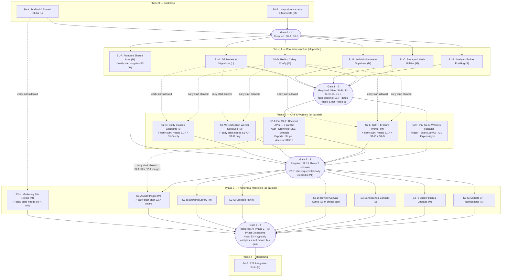

```mermaid
graph TD

subgraph P0["Phase 0 — Bootstrap"]
  S0A["S0-A: Scaffold & Shared Stubs (L)"]
  S0B["S0-B: Integration Harness & Manifests (M)"]
end

GATE01(["Gate 0→1\nRequired: S0-A, S0-B"])

subgraph P1["Phase 1 — Core Infrastructure (all parallel)"]
  S1A["S1-A: DB Models & Migrations (L)"]
  S1B["S1-B: Auth Middleware & Supabase (M)"]
  S1C["S1-C: Storage & Hash Utilities (M)"]
  S1D["S1-D: Redis / Celery Config (M)"]
  S1E["S1-E: Analytics Emitter PostHog (S)"]
  S1F["S1-F: Frontend Shared Infra (M)\n⚡ early start — gates P3 only"]
end

GATE12(["Gate 1→2\nRequired: S1-A, S1-B, S1-C, S1-D, S1-E\nNon-blocking: S1-F (gates Phase 3, not Phase 2)"])

subgraph P2["Phase 2 — APIs & Workers (all parallel)"]
  S2G["S2-G: Entity Classes Endpoints (S)\n⚡ early start: needs S1-A + S1-D only"]
  S2M["S2-M: Notification Worker SendGrid (M)\n⚡ early start: needs S1-A + S1-D only"]
  S2L["S2-L: GDPR Erasure Worker (M)\n⚡ early start: needs S1-A + S1-C + S1-D"]
  S2_APIS["S2-A thru S2-F: Backend APIs — 6 parallel\nAuth · Drawings+SSE · Symbols\nExports · Stripe · Account+GDPR"]
  S2_WORKERS["S2-H thru S2-K: Workers — 4 parallel\nIngest · Scan/ClamAV · ML · Export-Async"]
end

GATE23(["Gate 2→3\nRequired: All 13 Phase 2 sessions\nS1-F also required (already cleared in P1)"])

subgraph P3["Phase 3 — Frontend & Marketing (all parallel)"]
  S3H["S3-H: Marketing Site Next.js (M)\n⚡ early start: needs S0-A only"]
  S3A["S3-A: Auth Pages (M)\n⚡ early start after S2-A clears"]
  S3B["S3-B: Drawing Library (M)"]
  S3C["S3-C: Upload Flow (M)"]
  S3D["S3-D: Review Canvas Konva (L) ★ critical path"]
  S3E["S3-E: Account & Consent (S)"]
  S3F["S3-F: Subscription & Upgrade (M)"]
  S3G["S3-G: Exports UI + Notifications (M)"]
end

GATE34(["Gate 3→4\nRequired: All Phase 2 + All Phase 3 sessions\nNote: S3-H typically completes well before this gate"])

subgraph P4["Phase 4 — Hardening"]
  S4A["S4-A: E2E Integration Tests (L)"]
end

%% Phase 0 → Gate 0→1
S0A --> GATE01
S0B --> GATE01

%% Gate 0→1 → Phase 1
GATE01 --> S1A
GATE01 --> S1B
GATE01 --> S1C
GATE01 --> S1D
GATE01 --> S1E
GATE01 --> S1F

%% Early start: S3-H from S0-A
S0A -.->|"early start allowed"| S3H

%% Phase 1 → Gate 1→2 (S1-F non-blocking for P2)
S1A --> GATE12
S1B --> GATE12
S1C --> GATE12
S1D --> GATE12
S1E --> GATE12

%% Early starts into Phase 2 (before GATE12 fully clears)
S1A -.->|"early start allowed"| S2G
S1D -.->|"early start allowed"| S2G
S1A -.->|"early start allowed"| S2M
S1D -.->|"early start allowed"| S2M
S1A -.->|"early start allowed"| S2L
S1C -.->|"early start allowed"| S2L
S1D -.->|"early start allowed"| S2L

%% Gate 1→2 → Phase 2 (standard path)
GATE12 --> S2_APIS
GATE12 --> S2_WORKERS

%% S1-F gates Phase 3 (feeds Gate 2→3)
S1F --> GATE23

%% Phase 2 → Gate 2→3
S2G --> GATE23
S2M --> GATE23
S2L --> GATE23
S2_APIS --> GATE23
S2_WORKERS --> GATE23

%% Early start: S3-A can begin as soon as S2-A clears
S2_APIS -.->|"early start allowed\nS3-A after S2-A merges"| S3A

%% Gate 2→3 → Phase 3
GATE23 --> S3A
GATE23 --> S3B
GATE23 --> S3C
GATE23 --> S3D
GATE23 --> S3E
GATE23 --> S3F
GATE23 --> S3G

%% Phase 3 → Gate 3→4
S3H --> GATE34
S3A --> GATE34
S3B --> GATE34
S3C --> GATE34
S3D --> GATE34
S3E --> GATE34
S3F --> GATE34
S3G --> GATE34

%% Gate 3→4 → Phase 4
GATE34 --> S4A
```