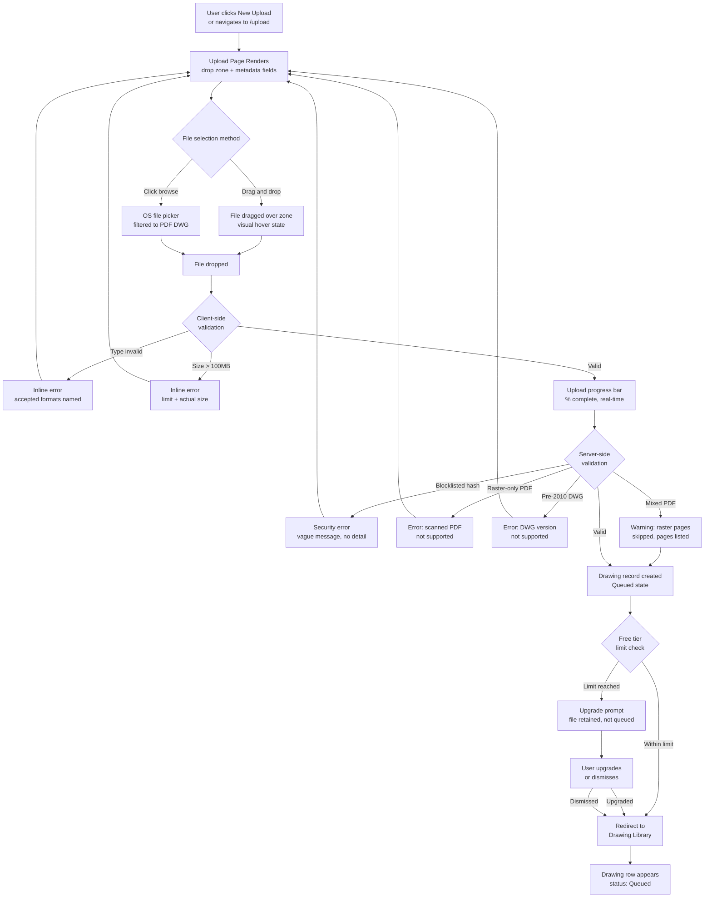
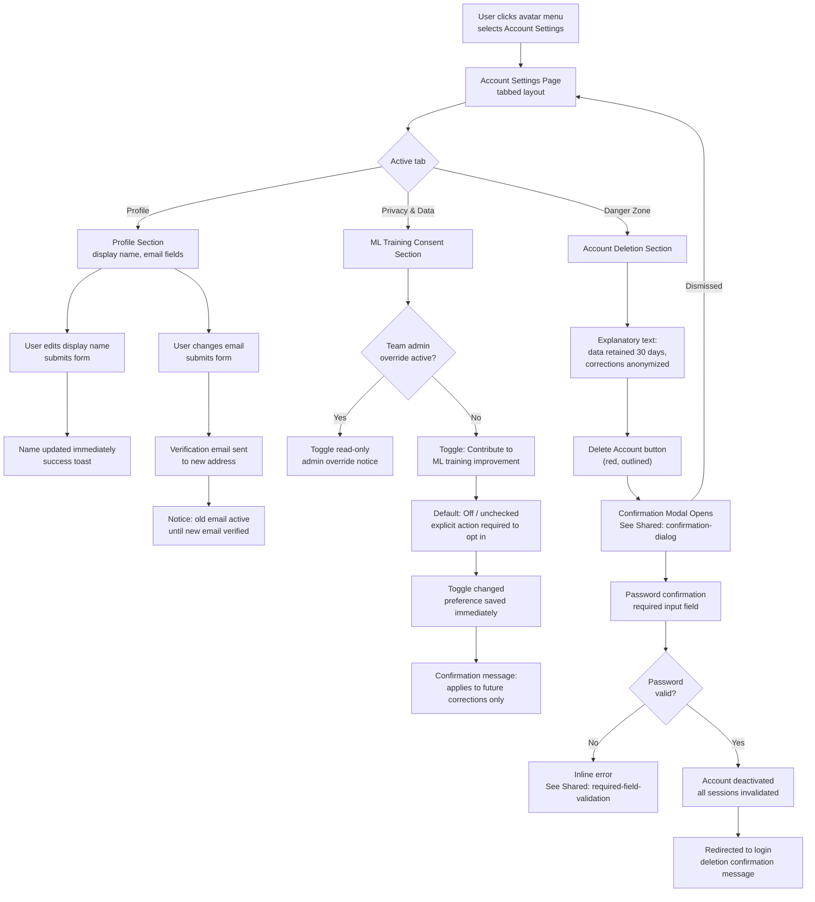

# Epic 1: Secure File Upload, Auth & Account Compliance — Implementation Context

> **Stories**: US-001 through US-005
> **Token budget**: ~15K tokens (leave ~160K for codebase + conversation)
> **Shared context**: Load `shared-context.md` from this directory for tech stack, database schema, API patterns, and cross-cutting requirements.

## Instructions for Claude Code

You are building this epic under human supervision. The human approves plans and resolves ambiguities — you write all the code.

1. **Load shared context** — Load `shared-context.md` from this directory for tech stack, database schema, API patterns, and cross-cutting requirements.
2. **Confirm the story** — Check the CURRENT STORY marker below. Ask: "The active story is [US-XXX: Title] — correct, or switch?" Wait for confirmation.
3. **Plan first** — Read acceptance criteria + related architecture/UX sections. Present 2-3 implementation approaches with trade-offs. Write a detailed plan (files, functions, data flow, how each AC is satisfied). Flag any spec ambiguities for the human to resolve.
4. **Wait for approval** — Do not write code until the human says "go", "approved", or "proceed".
5. **Implement** — Write production-quality code satisfying every Given/When/Then scenario in the acceptance criteria. Run tests after each story.
6. **Stay in scope** — Implement ONLY the current story. Other stories in this file are context only — do not implement them.

## CURRENT STORY: US-001
> Change this marker when switching to a different story.

---

# Stories in This Epic

## US-001: Register account and verify email (Medium) ← ACTIVE

#### US-001: Register account and verify email
**Epic**: Secure File Upload, Auth & Account Compliance
**Priority**: Must-have
**Complexity**: Medium

**User Story**:
As Priya, an Instrumentation Engineer,
I want to register for an account using my email and password and verify my email address,
So that my drawings and extraction data are securely attributed to my identity and I can begin uploading P&ID files.

**Acceptance Criteria**:
- **Scenario 1 (Happy Path — Successful Registration)**:
  - Given I am an unauthenticated visitor on the registration page
  - When I submit a valid email address, a password meeting complexity requirements, and my display name
  - Then my account is created in an unverified state, a verification email is sent to the provided address, and the page displays a confirmation message instructing me to check my email before I can upload drawings

- **Scenario 2 (Email Verification Completes Registration)**:
  - Given I have registered and received a verification email containing a unique time-limited link
  - When I click the verification link within its valid window
  - Then my account is marked as verified, I am redirected to the application dashboard, and I am permitted to upload my first drawing

- **Scenario 3 (Duplicate Email Rejected)**:
  - Given an account already exists for a given email address
  - When I attempt to register using that same email address
  - Then the form displays an error stating that an account with this email already exists, and no new account is created

- **Scenario 4 (Upload Blocked Until Verified)**:
  - Given I have registered but have not yet clicked the verification link
  - When I attempt to upload a drawing
  - Then the system blocks the upload and displays a message stating that email verification is required, with an option to resend the verification email

- **Scenario 5 (Expired Verification Link)**:
  - Given I have registered and my verification email link has expired
  - When I click the expired link
  - Then the page displays an error stating the link has expired and offers a resend option that generates a new valid verification link

**Technical Notes**:
- Password complexity requirements (minimum length, character classes) should be defined by the Architecture Agent and enforced consistently on both client and server.
- Verification link expiry window should be defined by the Architecture Agent; the resend flow must invalidate any previously issued unclicked verification tokens for the same account.
- The unverified account state must be represented in the data model so the upload gate in FR-1 can query it.

**Related Requirements**: FR-5

**Dependencies**: None

---

## US-002: Log in via email/password and Google OAuth with account linking (Medium)

#### US-002: Log in via email/password and Google OAuth with account linking
**Epic**: Secure File Upload, Auth & Account Compliance
**Priority**: Must-have
**Complexity**: Medium

**User Story**:
As Priya, an Instrumentation Engineer,
I want to log in with my email and password or via my Google account, with clear handling when both methods share the same email,
So that I can access my drawing library securely without being locked out or silently assigned a duplicate account.

**Acceptance Criteria**:
- **Scenario 1 (Happy Path — Email/Password Login)**:
  - Given I am a verified, registered user on the login page
  - When I submit my correct email address and password
  - Then I am authenticated, a session is created, and I am redirected to my drawing library dashboard

- **Scenario 2 (Happy Path — Google OAuth Login for New Account)**:
  - Given I have no existing account and I choose to log in with Google
  - When I complete Google OAuth consent and Google returns a verified email address
  - Then a new verified account is created using the Google-provided email, I am authenticated, and I am redirected to the drawing library dashboard

- **Scenario 3 (Account Linking Prompt — OAuth Email Matches Existing Password Account)**:
  - Given I have an existing password-registered account for a given email address
  - When I attempt to log in via Google OAuth using that same email address
  - Then the system does not create a duplicate account or silently merge, and instead presents a prompt explaining that an account with this email already exists and asking me to confirm account linking by authenticating with my existing password

- **Scenario 4 (Brute-Force Lockout)**:
  - Given I am on the login page and have submitted incorrect credentials 5 consecutive times for a given email
  - When I attempt a 6th login within the 15-minute lockout window
  - Then the login is rejected, the UI displays a message stating the account is temporarily locked and indicates when I may try again, and no further attempts are processed until the lockout expires

- **Scenario 5 (Session Expiry Redirect)**:
  - Given I am an authenticated user whose session has been inactive for 8 hours
  - When I attempt to navigate to any authenticated page
  - Then my session is invalidated, I am redirected to the login page, and the page displays a session-expiry notification

**Technical Notes**:
- The 5-minute pre-expiry warning modal referenced in NFR-18 is a session management UX behavior; the Architecture Agent should implement the server-side inactivity timer that feeds the frontend countdown.
- Account linking must be implemented as an explicit confirmation flow — never as an automatic silent merge — to prevent account takeover via OAuth.
- Lockout state (attempt count, lockout timestamp) must persist server-side; client-side-only enforcement is insufficient.
- Google OAuth integration requires a registered OAuth client with the Google Cloud Console; this is an Architecture concern.

**Related Requirements**: FR-5

**Dependencies**: US-001

---

## US-003: Upload PDF or DWG file with format, size, and raster validation (Large)

#### US-003: Upload PDF or DWG file with format, size, and raster validation
**Epic**: Secure File Upload, Auth & Account Compliance
**Priority**: Must-have
**Complexity**: Large

**User Story**:
As Priya, an Instrumentation Engineer,
I want to upload my P&ID drawing file via drag-and-drop or a file browser picker with immediate feedback on whether the file is accepted,
So that I know my drawing has been received and queued for processing without switching to another application to verify format compatibility.

**Acceptance Criteria**:
- **Scenario 1 (Happy Path — Valid PDF Upload)**:
  - Given I am an authenticated, verified user on the drawing upload surface
  - When I drag and drop a PDF file that is ≤ 100MB and contains vector geometry
  - Then a real-time upload progress indicator is displayed, and upon server acknowledgment a unique Drawing record is created, associated with my account, placed in `Queued` state, and the drawing appears in my library with status `Queued`

- **Scenario 2 (Happy Path — Valid DWG Upload via File Browser)**:
  - Given I am an authenticated, verified user
  - When I use the file browser picker to select an AutoCAD DWG file (versions 2010–2024) that is ≤ 100MB
  - Then the same upload progress and Drawing record creation behavior occurs as Scenario 1, with the drawing entering `Queued` state in my library

- **Scenario 3 (File Size Limit Exceeded)**:
  - Given I attempt to upload a file larger than 100MB
  - When the file is submitted via drag-and-drop or file browser
  - Then the upload is rejected before the file is transferred in full, and the page displays an error message specifying the 100MB limit and the actual file size

- **Scenario 4 (Unsupported File Type Rejected)**:
  - Given I attempt to upload a file that is neither a PDF nor a DWG (e.g., a JPEG, DOCX, or DXF)
  - When the file is submitted
  - Then the upload is rejected and the page displays an error naming the accepted formats (PDF and DWG)

- **Scenario 5 (Raster-Only PDF Rejected; Mixed PDF Partially Accepted)**:
  - Given I upload a PDF that contains only raster (scanned) pages with no vector geometry
  - When the system processes the upload
  - Then the Drawing record enters a terminal error state and the library displays a descriptive error explaining that scanned PDFs without vector geometry are not supported; if instead the PDF contains a mix of vector and raster pages, the Drawing record is created, raster pages are skipped, and I am notified in the library view of which page numbers were excluded

- **Scenario 6 (Blocklisted File Hash Rejected)**:
  - Given a file whose SHA-256 hash matches an entry in the FileHashBlocklist
  - When I attempt to upload that file
  - Then the upload is rejected with a security error message that does not reveal the reason is malware-related, and no file data is written to object storage

- **Scenario 7 (Pre-2010 DWG Version Rejected)**:
  - Given I attempt to upload a DWG file created in AutoCAD version 2009 or earlier
  - When the file is submitted via drag-and-drop or file browser
  - Then the upload is rejected before the Drawing record is created, and the page displays an error message stating that only DWG files from AutoCAD 2010–2024 are supported, naming the detected version where determinable

**Technical Notes**:
- SHA-256 hash computation (FR-17) must occur before the file is written to object storage; the blocklist check must be the first server-side gate after authentication and size/type validation.
- Raster-vs-vector detection for PDFs requires server-side parsing; the Architecture Agent should determine the appropriate library (e.g., pdfminer, PyMuPDF) and define the vector geometry threshold.
- DWG version detection (to reject pre-2010 files, Scenario 7) must be implemented server-side; the client-side picker must not be the sole enforcement point.
- Upload progress visibility requires a chunked or multipart upload mechanism; the Architecture Agent should define the upload protocol.

**Related Requirements**: FR-1, FR-17

**Dependencies**: US-001, US-002

---

## US-004: Manage ML Training Consent and Configure Account Settings (Small)

#### US-004: Manage ML Training Consent and Configure Account Settings
**Epic**: Secure File Upload, Auth & Account Compliance
**Priority**: Must-have
**Complexity**: Small

**User Story**:
As Priya, an Instrumentation Engineer,
I want to explicitly choose whether my correction actions contribute to ML model training,
So that I retain control over how my proprietary drawing data is used.

As Priya, an Instrumentation Engineer,
I also want to update my display name and email address from account settings,
So that my account details remain accurate and attributable to me.

**Acceptance Criteria**:
- **Scenario 1 (Happy Path — Opt-In Consent Prompt at Registration and First Upload)**:
  - Given I am completing registration or uploading my first drawing
  - When the ML training consent prompt is presented
  - Then the prompt clearly states that drawing geometry and correction labels (not raw drawing files) are used for training, the default selection is opted-out, and I must take an explicit action to opt in; my preference is saved to my account immediately upon selection

- **Scenario 2 (Changing Consent Preference from Account Settings)**:
  - Given I am an authenticated user on the account settings page
  - When I toggle my ML training data contribution preference from opted-out to opted-in (or vice versa)
  - Then the new preference is saved immediately and applies to all correction actions I perform from that point forward; existing correction records are not retroactively altered

- **Scenario 3 (Opted-Out Corrections Excluded from Training Pipeline)**:
  - Given my training consent preference is set to opted-out
  - When I perform correction actions on a drawing (reclassify, reject, or manually add a symbol)
  - Then the correction is saved and visible in my review canvas, but the correction record is flagged as excluded from the ML training pipeline

- **Scenario 4 (Update Display Name and Email)**:
  - Given I am an authenticated user on the account settings page
  - When I submit a new display name or a new email address
  - Then my display name is updated immediately; if I changed my email address, a verification email is sent to the new address and the old email remains active until the new one is verified

- **Scenario 5 (Team Admin Consent Override — Conditional)**:
  - Given I am a member of a Team where the Team Admin has set a team-level training consent preference
  - When I navigate to my account settings ML consent section
  - Then the setting is displayed as read-only with a message indicating it is controlled by my Team Admin, and I cannot override it

**Technical Notes**:
- The `MLTrainingConsent` entity must store the opt-in/opt-out state and timestamp; the `UserCorrection` entity must capture the `training_consent` flag at the time of creation (not at the time of pipeline execution) so that retroactive consent changes do not alter historical records.
- Team-level consent (Scenario 5) requires that the correction pipeline checks the team's consent state when a user belongs to a team, overriding the individual user's preference. **Scenario 5 is conditionally active only when the Team Workspace (Epic 5, US-023/US-024) is present in the sprint scope; if Epic 5 is excluded, Scenario 5 should be deferred to US-023.**
- Email change flow must follow the same verification pattern as registration (US-001) to prevent account hijacking via unverified email updates.

**Related Requirements**: FR-5, FR-13

**Dependencies**: US-001, US-002

---

## US-005: Delete account and trigger GDPR erasure pipeline (Medium)

#### US-005: Delete account and trigger GDPR erasure pipeline
**Epic**: Secure File Upload, Auth & Account Compliance
**Priority**: Must-have
**Complexity**: Medium

**User Story**:
As Priya, an Instrumentation Engineer,
I want to permanently delete my account from account settings with a clear confirmation step,
So that my personal data is removed in compliance with GDPR's right-to-erasure and I retain confidence that my proprietary drawing data is not retained after I leave.

**Acceptance Criteria**:
- **Scenario 1 (Happy Path — Account Deletion Initiated)**:
  - Given I am an authenticated user on the account settings page
  - When I initiate account deletion and confirm by entering my password
  - Then my account is immediately deactivated (all active sessions are invalidated and I am redirected to the login page with a confirmation message), and an automated erasure job is scheduled to complete within 30 days

- **Scenario 2 (PII Purged Within 30 Days)**:
  - Given my account deletion has been initiated
  - When the scheduled erasure job executes within 30 days
  - Then my email address, display name, and password hash are permanently deleted from the system and cannot be recovered or queried

- **Scenario 3 (UserCorrection Records Anonymized, Not Deleted)**:
  - Given my account deletion has been initiated and I have UserCorrection records from opted-in training sessions
  - When the erasure job executes
  - Then my user ID on all UserCorrection records is replaced with a non-reversible anonymous ID, preserving the training utility of the correction data while removing re-identifiability; no UserCorrection records are deleted

- **Scenario 4 (Personal Drawings Deleted; Team Drawings Retained)**:
  - Given my account deletion has been initiated
  - When the erasure job executes
  - Then drawing files I uploaded outside of any team context are permanently deleted from object storage within 30 days; drawings I uploaded to a team library are retained under team ownership and are not deleted

- **Scenario 5 (Audit Log and Export Records Anonymized)**:
  - Given my account deletion has been initiated
  - When the erasure job executes
  - Then ExportRecord and audit log entries retain the action type and entity IDs but replace my user-identifying fields with the same non-reversible anonymous ID used for UserCorrection records

**Technical Notes**:
- Account deactivation (session invalidation) must be synchronous and immediate; the PII purge, file deletion, and anonymization steps are asynchronous and executed by a scheduled background job within the 30-day window.
- The anonymous ID must be deterministic per deleted user (so all records for one user share the same anonymous ID) but non-reversible; the Architecture Agent should define the hashing or token strategy.
- The erasure job must be idempotent so that re-execution (e.g., after a job failure and retry) does not produce inconsistent anonymization states.
- ExportRecord StoredFiles (generated export files) for personal drawings should also be deleted from object storage as part of the personal drawing deletion step (Scenario 4).

**Related Requirements**: FR-14

**Dependencies**: US-001, US-002, US-003, US-004
### Drawing Library Management & Processing State (Must-have for MVP)
**Requirements Covered**: FR-6, FR-16
**Description**: Provides the persistent drawing workspace engineers return to across sessions. Covers the library list view (status, revision labels, search/filter/pagination), the full processing state machine (Queued → Scanning → Processing → Complete/Failed/Scan_Failed), retry flows for failed jobs, and analytics event instrumentation for all tracked user actions.
**User Stories**: US-006 – US-010

---

# PRD — Functional Requirements

**FR-1: Upload P&ID Drawing File**
- **Description**: Users upload a PDF or AutoCAD DWG file containing a P&ID drawing. Addresses the "Tool Fragmentation Problem" by providing a single entry point regardless of source file format.
- **Priority**: P0
- **Category**: File Ingestion
- **Acceptance Criteria**:
  1. System accepts PDF (single or multi-page) and DWG (AutoCAD 2010–2024 format) file uploads via drag-and-drop or file browser
  2. System rejects files exceeding 100MB with a user-visible error message specifying the limit
  3. System rejects non-PDF, non-DWG file types and displays a descriptive error naming the accepted formats
  4. Upload progress is visible to the user in real time until server acknowledgment is received
  5. System generates a unique Drawing record upon successful upload and associates it with the authenticated user's account
  6. System detects raster-only PDF uploads (no vector geometry) and displays a descriptive error explaining that scanned PDFs are not supported; for multi-page PDFs with mixed vector/raster pages, raster pages are skipped and the user is notified of which pages were excluded
- **Related Learnings / Rationale**: Priya's workflow alternates between client-supplied PDFs and DWG exports; supporting both formats removes a gatekeeping step that would otherwise cause her to abandon the tool.

---

**FR-5: User Authentication & Account Management**
- **Description**: Users register, log in, and manage their accounts with secure session handling. Required to associate drawings, corrections, and export history with individual users and enforce subscription tier limits.
- **Priority**: P0
- **Category**: Authentication
- **Acceptance Criteria**:
  1. Users register with email and password; email verification is required before first upload is permitted
  2. Users log in with email/password; OAuth login via Google is supported; if a Google OAuth email matches an existing password-registered account, the system prompts the user to link the accounts rather than creating a duplicate or silently merging
  3. Sessions expire after 8 hours of inactivity and redirect the user to the login page with a session-expiry message
  4. Users can reset their password via a time-limited email link (link expires in 24 hours); all active sessions are invalidated on password reset
  5. Users can update their display name and email address from account settings
  6. After 5 consecutive failed login attempts for a given email, the account is locked for 15 minutes; the user is notified via the login UI
- **Related Learnings / Rationale**: Marcus's document control role requires individual attribution of who uploaded or modified a drawing; session management and account identity are prerequisites for the audit trail needed in his compliance context.

---

**FR-13: ML Training Consent & Data Contribution**
- **Description**: Users and teams explicitly opt in or out of contributing their correction actions as ML training data. Required to satisfy the Section 17 regulatory constraint prohibiting use of customer drawings for model training without consent.
- **Priority**: P0
- **Category**: Compliance
- **Acceptance Criteria**:
  1. During account registration and at first drawing upload, users are presented with an explicit opt-in prompt for ML training data contribution; the default state is opted-out
  2. Users can change their training data contribution preference at any time from account settings; the change applies to all future correction actions immediately
  3. Team Admins can set a team-level training data contribution preference that applies to all team members; individual members cannot override the team-level setting
  4. Correction actions from opted-out users are stored for the user's own review and export but are excluded from all ML training pipelines
  5. The opt-in prompt clearly states that drawing geometry and correction labels (not raw drawing files) are used for training
- **Related Learnings / Rationale**: FR-3 AC-7 records corrections as training feedback; without this FR, all corrections silently violate Section 17's prohibition on using customer data for training without explicit consent.

---

**FR-14: Account Deletion & GDPR Erasure**
- **Description**: Users can permanently delete their account, triggering removal of PII within 30 days and anonymization of retained records that have independent retention value (billing, model training).
- **Priority**: P0
- **Category**: Compliance
- **Acceptance Criteria**:
  1. Account deletion is accessible from account settings and requires password confirmation before executing
  2. On deletion, user PII (email, name, password hash) is purged within 30 days via an automated scheduled job
  3. UserCorrection records attributed to the deleted user are anonymized (user ID replaced with a non-reversible anonymous ID) rather than deleted, preserving training utility while removing re-identifiability; anonymization occurs within 30 days
  4. ExportRecord and audit log entries retain the action and entity IDs but replace user-identifying fields with the anonymous ID
  5. Drawing files uploaded solely by the deleted user (no team context) are permanently deleted from object storage within 30 days; drawings in a team library are retained under team ownership
- **Related Learnings / Rationale**: NFR-10 mandates GDPR right-to-erasure; UserCorrections retained 5 years for training value must be anonymized rather than deleted to satisfy both the retention policy and erasure right simultaneously.

---

**FR-17: Security File Hash Blocklist**
- **Description**: The system maintains a blocklist of quarantined file hashes and permanently rejects re-uploads of any file matching a blocked hash.
- **Priority**: P0
- **Category**: Security
- **Acceptance Criteria**:
  1. On `Scan_Failed`, the SHA-256 hash of the rejected file is recorded in a persistent blocklist
  2. At upload time, the system computes the SHA-256 hash of the incoming file and rejects it with a security error if the hash matches any blocklist entry, before the file is written to object storage
  3. The rejection message does not expose the reason (malware detection) or blocklist contents to the user
  4. Blocklist entries are permanent and cannot be removed via the user interface
- **Related Learnings / Rationale**: Section 9 prohibits retry for Scan_Failed drawings but no mechanism prevents re-upload of the identical file under a different filename.

---

### P1 — Should Have for v1.0

# Architecture

## 6. Security & Compliance Architecture

**Authentication Flow**: Supabase Auth issues RS256 JWTs. Google OAuth account-linking requires password confirmation before merging OAuth identity to existing account. Brute-force: 5 failed attempts → 15-minute server-side lockout (stored in Redis with TTL). Password reset invalidates all active sessions via Supabase Auth `admin.signOut(userId)` and updates `USER.token_invalidated_at`; middleware rejects any token with `iat` before this timestamp.

**Authorization Model**: RBAC with three roles — `user` (personal library), `team_member` (shared library read + upload), `team_admin` (shared library full control + billing). Role evaluated server-side on every request; never derived from JWT claims alone.

**Data Encryption**:
- At rest: AES-256 via S3 SSE-S3 or SSE-KMS; PostgreSQL encrypted EBS volumes.
- In transit: TLS 1.3 required for all external connections; TLS 1.2 minimum for legacy clients.
- DWG parsing sandbox: isolated Docker container with no network egress, read-only filesystem except for temp output directory; process runs as non-root user.

**Security Boundaries**:
- Object storage: never publicly accessible; all access via pre-signed URLs with 15-minute expiry.
- Blocklist enforcement: `POST /drawings/hash-check` gates pre-signed URL issuance; no blocked file hash is ever admitted to the S3 upload flow. Ingest Worker performs a second-pass server-side hash verification post-storage as a defense-in-depth check.
- ML worker: reads from S3 via IAM role; no internet egress; writes results only to PostgreSQL.
- Stripe webhooks: verified via `Stripe-Signature` header before any state mutation.

**GDPR Compliance**:
- EU region default (Frankfurt `eu-central-1`); US region optional (Virginia `us-east-1`).
- Right-to-erasure: 30-day async job; HMAC-based deterministic anonymous ID (`HMAC-SHA256(user_id || server_secret)`); anonymous ID persisted to `USER.anonymous_id` on first job execution and reused on retry, ensuring cross-table consistency.
- UserCorrections anonymized not deleted; training utility preserved post-deletion.
- DPA available for Team tier; consent captured at registration with opt-out default.
- Audit logs append-only; retained 2 years; anonymized on user deletion.

**OWASP Top 10 Mitigations**:
- Injection: SQLAlchemy ORM parameterized queries; no raw SQL construction from user input.
- Broken Access Control: server-side ownership check on every drawing/symbol/table-cell endpoint; team role enforcement in middleware.
- IDOR: all resource IDs are UUIDs; ownership validated before response.
- File Upload: type validation + malware scan + two-gate blocklist check (pre-URL + post-storage verification) before processing; DWG parsed in sandbox.
- Sensitive Data Exposure: PII fields encrypted at column level for email in audit logs; pre-signed URLs short-TTL.

---

## 8. AI & Emerging Tech Assessment

**Proven Capabilities** (safe to commit):
- Vector symbol detection via CNN-based object detection (YOLO-variant or DETR) on P&ID line drawings — well-established in engineering document processing literature.
- Table region detection via layout analysis models (LayoutLM, rule-based geometric detection).
- Confidence score output — native to all object detection frameworks.

**R&D / Risk Items**:
- ≥85% F1 on diverse real-world P&IDs — validated only post-training; must be confirmed by pre-launch experiment (Section 13 of PRD).
- DWG-to-vector fidelity via ODA File Converter — success rate on complex drawings unknown; 50-file prototype required.

**ML Inference Cost Shape**:
- GPU inference: the dominant cost driver. Each A1 drawing consumes 2–8 GPU-minutes on a G4dn instance. At 20 concurrent jobs (NFR-2), minimum 2–3 GPU instances needed at peak. Cost scales directly with processing volume.
- Token costs: N/A — no LLM APIs; all inference is self-hosted model serving.

**Human-in-the-Loop**:
- FR-3 correction canvas is the primary validation layer; every export reflects human-reviewed state.
- Confidence score surfaced per symbol — David's safety use case requires ability to sort/filter by low-confidence detections as a Phase 2 enhancement.
- Fallback if ML service is unavailable: drawing transitions to `Failed` state with retry option; no silent partial results.
- Table cell corrections (FR-7, US-022) feed the same training consent pipeline as symbol corrections, via the `TABLE_CELL.correction_training_consent` field.

**Training Data Flywheel**:
- `UserCorrection` records with `training_consent = true` feed a separate offline training pipeline (not in MVP scope).
- Anonymization preserves training utility post-user-deletion — architecture supports this from day one.
- Model versioning: ML worker loads model from S3 artifact store; version pinned in worker config; new model versions deployable without API downtime.

---

## 12. Design Decisions & Open Questions

**12a. Design Decisions Made**:

- **Pre-Storage Blocklist Enforcement via Client Hash Pre-Check**: FR-17 AC-2 requires that no blocked file byte reaches storage. The pre-signed S3 URL flow cannot interpose on the byte stream between browser and S3, so the hash gate must occur before the URL is issued. Decision: client computes SHA-256 before upload; `POST /drawings/hash-check` validates against `FILE_HASH_BLOCKLIST` and is a mandatory precondition for receiving a pre-signed URL. A second server-side verification by the Ingest Worker defends against client-side hash tampering and newly-added blocklist entries. Trade-off: requires client-side SHA-256 computation (browser SubtleCrypto API), which adds latency for large files; a pre-engineering spike validates this UX impact.

- **Upload-Complete Idempotency**: Network retries on `POST /drawings/{id}/upload-complete` must not produce duplicate ingest jobs. Decision: endpoint checks the Drawing's current `processing_state`; if already `Queued` or later, returns `200` without re-enqueuing. Trade-off: adds a DB read on every call; cost is negligible given the low frequency of this endpoint.

- **TABLE_CELL as a First-Class Entity**: FR-7 table extraction and US-022 cell editing require persistent, correctable table data. Decision: `TABLE_CELL` is a distinct entity with FK to `DRAWING`, `bbox`, `extracted_value`, `corrected_value`, and `correction_training_consent`. `USER_CORRECTION` gains a nullable `table_cell_id` FK to record cell-level corrections uniformly. Trade-off: adds a join for exports that include both symbol and table data, but keeps the correction audit trail unified.

- **Correction History Pre-Loaded with Symbol Fetch**: The canvas panel open must complete within 200ms (NFR-19). A separate server round-trip for correction history breaks this target on any non-trivial network latency. Decision: `GET /drawings/{id}/symbols` returns a `corrections_by_symbol_id` map in the same response. Trade-off: increases payload size, but correction history per symbol is small (typically 0–3 records) and the payload is bounded by the per-page symbol limit.

- **Revision Comparison Staleness Tracking**: The `REVISION_COMPARISON` entity stores a `last_correction_at` timestamp that is updated whenever a correction is submitted for either drawing in the comparison. Decision: the `GET /comparisons/{id}` response includes a `stale` boolean derived from `last_correction_at > computed_at`. The UI uses this to warn users that the comparison predates recent corrections. Trade-off: `last_correction_at` requires a lightweight update on every correction write to any drawing involved in a comparison; acceptable overhead.

- **GDPR Anonymous ID Persistence**: Making the erasure anonymous ID deterministic with only `(user_id || server_secret)` and persisting it to `USER.anonymous_id` on first execution ensures retry consistency. Decision: the erasure job reads the persisted `anonymous_id` on all retries; if not yet set, computes and writes it transactionally before touching any related records. Trade-off: if `server_secret` rotates, the stored `anonymous_id` values remain valid because they are persisted — rotation only affects future deletions.

- **Upload Protocol (Client → S3 Direct)**: Client uploads directly to S3 via pre-signed PUT URL; API receives a completion signal. Trade-off: API server is never a file byte proxy, reducing memory pressure, but requires the hash-check pre-step to enforce blocklist before URL issuance.

- **DWG Parsing Sandbox**: Isolated Docker sidecar with no network egress and non-root process for all DWG parsing (NFR-6 explicit requirement). Trade-off: adds container orchestration complexity but eliminates code-execution attack surface from malicious DWG files.

- **SSE vs. WebSocket for Status Push**: Decision: Server-Sent Events (SSE) via Redis pub/sub, with 10-second polling fallback for proxied connections. Trade-off: SSE is unidirectional (sufficient for status push) and simpler to scale than WebSocket connections; polling fallback handles corporate proxy environments common in the engineering target market.

- **Celery on Redis vs. Dedicated Queue (SQS/RabbitMQ)**: Redis already required for caching and SSE pub/sub. Decision: Celery with Redis broker at MVP. Trade-off: Redis becomes a dependency for three concerns (queue, cache, SSE); SQS migration path available at Phase 3 without changing worker code.

**12b. Open Questions**:

- **`Complete → Under_Review` State Transition Trigger**: Does opening the canvas alone trigger `Under_Review`, or does the first correction action? Impact: If canvas-open triggers it, drawings that are opened but not corrected show `Under_Review` in the library, which may confuse Marcus when auditing drawing states.

- **Grace Period Clock Start**: Does the 7-day grace period begin on the first Stripe `invoice.payment_failed` event, or after Stripe has exhausted its own retry schedule (~3–4 days)? Impact: Billing notification scheduling (day 1 and day 6 emails) cannot be finalized without this decision.

- **Tag Label Entry for Manual Annotations**: Can users type a tag label (e.g., "FT-201") when manually adding a symbol (US-014)? The API and schema now support `tag_label` as an optional field; the remaining question is whether the PRD intends this as a required user input or an optional annotation. Impact: affects annotation panel UI design and export schema documentation.

- **Multi-Tenant Correction Conflict Resolution**: When two team members submit conflicting corrections for the same symbol near-simultaneously, which wins? Last-write-wins (timestamp-based) is simplest but may silently discard a correction; explicit conflict detection requires a `version` field on `DETECTED_SYMBOL`. The PRD defers real-time collaboration but does not define a conflict resolution strategy for near-simultaneous writes.

---

# UX Design

## Shared Functional Patterns (this epic)

- **confirmation-dialog**: Destructive actions (delete, account deletion) require a modal confirmation displaying the entity name; two buttons: destructive-red primary + neutral secondary Cancel; no action executes until confirmed

- **required-field-validation**: Field non-empty after trim; red `#EF4444` border + inline error text (`text-sm`, `#EF4444`) below field; on form submit, focus moves to first invalid field; error clears on next valid input

---

## Node 2: File Upload Drop Zone

### User Stories Covered
- US-003: Upload PDF or DWG file with format, size, and raster validation
- US-017: Queue and deliver asynchronous export for large drawings (upload entry point)
- US-018: Enforce Free Tier Processing Limit and Display Upgrade Prompt

### User Flow (Mermaid)

### Interface Blueprint

**Interaction Pattern**: Centered single-task form with progressive disclosure of metadata fields after file selection

**Structure & Regions**:

| Region | Dimensions | Contents |
|---|---|---|
| Page Header | Full-width, 64px | Back arrow to Library; page title "Upload Drawing" |
| Drop Zone | 640px wide, 240px tall, centered | Dashed border `#E5E7EB`; upload cloud icon; headline "Drag PDF or DWG here"; subtext "or browse files · Max 100MB"; hover state: blue border `#3B82F6` + blue tint background |
| File Metadata Fields | 640px wide, below drop zone | Revision label (optional text input); appears only after valid file selected |
| Validation Error Region | 640px wide, below drop zone | Inline error/warning messages; icon + descriptive text; amber for warnings (raster pages skipped), red for errors |
| Upload Progress | Replaces drop zone on upload start | Filename + file size; linear progress bar (blue fill); percentage label; Cancel link |
| Free Tier Counter | Below drop zone, Free users only | "2 of 3 drawings used this month" with amber color at 3/3 |

**Component/Data Placement**:
- Format hint text beneath drop zone always visible: "Accepted: PDF (vector), DWG (AutoCAD 2010–2024)"
- Revision label field: optional, labeled "Revision (optional)", placeholder "e.g. Rev C"
- Cancel upload: text link, terminates transfer and returns to idle drop zone state
- Blocklisted file error: generic "This file could not be uploaded for security reasons" — no mention of malware or blocklist

**Information Hierarchy**:
- Primary: Drop zone (the action)
- Secondary: Validation feedback (outcome)
- Tertiary: Revision label / metadata (contextual enrichment)

### Prototype Placeholder

**File**: `prototype-file-upload.html`

<!-- PROTOTYPE_PLACEHOLDER:file-upload -->

### Implementation Notes

### Interaction Behaviors
- **Drop Zone**: Accepts drag-and-drop of PDF/DWG files; hover state shows blue border + light blue background; dragging-over state adds box shadow; click or drag triggers file selection
- **File Input**: Programmatically triggered via browse link or drop zone click; filtered to `.pdf,.dwg` extensions
- **Client-side Validation**: Type and size checks on file selection; validation errors display inline with icon and descriptive text (red `#EF4444` background)
- **Metadata Section**: Progressive disclosure — appears only after valid file selected; Revision field is optional
- **Upload Progress**: Simulates realistic upload with 300ms interval increments; displays filename, file size, linear progress bar, percentage, and Cancel link
- **Free Tier Limit**: Displays counter banner "2 of 3 drawings processed this month" with reset date; on upload completion, checks limit and shows upgrade modal if reached
- **Upgrade Modal**: Non-blocking overlay showing file info and two CTAs: "Upgrade to Pro" (redirects to subscription page) and "Learn more" (dismisses modal)
- **Toast Notifications**: Stack at top-right; auto-dismiss after 5s; manual close via × button; success (green) and error (red) variants with left-border color indicator
- **Keyboard Navigation**: Escape cancels upload or closes modal; Enter in revision field would submit (ready for form submission pattern); Tab accessible all inputs

### Data Fields & Types
- **File Name**: String, max 255 chars (OS limit), displayed in progress section and modal
- **File Size**: Number (bytes), validated ≤ 100MB (104,857,600 bytes), formatted as "X.X MB"
- **Revision Label**: String, optional, max 32 chars, placeholder "e.g. Rev C", auto-saved with file metadata
- **Upload Progress**: Number 0–100, updated via simulated interval, displayed as percentage and visual bar
- **User Tier**: String (free/pro/team), determines limit enforcement and banner display
- **Drawings Used This Month**: Number, displayed in counter banner (e.g., "2 of 3"), reset on 1st of next month
- **File Type**: Validated extension (`.pdf`, `.dwg`); case-insensitive; MIME type check performed server-side

### Validation Rules
- **required-file-type-validation**: File extension must be `.pdf` or `.dwg` (case-insensitive); error: "Invalid file format. Accepted formats: PDF (vector), DWG (AutoCAD 2010–2024)"
- **required-file-size-validation**: File size ≤ 100MB; error message includes actual size: "File size exceeds 100MB limit. Your file is X.X MB."
- **free-tier-processing-limit**: Free users limited to 3 drawings/month; on reaching limit, upgrade modal displays with current file info; file is retained, not queued, until upgrade or dismissal
- **trim-and-normalize**: Revision label trimmed of leading/trailing whitespace; optional field defaults to empty string if not provided

### State Management
- **appState object**: Tracks `fileSelected`, `fileName`, `fileSize`, `isUploading`, `uploadProgress`, `userTier`, `drawingsUsedThisMonth`, `drawingsLimitThisMonth`, `isFreeTierLimitReached`
- **UI Section Visibility**: Metadata section, progress section, validation error, free tier counter, and upgrade modal controlled via `.visible` CSS class toggled by JavaScript
- **Upload Simulation**: `setInterval` loop increments progress 0–100% over ~3–4 seconds; on completion, server-side validation delay (500ms) simulates network latency
- **Reset Flow**: `resetUploadUI()` clears file input, hides metadata/progress sections, resets fileSelected and isUploading flags; triggered on cancel, successful completion, or validation error

### Ergonomics / Shortcuts
- **Click or Drag**: Both methods activate file picker (unified interaction pattern)
- **Escape Key**: Cancels in-flight upload or closes modal; returns to drop zone idle state
- **Enter Key**: In revision field, would trigger form submission (ready for form-submit handler if needed)
- **Tab Key**: Navigates through all interactive elements (file input, browse link, revision input, buttons) in logical order

### Visual / Response Specifications
- **Transitions / Latency**: 
  - Drop zone hover: 200ms smooth border/background color transition
  - Progress bar: 300ms linear width animation
  - Modal slide-in: CSS animation (not implemented in prototype but ready for Tailwind/CSS addition)
  - Toast slide-in: 300ms ease-out from right edge
  - File upload simulation: 300ms interval loop for realistic ~3–4 second total duration
- **Design Specifics**:
  - Drop zone idle: `#E5E7EB` dashed border (2px), white background, 240px min-height, center-aligned content
  - Drop zone hover: `#3B82F6` dashed border, `#F0F9FF` background
  - Dragging-over state: `#3B82F6` dashed border, `#EFF6FF` background, 3px outer glow (`rgba(59, 130, 246, 0.1)`)
  - Error message: Red `#FEE2E2` background, `#FECACA` border, `#991B1B` text
  - Free tier counter: Amber `#FEF3C7` background, `#FCD34D` border, `#92400E` text
  - Progress bar: Blue fill `#3B82F6` over gray `#E5E7EB` background
  - Modal: 480px max-width, centered, white background, shadow, 32px padding
  - Toasts: 320px max-width, 4px left border matching status color, 14px font, auto-dismiss 5s
- **States**:
  - Idle: Drop zone with cloud icon and placeholder text
  - File Selected: Metadata section appears, revision field visible
  - Uploading: Progress section replaces drop zone; real-time % display and cancel affordance
  - Upload Complete (Success): Toast notification; redirect to library after 1.5s
  - Upload Complete (Free Limit Reached): Upgrade modal displays; file retained; modal has two dismiss paths
  - Error: Inline validation error with red styling; drop zone returns to idle on error

> **Scope for this epic**: Implement only US-003 on this screen. Features for US-017, US-018 belong to other epics — do not implement them here.

**Prototype File**: `prototypes/prototype-file-upload.html` — read this file on demand for the full HTML prototype.

---

## Node 6: Account Settings

### User Stories Covered
- US-004: Manage ML Training Consent and Configure Account Settings
- US-005: Delete account and trigger GDPR erasure pipeline

### User Flow (Mermaid)

### Interface Blueprint

**Interaction Pattern**: Single-page settings with left tab navigation; sections separated by horizontal rules

**Structure & Regions**:

| Region | Dimensions | Contents |
|---|---|---|
| Page Header | Full-width, 64px | "Account Settings" heading; breadcrumb: Home > Settings |
| Left Tab Nav | 200px wide, full-height | Tabs: Profile · Privacy & Data · Danger Zone; active tab left border indicator |
| Content Area | Remaining width, padded 40px | Section content per selected tab |
| Profile Section | Auto height | Display name field + Save; Email field + Save (triggers verification flow notice) |
| Privacy & Data Section | Auto height | ML training consent toggle with explanatory label; team-override state shown as read-only with admin notice |
| Danger Zone Section | Auto height | Red-tinted background `#FEF2F2`; deletion description; "Delete Account" red outlined button |
| Password Confirmation Modal | 480px wide modal | "Confirm account deletion" heading; password input; Delete (red primary) + Cancel |

**Component/Data Placement**:
- ML consent toggle: two-state switch with label "Contribute correction data to ML model improvement"; description below: "Drawing geometry and correction labels — not raw files — may be used for training"
- **Opted-out state (default)**: toggle gray, label "Not contributing" — this is the initial rendered state for all new and existing users per FR-13 AC-1; opted-in state: toggle blue, label "Contributing"
- Deletion modal explains: "Your drawings and personal data will be deleted within 30 days. Correction records will be anonymized."
- Team override notice: `#6B7280` italic — "This setting is managed by your Team Admin"

**Information Hierarchy**:
- Primary: Profile fields (most frequent use)
- Secondary: Privacy consent (compliance-critical but infrequent)
- Tertiary: Danger Zone (rare, destructive — visually isolated)

### Prototype Placeholder

**File**: `prototype-account-settings.html`

<!-- PROTOTYPE_PLACEHOLDER:account-settings -->

### Implementation Notes

### Interaction Behaviors
- **Tab Switching**: Clicking a tab link (Profile / Privacy & Data / Danger Zone) removes active class from all sections, shows selected section, highlights active tab with blue left border
- **Display Name Save**: Validates non-empty trimmed input; on error, adds red border and shows error text; on success, shows green toast notification (auto-dismisses after 5s)
- **Email Change**: Validates email format (contains @); on success, shows amber verification notice banner and green toast
- **ML Consent Toggle**: Clicking toggle switches between checked/unchecked states; checked state shows blue background and dot positioned right; unchecked (default) shows gray background and dot positioned left; change triggers success toast
- **Admin Override**: When team admin override is active, toggle becomes non-interactive (pointer-events: none, opacity 0.6) and admin notice displays below toggle
- **Delete Account Initiation**: Clicking "Delete Account" button opens modal; password input auto-focuses
- **Delete Confirmation Modal**: Password field required; on empty submit, shows inline error; on valid password, closes modal and shows success toast
- **Modal Dismissal**: Cancel button or Esc key closes modal without action; password field clears on close

### Data Fields & Types
- **Display Name**: String, max 256 chars, trimmed before save, default "Marcus Chen"
- **Email Address**: String, email format validated (@ required), default "marcus.chen@acmecorp.com"
- **ML Consent Toggle**: Boolean, **default unchecked/false (opted-out) per FR-13 AC-1 and GDPR requirement**, checked = contributing, unchecked = private
- **Delete Password**: String, required field, password input type (masked display)
- **Admin Override Active**: Boolean, controls toggle read-only state and notice display

### Validation Rules
- **Display Name**: Non-empty after trim; error text "Display name cannot be empty" shown below field
- **Email Address**: Must contain @ symbol; error text "Please enter a valid email address" shown below field
- **Delete Password**: Required non-empty field; error text "Password is required" shown below input when empty; focus moves to password field when modal opens
- **Toggle interactions**: Admin override makes toggle non-interactive; no validation required for toggle state change itself

### State Management
- **Active Tab**: Stored via .active class on tab link and section element; switches on click via data-tab attribute matching; defaults to Profile tab on load
- **ML Consent State**: Tracked by .checked class on toggle-switch element; **default is unchecked/false (opted-out) per FR-13 AC-1**; no localStorage persistence (form-scoped only)
- **Modal Visibility**: Delete modal controlled by .show class on modal-overlay; password field clears and error state resets on close
- **Form Field State**: Input values held in DOM; profile and email fields persist across tab switches; password field clears when modal closes
- **Toast State**: Shown/hidden via .show class; auto-dismisses after 5 seconds or manual close via setTimeout

### Ergonomics / Shortcuts
- **Modal Escape Key**: Pressing Escape while delete modal is open closes modal without action (can be added with keydown listener if needed)
- **Password Field Focus**: Password input receives automatic focus when delete modal opens (improves UX for password entry)
- **Tab Navigation**: All form inputs and buttons keyboard-accessible via Tab key in logical order
- **Enter Key**: Pressing Enter in modal does not auto-submit (button click required per design)

### Visual / Response Specifications
- **Transitions / Latency**: Tab switch is instant (no animation); toggle background color transition 0.2s; toast slide-in animation 0.3s ease; form field focus ring transition 0.15s
- **Design Specifics**: 
  - Active tab: #EFF6FF background with #3B82F6 left border (3px)
  - Toggle switch: Default gray (#D1D5DB) background, checked (#3B82F6); dot transitions left position 0.2s
  - Danger Zone: Light red background (#FEF2F2) with red border (#FBCFE8)
  - Email verification notice: Amber background (#FEF3C7), darker amber text (#92400E)
  - Admin override notice: Light gray background (#F9FAFB), gray italic text (#6B7280)
  - Modal: White background with 32px padding, 480px max-width, centered with 0.5 opacity backdrop
  - Toast: White background with 4px left border, success=green (#10B981), error=red (#EF4444)
- **States**:
  - Form inputs: Default gray border → focus blue border with blue shadow → disabled light gray background
  - Tab links: Hover #F3F4F6 background; active #EFF6FF background with blue left border
  - Buttons: Hover darker color with shadow; disabled opacity 0.5, cursor not-allowed
  - Toggle: Unchecked gray dot left-positioned; checked blue dot right-positioned (22px from left)
  - Password field on error: Red border (#EF4444) with inline red error text
  - **ML Consent Default State**: Toggle rendered unchecked (gray, dot left) — this is the intentional opt-out default per GDPR compliance requirement

**Prototype File**: `prototypes/prototype-account-settings.html` — read this file on demand for the full HTML prototype.

---

# Requirements Needing Clarification

- Tier-gated feature visibility rules (Scenario 5) must be driven by a server-returned feature flag set on session, not hardcoded client-side, to allow tier changes to take effect without a page reload.

**Related Requirements**: FR-9, FR-16

**Dependencies**: US-001, US-002 (authenticated user with active session required to evaluate subscription state); US-019 (upgrade prompt navigates to the upgrade flow introduced by US-019; this story is blocked until US-019 provides a reachable upgrade entry point)

> **Note to Orchestrator**: The suggested fix for US-018 directed the change to US-025 (adding a Free tier access attempt and upgrade CTA scenario consistent with Scenario 5 here). US-018 itself is complete as written; no modification to this story is required. The US-025 author must add the corresponding scenario when that story is written or refined.
---

#### US-019: Upgrade and Downgrade Subscription Tier with Stripe Integration
**Epic**: Structured Data Export & Subscription Billing
**Priority**: Must-have
**Complexity**: Large

**User Story**:
As Marcus, a CAD/Document Control Manager and Team Admin,
I want to upgrade our team's subscription to Pro or Team tier from within the application and downgrade when needed,
So that I can provision the correct access level for my engineering team in time for project milestones without leaving the product to manage billing through an external portal.

> **Persona rationale**: Subscription upgrade and downgrade is a billing-owner action. Marcus is the Team Admin responsible for managing the drawing library and team access; he is the natural owner of billing decisions on behalf of a team. David (Process Safety Engineer) may trigger the upgrade prompt but would escalate billing authority to Marcus or a department manager rather than completing the purchase himself. Individual engineers such as Priya may upgrade personal Pro seats autonomously, but the Team tier seat-count scenario (AC-2) is unambiguously an admin action.

**Acceptance Criteria**:
- `subscription_upgraded` and `subscription_downgraded` analytics events must include: user ID, previous tier, new tier, subscription ID, and timestamp.

**Related Requirements**: FR-9, FR-15, FR-16

**Dependencies**: US-001, US-002 (authenticated user with active session required before subscription state can be read or modified); US-018 (upgrade prompt entry point that routes users to this flow)
---

#### US-020: Handle Stripe payment failure grace period and cancellation webhook events
**Epic**: Structured Data Export & Subscription Billing
**Priority**: Must-have
**Complexity**: Medium

**User Story**:
As David, a Process Safety Engineer,
I want the system to give me time to resolve a failed payment before my access is affected, and to accurately reflect my subscription state when I cancel,
So that a transient billing issue does not interrupt an active HAZOP preparation session and I retain access for the period I have already paid for.

**Acceptance Criteria**:

# Cross-Epic Dependencies

> **Dependencies**: None — this is a foundational epic.

**Provides to**:
- Epic 3 (Team Workspace, Shared Library & Instrument Table Extraction, US-023): FR-13
