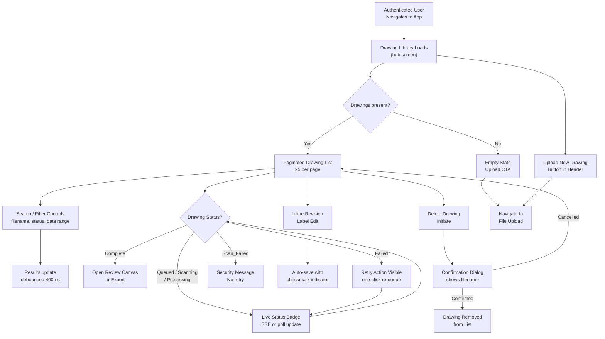

# Epic 2: Drawing Library Management & Processing State — Implementation Context

> **Stories**: US-006 through US-010
> **Token budget**: ~11K tokens (leave ~160K for codebase + conversation)
> **Shared context**: Load `shared-context.md` from this directory for tech stack, database schema, API patterns, and cross-cutting requirements.

## Instructions for Claude Code

You are building this epic under human supervision. The human approves plans and resolves ambiguities — you write all the code.

1. **Load shared context** — Load `shared-context.md` from this directory for tech stack, database schema, API patterns, and cross-cutting requirements.
2. **Confirm the story** — Check the CURRENT STORY marker below. Ask: "The active story is [US-XXX: Title] — correct, or switch?" Wait for confirmation.
3. **Plan first** — Read acceptance criteria + related architecture/UX sections. Present 2-3 implementation approaches with trade-offs. Write a detailed plan (files, functions, data flow, how each AC is satisfied). Flag any spec ambiguities for the human to resolve.
4. **Wait for approval** — Do not write code until the human says "go", "approved", or "proceed".
5. **Implement** — Write production-quality code satisfying every Given/When/Then scenario in the acceptance criteria. Run tests after each story.
6. **Stay in scope** — Implement ONLY the current story. Other stories in this file are context only — do not implement them.

## CURRENT STORY: US-006
> Change this marker when switching to a different story.

---

# Stories in This Epic

## US-006: View Drawing Library with Status, Revision Labels, and Pagination (Medium) ← ACTIVE

#### US-006: View Drawing Library with Status, Revision Labels, and Pagination
**Epic**: Drawing Library Management & Processing State
**Priority**: Must-have
**Complexity**: Medium

**User Story**:
As Marcus, CAD/Document Control Manager,
I want to view all uploaded drawings in a paginated library showing filename, upload date, processing status, and revision label,
So that I can track the state of every drawing in the team's library without switching between folders or external tracking sheets.

**Acceptance Criteria**:
- **Scenario 1 (Happy Path — Library Loads with Drawing Records)**:
  - Given Marcus is authenticated and has uploaded at least one drawing
  - When he navigates to the Drawing Library page
  - Then the page displays a list of drawings, each showing: filename, upload date, processing status badge (Queued / Scanning / Processing / Complete / Failed / Scan_Failed), and revision label (if assigned)

- **Scenario 2 (Pagination)**:
  - Given Marcus has more than 25 drawings in his library
  - When the library page loads
  - Then drawings are displayed in pages of 25, with pagination controls showing current page and total page count; navigating to the next page loads the next 25 records without a full page reload

- **Scenario 3 (Revision Label — Assigned at Upload)**:
  - Given a drawing was uploaded with a revision label of "Rev C"
  - When Marcus views the library
  - Then the drawing row displays "Rev C" in the revision label column

- **Scenario 4 (Revision Label — Assigned After Upload)**:
  - Given a completed drawing has no revision label assigned
  - When Marcus assigns the label "Rev D" inline from the library view
  - Then the label is saved and immediately displayed in the drawing row without a page reload

- **Scenario 5 (Empty State)**:
  - Given Marcus has no drawings uploaded to his library
  - When he navigates to the Drawing Library page
  - Then the page displays an empty state message with a prompt to upload the first drawing

**Technical Notes**:
- Processing status badges must reflect live state; poll or use server-sent events for drawings in transient states (Queued, Scanning, Processing) so status updates without manual page refresh.
- Pagination default of 25 records per page; page size should be configurable server-side to allow future adjustment.
- Revision label inline edit must debounce and persist to server; no separate save button required, but a visible save-confirmation indicator (e.g., checkmark) is expected.

**Related Requirements**: FR-6

**Dependencies**: US-001 (file upload, which creates Drawing records)

---

## US-007: Search and Filter Drawing Library by Filename, Status, and Date Range (Medium)

#### US-007: Search and Filter Drawing Library by Filename, Status, and Date Range
**Epic**: Drawing Library Management & Processing State
**Priority**: Must-have
**Complexity**: Medium

**User Story**:
As Marcus, CAD/Document Control Manager,
I want to search the drawing library by filename and revision label, and filter by processing status and upload date range,
So that I can locate a specific drawing or set of drawings across a large library without scrolling through hundreds of records.

**Acceptance Criteria**:
- **Scenario 1 (Happy Path — Filename Search)**:
  - Given Marcus has drawings with filenames including "FD-100" and "FD-200" in his library
  - When he types "FD-100" into the search field
  - Then the library displays only drawings whose filename or revision label contains "FD-100"; results update as he types with a debounce of no more than 400ms

- **Scenario 2 (Filter by Processing Status)**:
  - Given Marcus has drawings in multiple processing states
  - When he selects "Failed" from the status filter dropdown
  - Then the library displays only drawings with a processing status of "Failed"; all other drawings are hidden from the current view

- **Scenario 3 (Filter by Upload Date Range)**:
  - Given Marcus has drawings uploaded across multiple months
  - When he sets an upload date range of 1 June 2025 to 30 June 2025
  - Then only drawings uploaded within that inclusive date range are displayed

- **Scenario 4 (Combined Search and Filter)**:
  - Given Marcus has applied a filename search of "FD" and a status filter of "Complete"
  - When both are active simultaneously
  - Then the library displays only drawings whose filename or revision label contains "FD" AND whose status is "Complete"; the active filter count is indicated in the UI

- **Scenario 5 (No Results)**:
  - Given Marcus applies a search or filter combination that matches no drawings
  - When the query executes
  - Then the library displays a "No drawings match your search" message; pagination controls are hidden

**Technical Notes**:
- Search is case-insensitive substring match against filename and revision label fields.
- Status filter should support multi-select to allow filtering on more than one status simultaneously.
- Active search/filter state should be preserved in the URL query string so Marcus can bookmark or share a filtered view.

**Related Requirements**: FR-6

**Dependencies**: US-006

---

## US-008: Track Drawing Through Processing State Machine and Surface Terminal States (Large)

#### US-008: Track Drawing Through Processing State Machine and Surface Terminal States
**Epic**: Drawing Library Management & Processing State
**Priority**: Must-have
**Complexity**: Large

**User Story**:
As Priya, Instrumentation Engineer,
I want to see my drawing's processing status update in real time as it moves through each stage — from upload through scanning to ML analysis — and receive clear notifications when processing completes or fails,
So that I know exactly when results are ready to review or when I need to take corrective action, without manually refreshing the page.

**Acceptance Criteria**:
- **Scenario 1 (Happy Path — Full Successful Transition)**:
  - Given Priya has uploaded a valid vector PDF drawing
  - When the system processes the drawing
  - Then the library status badge transitions sequentially through: Queued → Scanning → Processing → Complete; each transition is reflected in the UI without a manual page refresh; on reaching Complete, an in-app notification is displayed indicating the drawing is ready to review

- **Scenario 2 (Scan_Failed Terminal State)**:
  - Given the malware scan service returns a failed result for a drawing
  - When the scan completes
  - Then the drawing status is set to Scan_Failed; the library displays a Scan_Failed badge; the drawing detail surface shows an explanation that the file could not be processed for security reasons without exposing malware scan details or blocklist contents; no retry option is presented

- **Scenario 3 (Processing Failed Terminal State)**:
  - Given ML inference does not complete within 20 minutes or the model returns an error
  - When the timeout or error occurs
  - Then the drawing status is set to Failed; an in-app notification informs Priya that processing could not be completed; a one-click retry action is visible on the drawing record in the library

- **Scenario 4 (Raster-Only PDF Detection)**:
  - Given Priya uploads a PDF that contains only raster images with no vector geometry
  - When the system evaluates the file during Scanning
  - Then the drawing transitions to a terminal rejection state; the UI displays an error message stating that scanned PDFs without vector geometry are not supported; no retry option is presented

**Technical Notes**:
- State transitions must be persisted in the Drawing record before the UI is notified; use server-sent events (SSE) or WebSocket for live status push to the browser; polling is an acceptable fallback with a maximum 10-second interval for drawings in transient states.
- The 20-minute ML inference timeout and 1 automatic retry before marking `Failed` are handled server-side (see Section 8 ML Inference Service spec); the UI only surfaces the terminal `Failed` state after the retry is exhausted.
- Raster page skipping for mixed vector/raster multi-page PDFs (per FR-1 AC-6) is a sub-case of this state machine; skipped pages must be recorded and surfaced in the drawing detail alongside the processing notification.
- The large-drawing symbol-count warning (> 500 symbols) is owned exclusively by US-011 Scenario 4 and is not duplicated here.

**Related Requirements**: FR-6, FR-16
*(Note: FR-2 is a triggering dependency via the ML inference service but is not a requirement covered by this story; FR-6 is the primary requirement and FR-16 governs the `processing_complete` and `processing_failed` events emitted at state transitions.)*

**Dependencies**: US-001 (file upload initiates state machine)

---

## US-009: Retry Failed Processing Job and Delete Drawing with Confirmation (Small)

#### US-009: Retry Failed Processing Job and Delete Drawing with Confirmation
**Epic**: Drawing Library Management & Processing State
**Priority**: Must-have
**Complexity**: Small

**User Story**:
As Priya, Instrumentation Engineer,
I want to retry a failed processing job with a single click and permanently delete drawings I no longer need after confirming my intent,
So that I can recover from transient ML failures without re-uploading files and keep my library uncluttered without risking accidental data loss.

**Acceptance Criteria**:
- **Scenario 1 (Happy Path — Retry Failed Job)**:
  - Given a drawing is in the Failed state (ML inference failure, not Scan_Failed)
  - When Priya clicks the retry action on that drawing record
  - Then the drawing status resets to Queued and re-enters the processing state machine using the existing stored file, without requiring a new file upload; the retry action is no longer visible while the drawing is in a transient state

- **Scenario 2 (Scan_Failed — No Retry Available)**:
  - Given a drawing is in the Scan_Failed state
  - When Priya views the drawing record in the library
  - Then no retry action is displayed; the drawing record shows only the Scan_Failed status and the security explanation message

- **Scenario 3 (Happy Path — Delete Drawing with Confirmation)**:
  - Given Priya has a drawing in any state in her library
  - When she initiates deletion and confirms the action in the confirmation dialog
  - Then the drawing, its associated DetectedSymbols, UserCorrections, and ExportRecords are permanently removed; the drawing no longer appears in the library; the StoredFile in object storage is marked for deletion

- **Scenario 4 (Deletion Cancelled)**:
  - Given Priya initiates deletion of a drawing
  - When she dismisses the confirmation dialog without confirming
  - Then the drawing remains in the library unchanged

- **Scenario 5 (Delete Drawing in Processing State)**:
  - Given a drawing is currently in Queued, Scanning, or Processing state
  - When Priya confirms deletion
  - Then the in-progress job is cancelled server-side and the drawing and all associated data are deleted; a brief status message confirms the cancellation and deletion were successful

**Technical Notes**:
- Retry must re-use the existing `StoredFile` reference; no new file is written to object storage on retry.
- Deletion of a drawing in a team context is subject to role restriction (Team Admins only per FR-10 AC-3); this story covers personal library deletion; team-library deletion enforcement is handled in the Team Workspace epic.
- The confirmation dialog must display the drawing filename so Priya can verify she is deleting the correct record.

**Related Requirements**: FR-6

**Dependencies**: US-006, US-008

---

## US-010: Emit and Deliver Structured Analytics Events for All Tracked User Actions (Medium)

#### US-010: Emit and Deliver Structured Analytics Events for All Tracked User Actions
**Epic**: Drawing Library Management & Processing State
**Priority**: Must-have
**Complexity**: Medium

**User Story**:
As the PID Analyzer platform,
I need all tracked user and system actions to be silently instrumented with structured analytics events,
So that the product team can measure activation, retention, and conversion metrics that reflect real usage and guide product improvements.

**Acceptance Criteria**:
- **Scenario 1 (Happy Path — Named Events Emitted with Required Payload)**:
  - Given a user or system performs any of the following actions: file upload completes, processing completes, processing fails, a correction action is taken, an export is initiated, an export file is downloaded, a free tier limit is reached, a subscription is upgraded, or a subscription is downgraded
  - When each action occurs
  - Then the corresponding named event (`drawing_uploaded`, `processing_complete`, `processing_failed`, `correction_action`, `export_initiated`, `export_downloaded`, `free_limit_reached`, `subscription_upgraded`, `subscription_downgraded`) is emitted with a payload containing: event name, timestamp (UTC), user ID, and the relevant entity ID (drawing ID, export record ID, or subscription ID as applicable)

- **Scenario 2 (Worker-Emitted Events Carry User ID from Job Payload)**:
  - Given a processing job is enqueued for a drawing owned by an authenticated user
  - When the ML worker emits a `processing_complete` or `processing_failed` event upon job completion or failure
  - Then the event payload contains the user ID that was included in the job payload at enqueue time; the worker does not resolve user ID from session context and does not emit the event without a user ID present in the job payload

- **Scenario 3 (Analytics Failure Does Not Block User Action)**:
  - Given the analytics pipeline is unavailable or returns an error
  - When a tracked action occurs
  - Then the action completes successfully and the user receives no error related to analytics; the event emission failure is logged server-side for retry or investigation but does not surface to the user

- **Scenario 4 (Free Limit Reached Event — Correct Trigger Point)**:
  - Given a Free tier user has processed 3 drawings in the current calendar month
  - When they attempt to initiate processing of a 4th drawing
  - Then the `free_limit_reached` event is emitted before the upgrade prompt is displayed; the event payload includes the user ID and subscription ID; the processing job is not queued

**Technical Notes**:
- Event emission must be non-blocking and asynchronous; the user-facing request must not wait on analytics delivery to return a response.
- The user ID must be written into the job payload at enqueue time (by the API layer that has authenticated session context) so that worker processes can include it in emitted events without requiring a database lookup or session access. This is mandatory for `processing_complete` and `processing_failed` events.
- Events originating from server-side transitions (e.g., `processing_complete`, `processing_failed`) are emitted by the backend processing service, not the browser client; ensure the analytics instrumentation layer is available to all backend services, not only the web API.
- A server-side retry queue (e.g., dead-letter queue) is recommended for failed event deliveries to support eventual consistency in the analytics pipeline without surfacing failures to users.
- All nine named events in FR-16 AC-1 must be covered; no subset delivery is acceptable for this story to be considered complete.

**Related Requirements**: FR-16

**Dependencies**: US-006, US-007, US-008, US-009

---

# PRD — Functional Requirements

**FR-6: Drawing Library Management**
- **Description**: Users view, organize, and delete all drawings they have uploaded, including processing status and export history per drawing. Addresses the "Version Confusion Problem" by providing a persistent record of processed drawings.
- **Priority**: P0
- **Category**: Drawing Management
- **Acceptance Criteria**:
  1. Drawing library displays all uploaded drawings with filename, upload date, processing status (Queued / Scanning / Processing / Complete / Failed), and revision tag
  2. User can open any completed drawing to return to the interactive review canvas
  3. User can delete a drawing and its associated extraction data; deletion requires a confirmation step
  4. User can assign a revision label (free-text, e.g., "Rev C") to any drawing at upload time or after processing
  5. Drawing library is paginated and supports search by filename and revision label; users can additionally filter by processing status and upload date range
- **Related Learnings / Rationale**: Marcus manages hundreds of drawing sheets; without a searchable library with revision labels and status/date filters, the tool becomes unusable at scale and he reverts to folder-based file management.

---

**FR-16: Analytics Event Instrumentation**
- **Description**: The system emits structured analytics events for all user actions required to measure the Section 15 success metrics.
- **Priority**: P0
- **Category**: Observability
- **Acceptance Criteria**:
  1. The following named events are emitted with timestamp and user ID on each occurrence: `drawing_uploaded`, `processing_complete`, `processing_failed`, `correction_action`, `export_initiated`, `export_downloaded`, `free_limit_reached`, `subscription_upgraded`, `subscription_downgraded`
  2. Each event payload includes the relevant entity ID (drawing ID, export record ID, subscription ID) in addition to timestamp and user ID
  3. Events are delivered to the analytics pipeline within 5 seconds of the triggering user action
  4. Event emission failures do not cause the triggering user action to fail; analytics delivery is best-effort and non-blocking
- **Related Learnings / Rationale**: Section 15 success metrics are unmeasurable without these specific named events; making this a P0 FR ensures instrumentation is implemented alongside features rather than deferred.

---

# Architecture

## 6. Security & Compliance Architecture

**Authentication Flow**: Supabase Auth issues RS256 JWTs. Google OAuth account-linking requires password confirmation before merging OAuth identity to existing account. Brute-force: 5 failed attempts → 15-minute server-side lockout (stored in Redis with TTL). Password reset invalidates all active sessions via Supabase Auth `admin.signOut(userId)` and updates `USER.token_invalidated_at`; middleware rejects any token with `iat` before this timestamp.

**Authorization Model**: RBAC with three roles — `user` (personal library), `team_member` (shared library read + upload), `team_admin` (shared library full control + billing). Role evaluated server-side on every request; never derived from JWT claims alone.

**Data Encryption**:
- At rest: AES-256 via S3 SSE-S3 or SSE-KMS; PostgreSQL encrypted EBS volumes.
- In transit: TLS 1.3 required for all external connections; TLS 1.2 minimum for legacy clients.
- DWG parsing sandbox: isolated Docker container with no network egress, read-only filesystem except for temp output directory; process runs as non-root user.

**Security Boundaries**:
- Object storage: never publicly accessible; all access via pre-signed URLs with 15-minute expiry.
- Blocklist enforcement: `POST /drawings/hash-check` gates pre-signed URL issuance; no blocked file hash is ever admitted to the S3 upload flow. Ingest Worker performs a second-pass server-side hash verification post-storage as a defense-in-depth check.
- ML worker: reads from S3 via IAM role; no internet egress; writes results only to PostgreSQL.
- Stripe webhooks: verified via `Stripe-Signature` header before any state mutation.

**GDPR Compliance**:
- EU region default (Frankfurt `eu-central-1`); US region optional (Virginia `us-east-1`).
- Right-to-erasure: 30-day async job; HMAC-based deterministic anonymous ID (`HMAC-SHA256(user_id || server_secret)`); anonymous ID persisted to `USER.anonymous_id` on first job execution and reused on retry, ensuring cross-table consistency.
- UserCorrections anonymized not deleted; training utility preserved post-deletion.
- DPA available for Team tier; consent captured at registration with opt-out default.
- Audit logs append-only; retained 2 years; anonymized on user deletion.

**OWASP Top 10 Mitigations**:
- Injection: SQLAlchemy ORM parameterized queries; no raw SQL construction from user input.
- Broken Access Control: server-side ownership check on every drawing/symbol/table-cell endpoint; team role enforcement in middleware.
- IDOR: all resource IDs are UUIDs; ownership validated before response.
- File Upload: type validation + malware scan + two-gate blocklist check (pre-URL + post-storage verification) before processing; DWG parsed in sandbox.
- Sensitive Data Exposure: PII fields encrypted at column level for email in audit logs; pre-signed URLs short-TTL.

---

## 8. AI & Emerging Tech Assessment

**Proven Capabilities** (safe to commit):
- Vector symbol detection via CNN-based object detection (YOLO-variant or DETR) on P&ID line drawings — well-established in engineering document processing literature.
- Table region detection via layout analysis models (LayoutLM, rule-based geometric detection).
- Confidence score output — native to all object detection frameworks.

**R&D / Risk Items**:
- ≥85% F1 on diverse real-world P&IDs — validated only post-training; must be confirmed by pre-launch experiment (Section 13 of PRD).
- DWG-to-vector fidelity via ODA File Converter — success rate on complex drawings unknown; 50-file prototype required.

**ML Inference Cost Shape**:
- GPU inference: the dominant cost driver. Each A1 drawing consumes 2–8 GPU-minutes on a G4dn instance. At 20 concurrent jobs (NFR-2), minimum 2–3 GPU instances needed at peak. Cost scales directly with processing volume.
- Token costs: N/A — no LLM APIs; all inference is self-hosted model serving.

**Human-in-the-Loop**:
- FR-3 correction canvas is the primary validation layer; every export reflects human-reviewed state.
- Confidence score surfaced per symbol — David's safety use case requires ability to sort/filter by low-confidence detections as a Phase 2 enhancement.
- Fallback if ML service is unavailable: drawing transitions to `Failed` state with retry option; no silent partial results.
- Table cell corrections (FR-7, US-022) feed the same training consent pipeline as symbol corrections, via the `TABLE_CELL.correction_training_consent` field.

**Training Data Flywheel**:
- `UserCorrection` records with `training_consent = true` feed a separate offline training pipeline (not in MVP scope).
- Anonymization preserves training utility post-user-deletion — architecture supports this from day one.
- Model versioning: ML worker loads model from S3 artifact store; version pinned in worker config; new model versions deployable without API downtime.

---

## 12. Design Decisions & Open Questions

**12a. Design Decisions Made**:

- **Pre-Storage Blocklist Enforcement via Client Hash Pre-Check**: FR-17 AC-2 requires that no blocked file byte reaches storage. The pre-signed S3 URL flow cannot interpose on the byte stream between browser and S3, so the hash gate must occur before the URL is issued. Decision: client computes SHA-256 before upload; `POST /drawings/hash-check` validates against `FILE_HASH_BLOCKLIST` and is a mandatory precondition for receiving a pre-signed URL. A second server-side verification by the Ingest Worker defends against client-side hash tampering and newly-added blocklist entries. Trade-off: requires client-side SHA-256 computation (browser SubtleCrypto API), which adds latency for large files; a pre-engineering spike validates this UX impact.

- **Upload-Complete Idempotency**: Network retries on `POST /drawings/{id}/upload-complete` must not produce duplicate ingest jobs. Decision: endpoint checks the Drawing's current `processing_state`; if already `Queued` or later, returns `200` without re-enqueuing. Trade-off: adds a DB read on every call; cost is negligible given the low frequency of this endpoint.

- **TABLE_CELL as a First-Class Entity**: FR-7 table extraction and US-022 cell editing require persistent, correctable table data. Decision: `TABLE_CELL` is a distinct entity with FK to `DRAWING`, `bbox`, `extracted_value`, `corrected_value`, and `correction_training_consent`. `USER_CORRECTION` gains a nullable `table_cell_id` FK to record cell-level corrections uniformly. Trade-off: adds a join for exports that include both symbol and table data, but keeps the correction audit trail unified.

- **Correction History Pre-Loaded with Symbol Fetch**: The canvas panel open must complete within 200ms (NFR-19). A separate server round-trip for correction history breaks this target on any non-trivial network latency. Decision: `GET /drawings/{id}/symbols` returns a `corrections_by_symbol_id` map in the same response. Trade-off: increases payload size, but correction history per symbol is small (typically 0–3 records) and the payload is bounded by the per-page symbol limit.

- **Revision Comparison Staleness Tracking**: The `REVISION_COMPARISON` entity stores a `last_correction_at` timestamp that is updated whenever a correction is submitted for either drawing in the comparison. Decision: the `GET /comparisons/{id}` response includes a `stale` boolean derived from `last_correction_at > computed_at`. The UI uses this to warn users that the comparison predates recent corrections. Trade-off: `last_correction_at` requires a lightweight update on every correction write to any drawing involved in a comparison; acceptable overhead.

- **GDPR Anonymous ID Persistence**: Making the erasure anonymous ID deterministic with only `(user_id || server_secret)` and persisting it to `USER.anonymous_id` on first execution ensures retry consistency. Decision: the erasure job reads the persisted `anonymous_id` on all retries; if not yet set, computes and writes it transactionally before touching any related records. Trade-off: if `server_secret` rotates, the stored `anonymous_id` values remain valid because they are persisted — rotation only affects future deletions.

- **Upload Protocol (Client → S3 Direct)**: Client uploads directly to S3 via pre-signed PUT URL; API receives a completion signal. Trade-off: API server is never a file byte proxy, reducing memory pressure, but requires the hash-check pre-step to enforce blocklist before URL issuance.

- **DWG Parsing Sandbox**: Isolated Docker sidecar with no network egress and non-root process for all DWG parsing (NFR-6 explicit requirement). Trade-off: adds container orchestration complexity but eliminates code-execution attack surface from malicious DWG files.

- **SSE vs. WebSocket for Status Push**: Decision: Server-Sent Events (SSE) via Redis pub/sub, with 10-second polling fallback for proxied connections. Trade-off: SSE is unidirectional (sufficient for status push) and simpler to scale than WebSocket connections; polling fallback handles corporate proxy environments common in the engineering target market.

- **Celery on Redis vs. Dedicated Queue (SQS/RabbitMQ)**: Redis already required for caching and SSE pub/sub. Decision: Celery with Redis broker at MVP. Trade-off: Redis becomes a dependency for three concerns (queue, cache, SSE); SQS migration path available at Phase 3 without changing worker code.

**12b. Open Questions**:

- **`Complete → Under_Review` State Transition Trigger**: Does opening the canvas alone trigger `Under_Review`, or does the first correction action? Impact: If canvas-open triggers it, drawings that are opened but not corrected show `Under_Review` in the library, which may confuse Marcus when auditing drawing states.

- **Grace Period Clock Start**: Does the 7-day grace period begin on the first Stripe `invoice.payment_failed` event, or after Stripe has exhausted its own retry schedule (~3–4 days)? Impact: Billing notification scheduling (day 1 and day 6 emails) cannot be finalized without this decision.

- **Tag Label Entry for Manual Annotations**: Can users type a tag label (e.g., "FT-201") when manually adding a symbol (US-014)? The API and schema now support `tag_label` as an optional field; the remaining question is whether the PRD intends this as a required user input or an optional annotation. Impact: affects annotation panel UI design and export schema documentation.

- **Multi-Tenant Correction Conflict Resolution**: When two team members submit conflicting corrections for the same symbol near-simultaneously, which wins? Last-write-wins (timestamp-based) is simplest but may silently discard a correction; explicit conflict detection requires a `version` field on `DETECTED_SYMBOL`. The PRD defers real-time collaboration but does not define a conflict resolution strategy for near-simultaneous writes.

---

# UX Design

## Node 1: Drawing Library

### User Stories Covered
- US-006: View Drawing Library with Status, Revision Labels, and Pagination
- US-007: Search and Filter Drawing Library by Filename, Status, and Date Range
- US-008: Track Drawing Through Processing State Machine and Surface Terminal States
- US-009: Retry Failed Processing Job and Delete Drawing with Confirmation
- US-010: Emit and Deliver Structured Analytics Events for All Tracked User Actions

### User Flow (Mermaid)

### Interface Blueprint

**Interaction Pattern**: Master-list dashboard with persistent top navigation and contextual row actions

**Structure & Regions**:

| Region | Dimensions | Contents |
|---|---|---|
| Top Navigation Bar | Full-width, 64px | Logo left; "New Upload" primary button right; user avatar/menu far right; notification bell; **grace period billing warning banner renders here on all authenticated pages when account is in grace period (see Grace Period Banner spec below)** |
| Search & Filter Bar | Full-width, 56px | Text search input (left, 320px wide); Status multi-select dropdown; Date range picker; Active filter count badge |
| Free Tier Banner | Full-width, 32px | Visible only for Free tier users; "X of 3 drawings processed this month" + upgrade link; always visible (not dismissible) |
| Drawing List Table | Full-width, scrollable | Column headers: Filename, Revision, Uploaded, Status, Uploader, Actions |
| Pagination Footer | Full-width, 48px | Page X of Y; Prev/Next arrows; record count label |
| Empty State | Centered in list area | Illustration + headline + "Upload your first drawing" CTA button |

**Component/Data Placement**:
- **Status badge**: Second-to-last column; pill with color per status token; live-updating for transient states
- **Revision label**: Inline editable text field in second column; pencil icon on hover; auto-saves on blur
- **Row actions**: Rightmost column; icon buttons — Open (arrow), Retry (circular arrow, only for Failed), Delete (trash); Scan_Failed rows show only an info icon (no retry, no open)
- **In-app toast notifications**: Bottom-right, stacked; dismissible; appear on processing_complete and processing_failed transitions
- **Free tier usage counter**: Subtle banner below search bar for Free tier users — "X of 3 drawings processed this month"
- **Grace Period Banner** (global): When an authenticated user's account is in billing grace period, a dismissible amber warning banner renders in the top navigation bar on **every authenticated page** (not only the Subscription page). Banner text: "Your payment failed — your account enters read-only mode in X days. [Update billing →]". This satisfies FR-15 and US-020 requirements that users receive in-app billing warnings regardless of which page they visit. The banner persists across page navigations for the duration of the grace period; dismissal state is session-scoped only (re-appears on next session).

**Information Hierarchy**:
- Primary: Filename + Status badge (scanning state of work)
- Secondary: Revision label + Upload date (context for version management)
- Tertiary: Row actions (available on hover/focus)

### Prototype Placeholder

**File**: `prototype-drawing-library.html`

<!-- PROTOTYPE_PLACEHOLDER:drawing-library -->

### Implementation Notes

### Interaction Behaviors
- **Search Input**: Debounced 400ms; filters filename in real-time; preserves results on page
- **Status Filter Dropdown**: Single-select dropdown; re-runs filter on change; shows active filter count badge
- **Date Range Pickers**: Two inputs (start/end); filter is inclusive; re-runs applyFilters on change
- **Revision Label Edit**: Inline editable text field in second column; appears on hover as input; auto-saves on blur or Enter key; shows transient "✓ Saved" checkmark (fades after 2s)
- **Row Action Buttons**: Open (arrow icon) for Complete status; Export (download icon) for Complete; Retry (circular arrow) for Failed; Info icon for Scan_Failed; Delete (trash) available for all rows
- **Confirmation Modal**: Displays filename; two buttons (Cancel/Delete); Escape key dismisses without action
- **Pagination**: Previous/Next buttons; disabled at boundaries; shows "Page X of Y" + record count; clicking changes currentPageNum and re-renders
- **Toast Notifications**: Stack at top-right; auto-dismiss after 5s; manual close via × button; success (green border) and error (red border) variants
- **Free Tier Banner**: Visible only for users with tier='free'; shows current/max count and upgrade link; always visible (not dismissible)
- **Live Status Updates**: Background polling simulates processing→complete transitions every 10 seconds; shows success toast on completion
- **Grace Period Banner (Global)**: Rendered in top navigation; dismissal writes session flag (graceBannerDismissed) that suppresses re-display within same session; amber background with left border accent

### Data Fields & Types
- **id**: integer, unique drawing identifier (1–20 in mock data)
- **filename**: string, e.g. "Reactor_Cooling_Loop_P001.pdf"
- **revision**: string, editable, e.g. "Rev A", "Rev B"
- **uploadedDate**: ISO date string (YYYY-MM-DD), formatted to "DD MMM YYYY" on render (e.g., "14 Jun 2025")
- **status**: enum (queued, processing, complete, failed, scan_failed)
- **uploader**: string, user display name (e.g., "Marcus Chen", "David Kumar", "Priya Sharma")
- **symbolCount**: integer, number of detected symbols; 0 for in-progress/failed drawings
- **userTier**: string, enum (free, pro, team); controls banner visibility
- **drawingsProcessedThisMonth**: integer, current count for free tier users (2 of 3 in mock state)

### Validation Rules
- **Search**: Lowercase comparison, partial matching on filename; no special character escaping
- **Revision Input**: Trimmed; non-empty required; no length limit displayed
- **Date Filters**: ISO date format; start date must be ≤ end date (inclusive filter logic)
- **Delete Confirmation**: Modal focuses on destructive action; requires explicit button click

### State Management
- **filteredDrawings**: Array of drawings matching current search/filter criteria; re-computed on applyFilters() call
- **currentPageNum**: Current page number (1-indexed); reset to 1 when filters change
- **deleteTargetId**: ID of drawing pending deletion; null until initiateDelete() called
- **searchTimeout**: setTimeout ID for debouncing search input (400ms delay)
- **userTier, drawingsProcessedThisMonth**: Set at init; control banner visibility
- **localStorage**: Drawing ID/name stored when opening canvas or export modal
- **sessionStorage**: graceBannerDismissed flag set when user dismisses grace period banner; session-scoped only, resets on new browser session

### Ergonomics / Shortcuts
- **Revision Edit**: Click label to activate input; press Enter or click outside to save
- **Pagination**: Tab+Enter on Previous/Next buttons
- **Delete Flow**: Escape key on confirmation modal closes without action
- **Grace Period Banner**: Includes keyboard-focusable "Update billing →" link and "×" dismiss button; both Tab-reachable

### Visual / Response Specifications
- **Transitions / Latency**: Status badge update instant; revision save indicator appears immediately, fades over 2s; page navigation instant; toast slide-in 0.3s ease; processing→complete simulation every 10–15s
- **Design specifics**: Status badges use color tokens (e.g., var(--color-status-complete) for Complete); revision inputs styled with subtle border, blue focus ring; pagination buttons disabled with opacity 0.5 at boundaries; confirmation modal centered with rgba(0,0,0,0.5) backdrop; free tier banner uses amber left border (4px); grace period banner amber background with left border accent
- **States**: Hover — table row background lightens to #F9FAFB; Focus — input fields show blue ring; Disabled — pagination buttons opacity 0.5, cursor not-allowed; Loading — processing status badge includes animated spinner border (0.8s rotation); Empty state — hidden by default, shown only when filteredDrawings.length === 0
### Data Fields & Types
- **id**: integer, unique drawing identifier
- **filename**: string, e.g. "Reactor_Cooling_Loop_P001.pdf"
- **revision**: string, editable, e.g. "Rev A", "Rev B"
- **uploadedDate**: ISO date string (YYYY-MM-DD), formatted to "DD MMM YYYY" on render
- **status**: enum (queued, processing, complete, failed, scan_failed)
- **uploader**: string, user display name
- **symbolCount**: integer, number of detected symbols; 0 for in-progress/failed drawings
- **userTier**: string, enum (free, pro, team); controls banner visibility and limits
- **drawingsProcessedThisMonth**: integer, current count for free tier users
- **accountGracePeriodEndsAt**: ISO datetime or null; present in user session context; when non-null and current time is before value, grace period banner renders globally across all authenticated pages

### Validation Rules
- **Search**: Lowercase comparison, partial matching on filename; no special character escaping (prototype assumes safe strings)
- **Revision Input**: Trimmed; non-empty required; no length limit displayed; accepts any text
- **Date Filters**: ISO date format; start date must be ≤ end date (no explicit validation enforced; filter logic is inclusive)
- **Delete Confirmation**: Modal focuses on destructive action; requires explicit button click; no undo after confirmation

### State Management
- **filteredDrawings**: Array of drawings matching current search/filter criteria; re-computed on applyFilters() call
- **currentPageNum**: Current page number (1-indexed); reset to 1 when filters change; used to slice pageSize rows from filteredDrawings
- **deleteTargetId**: ID of drawing pending deletion; null until initiateDelete() called; cleared on closeConfirmation()
- **searchTimeout**: setTimeout ID for debouncing search input; cleared and re-set on each keystroke to delay filter execution by 400ms
- **userTier, drawingsProcessedThisMonth**: Set at page init; control banner visibility and messaging
- **localStorage**: Drawing ID/name stored when opening canvas or export modal (used by downstream screens to pre-populate context)
- **graceBannerDismissed** (session flag): Boolean, session-scoped; set to true when user dismisses grace period banner; prevents re-display within same session but resets on new session. Stored in sessionStorage, not localStorage, to ensure it reappears across browser sessions during the full grace period window.

### Ergonomics / Shortcuts
- **Revision Edit**: Tab into input field; press Enter or click outside to save; shows inline checkmark feedback
- **Pagination**: Previous/Next keyboard-accessible via Tab+Enter (buttons are native)
- **Delete Flow**: Escape key on confirmation modal closes without action (standard dialog pattern)
- **Search Focus**: Input field is auto-focusable for power users (no programmatic focus on load; manual Tab navigation available)
- **Grace Period Banner**: Includes a visible keyboard-focusable "Update billing →" link and a "×" dismiss button; both Tab-reachable; dismiss button has aria-label="Dismiss billing warning"

### Visual / Response Specifications
- **Transitions / Latency**: 
  - Status badge update: Instant (no artificial delay)
  - Revision save indicator: Checkmark appears immediately, fades over 2s (CSS animation)
  - Page navigation: Instant table re-render; scroll to top of page
  - Toast notification: 0.3s slide-in animation; 5s display duration; 0.2s fade-out on auto-dismiss
  - Processing to Complete simulation: 10–15s interval (realistic polling window)
- **Design Specifics**: 
  - Status badges use color tokens (e.g., var(--color-status-complete) for Complete state) and include spinner animation for transient states
  - Revision inputs styled with subtle border; blue focus ring per design system
  - Pagination buttons disabled with opacity 0.5 at boundaries
  - Confirmation modal centered with rgba(0,0,0,0.5) backdrop; 480px max-width
  - Free tier banner uses amber left border (4px) matching warning color token
  - **Grace period banner**: Full-width, 40px height, rendered immediately below the 64px top navigation bar; amber background (var(--color-warning-subtle)); left-aligned text with "Update billing →" link styled as inline anchor (not a button); "×" dismiss icon right-aligned; banner slides down from top navigation on first render (0.2s ease-in); does not push page content — overlays with position:sticky so table remains fully scrollable beneath it
- **States**: 
  - Hover: Table row background lightens to #F9FAFB; pencil icon appears
  - Focus: Input fields show blue ring (3px offset); buttons inherit default focus outline or custom styling
  - Disabled: Pagination buttons and disabled actions show opacity 0.5, cursor: not-allowed
  - Loading: Processing status badge includes animated spinner border (0.8s rotation)
  - Empty state: Hidden by default; shown only when filteredDrawings.length === 0

### Entity Icon Map Usage
- **Pipe** (blue horizontal line): Not used in Library (used in Canvas/Panel)
- **Valve** (green diamond): Not used in Library (used in Canvas/Panel)
- **Instrument** (amber circle): Not used in Library (used in Canvas/Panel)
- **Processing/Queued** (clock icon): Implied by status badge visual and spinner animation
- **Complete** (checkmark): Visual feedback in save indicator (`✓ Saved`)
- **File/Document** (page icon): Used in Open/Export action buttons

**Prototype File**: `prototypes/prototype-drawing-library.html` — read this file on demand for the full HTML prototype.

---

# Cross-Epic Dependencies

> **Dependencies**: None — this is a foundational epic.

**Provides to**:
- Epic 3 (Team Workspace, Shared Library & Instrument Table Extraction, US-024): FR-6
