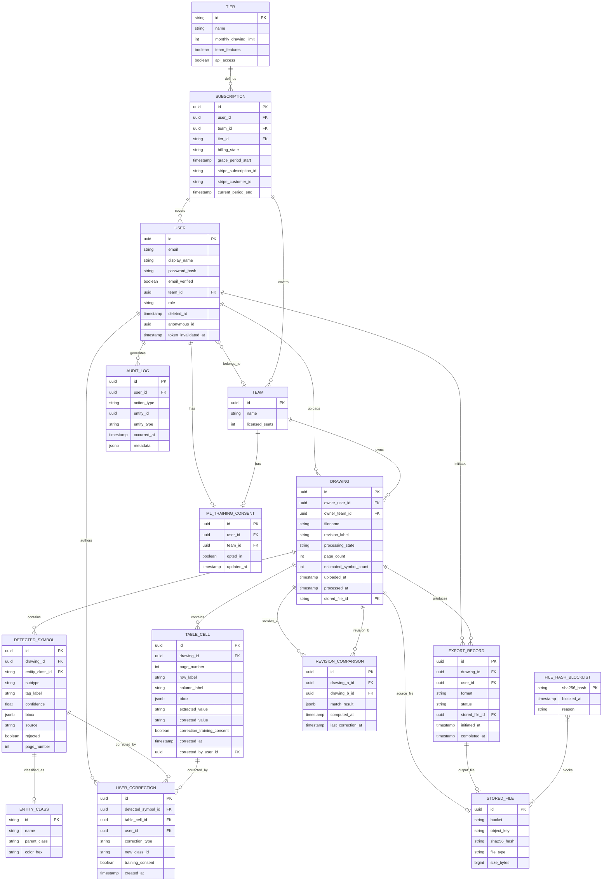

# Shared Technical Context

> Load this file alongside any epic file. It contains the tech stack, database schema,
> API patterns, and code-impacting requirements shared across all epics.

## Selected Technology Stack

## 3. Technology Stack
- **Selected: React + Vite SPA** — pure SPA is sufficient for authenticated views; Next.js deployed separately for marketing/landing pages only to satisfy NFR-17 SEO requirement. Alternative: Next.js monorepo if marketing and app are managed by the same team.
- **Selected: FastAPI + Celery** — Python unifies the API and ML worker codebase, reducing the interface surface between services. Alternative: NestJS if the team is JS-primary and ML workers are fully containerized as a separate service.
- **Selected: PostgreSQL** — all entities have clear relational structure; JSONB for symbol bounding box payloads. Alternative: Aurora Serverless v2 if traffic is highly variable and cold-start latency is acceptable.
- **Selected: Redis (Celery broker)** — persistent job queue with task retry, priority queues for ML vs. export jobs, TTL-based result expiry. Redis pub/sub drives SSE streams for drawing status updates.
- **Auth**: Supabase Auth or Auth0 — provides JWT RS256, Google OAuth, email verification, session management out of the box. **Selected: Supabase Auth** (self-hostable, reduces vendor lock-in, Postgres-native). Session invalidation on password reset is handled via Supabase Auth's server-side `admin.signOut(userId)` API, which revokes all active sessions for the user. A lightweight middleware hook checks a `token_invalidated_at` timestamp on the User record as a belt-and-suspenders guard for tokens issued before a reset event; this hook runs on every authenticated request and rejects tokens with an `iat` (issued-at) claim predating the invalidation timestamp. Alternative: Auth0 if managed SLA is preferred.

## Database Schema

**Key Schema Changes from Prior Version**:
- `TABLE_CELL` entity added to support FR-7 table extraction and US-022 real-time cell editing. Stores extracted value, corrected value, bbox coordinates, and per-cell correction consent.
- `USER_CORRECTION` gains a nullable `table_cell_id FK` to link corrections to table cells in addition to detected symbols.
- `REVISION_COMPARISON` gains `last_correction_at` timestamp to surface staleness to the UI (see Section 12b).
- `USER` gains `token_invalidated_at` timestamp for middleware-level token rejection on password reset.
- `USER.anonymous_id` is now populated on first erasure job execution and persisted; retries read this value rather than recomputing.

**Anonymization Strategy (revised)**:
- The anonymous ID is HMAC-SHA256 of `(user_id || server_secret)` only — no timestamp component.
- On first erasure job execution, the computed anonymous ID is written to `USER.anonymous_id` before any records are updated.
- All subsequent erasure job retries (regardless of execution day) read `USER.anonymous_id` directly, ensuring cross-table consistency (FR-14 AC-3).

**Indexing Strategy**:
- `DRAWING`: composite index on `(owner_team_id, processing_state, uploaded_at DESC)` for library queries; index on `owner_user_id`; full-text GIN index on `filename + revision_label` for search.
- `DETECTED_SYMBOL`: index on `(drawing_id, rejected, entity_class_id)` for canvas load; index on `(drawing_id, page_number)` for multi-page navigation.
- `TABLE_CELL`: index on `(drawing_id, page_number)` for table panel load.
- `USER_CORRECTION`: index on `(detected_symbol_id)`; index on `(table_cell_id)`; partial index on `training_consent = true` for ML pipeline queries.
- `AUDIT_LOG`: index on `(user_id, occurred_at DESC)`; partitioned by month for 2-year retention management.
- `FILE_HASH_BLOCKLIST`: primary key on `sha256_hash` (hash lookup at upload request time — before pre-signed URL issuance).

**Schema Migration Strategy**:
- All migrations via Alembic (FastAPI/SQLAlchemy); forward-only at MVP, expand-and-contract for breaking changes post-launch.

---

## API Patterns

**Style**: REST with JSON. SSE for drawing processing status push. No GraphQL at MVP — query patterns are well-defined and REST endpoints map cleanly to resource operations.

**Upload Protocol (revised for pre-storage blocklist enforcement)**:

The upload flow enforces FR-17 AC-2 (no blocked file byte reaches S3) through a mandatory hash pre-check before pre-signed URL issuance:

1. Client computes SHA-256 of the file locally before initiating upload.
2. Client calls `POST /drawings/hash-check` with `{sha256_hash, filename, size_bytes}`.
3. Server checks `FILE_HASH_BLOCKLIST`. If the hash is present, returns `409 Conflict` — no Drawing record is created, no S3 URL is issued.
4. If hash is not blocked, server creates the Drawing record in `Pending` state and returns a pre-signed S3 PUT URL via `POST /drawings`.
5. Client uploads directly to S3 using the pre-signed URL.
6. Client calls `POST /drawings/{id}/upload-complete` to signal S3 write completion and trigger processing.
7. Ingest Worker performs a server-side SHA-256 verification of the stored object against the client-supplied hash. Mismatch → Drawing transitions to `Failed` (possible corruption in transit); hash is also checked a second time against the blocklist to handle newly-added entries between steps 3 and 7.

This two-gate approach (pre-URL client-side check + post-storage server-side verification) ensures no blocked file reaches S3 in the normal path while guarding against hash race conditions and client-side hash tampering.

**Upload-Complete Idempotency**: `POST /drawings/{id}/upload-complete` is idempotent. If the Drawing record is already in `Queued` or any later processing state, the endpoint returns `200` without re-enqueuing the ingest job. This prevents duplicate Celery jobs from network retries.

**P0 Endpoint Summary**:

| Method | Path | Purpose | Request Body | Response | Auth |
|--------|------|---------|--------------|----------|------|
| POST | `/auth/register` | Register new user | `{email, password, display_name}` | `{user_id, status}` | None |
| POST | `/auth/login` | Email/password login | `{email, password}` | `{access_token, refresh_token}` | None |
| POST | `/auth/oauth/google` | Google OAuth callback | `{code}` | `{access_token, refresh_token}` | None |
| POST | `/auth/refresh` | Refresh access token | `{refresh_token}` | `{access_token}` | None |
| POST | `/auth/logout` | Invalidate session | — | `204` | JWT |
| POST | `/auth/password-reset/request` | Send reset email | `{email}` | `204` | None |
| POST | `/auth/password-reset/confirm` | Apply new password | `{token, new_password}` | `204` | None |
| POST | `/drawings/hash-check` | Blocklist check before upload; gate for pre-signed URL issuance | `{sha256_hash, filename, size_bytes}` | `{allowed: bool, drawing_id?}` | JWT |
| GET | `/drawings` | List drawing library | `?page&status&search&date_from&date_to` | `{items[], total, page}` | JWT |
| POST | `/drawings` | Create Drawing record + issue pre-signed S3 PUT URL (requires prior hash-check pass) | `{drawing_id, filename}` | `{drawing_id, upload_url}` | JWT |
| GET | `/drawings/{id}` | Drawing detail + symbol counts | — | `{drawing, symbol_counts}` | JWT |
| PATCH | `/drawings/{id}` | Update revision label | `{revision_label}` | `{drawing}` | JWT |
| DELETE | `/drawings/{id}` | Delete drawing + cascade | — | `204` | JWT |
| POST | `/drawings/{id}/retry` | Re-queue failed ML job | — | `{drawing}` | JWT |
| GET | `/drawings/{id}/status` | SSE stream for live status | — | SSE event stream | JWT |
| GET | `/drawings/{id}/symbols` | All detected symbols for canvas page, with correction history | `?page_number&limit&offset` | `{symbols[], corrections_by_symbol_id{}}` | JWT |
| PATCH | `/symbols/{id}` | Reclassify or reject symbol | `{entity_class_id?, rejected?}` | `{symbol}` | JWT |
| POST | `/drawings/{id}/symbols` | Manually add symbol | `{bbox, entity_class_id, page_number, tag_label?}` | `{symbol}` | JWT |
| POST | `/drawings/{id}/exports` | Initiate export | `{format: csv\|xlsx}` | `{export_id, status, download_url?}` | JWT |
| GET | `/exports/{id}` | Poll async export status | — | `{status, download_url?}` | JWT |
| GET | `/account` | Get account details | — | `{user}` | JWT |
| PATCH | `/account` | Update name/email | `{display_name?, email?}` | `{user}` | JWT |
| DELETE | `/account` | Initiate account deletion | `{password}` | `204` | JWT |
| GET | `/account/consent` | Get ML training consent | — | `{opted_in}` | JWT |
| PATCH | `/account/consent` | Update ML training consent | `{opted_in}` | `{consent}` | JWT |
| GET | `/subscription` | Get current subscription + usage | — | `{tier, billing_state, usage}` | JWT |
| POST | `/subscription/checkout` | Create Stripe Checkout session | `{tier, seat_count?}` | `{checkout_url}` | JWT |
| POST | `/webhooks/stripe` | Stripe webhook receiver | Stripe payload | `200` | Stripe-sig |
| GET | `/entity-classes` | Fetch classification taxonomy | — | `{classes[]}` | JWT |
| POST | `/drawings/{id}/upload-complete` | Signal S3 upload done; trigger processing (idempotent) | `{stored_file_id}` | `{drawing}` | JWT |

**Notable Endpoint Design Notes**:
- `POST /drawings/hash-check` must be called before `POST /drawings`. The API enforces this by requiring a `drawing_id` returned from `hash-check` to create the Drawing record; a `POST /drawings` without a valid prior hash-check pass returns `400`.
- `GET /drawings/{id}/symbols` accepts optional `limit` and `offset` parameters. Default page size is 200 symbols. The response envelope includes a `total` count so the client can paginate. Correction history keyed by symbol ID is included in the same response to avoid a second round-trip on panel open (NFR-19 <200ms target).
- `POST /drawings/{id}/symbols` accepts an optional `tag_label` field for user-supplied instrument tags on manual annotations. Manually added symbols are flagged with `source = "manual"` in `DETECTED_SYMBOL`; exports render the tag value from the `tag_label` field regardless of source.

**P1 Endpoints** (grouped):
- `GET/POST /teams` — create team, get team details
- `GET/POST/DELETE /teams/{id}/members` — list, invite, remove members
- `GET /teams/{id}/consent`, `PATCH /teams/{id}/consent` — team-level ML consent
- `POST /drawings/compare` — initiate revision comparison `{drawing_a_id, drawing_b_id}`
- `GET /comparisons/{id}` — get comparison result; response includes `stale: bool` derived from `last_correction_at > computed_at`
- `GET /drawings/{id}/tables` — get extracted table cells for a drawing page
- `PATCH /table-cells/{id}` — edit extracted table cell value; records correction with consent flag
- `GET /exports/{id}/comparison-csv` — export comparison result as CSV

**Auth Strategy**: JWT (RS256) access tokens (8hr expiry) + rotating refresh tokens (30-day). Supabase Auth manages issuance and rotation. On password reset, all tokens are invalidated via Supabase Auth's `admin.signOut(userId)` call; `USER.token_invalidated_at` is simultaneously updated. Middleware rejects tokens whose `iat` claim predates `token_invalidated_at`.

**Rate Limiting**: API Gateway enforces 100 req/min per authenticated user; 10 req/min per IP for unauthenticated endpoints; 1,000 req/min per API key for future FR-11. Stripe webhook endpoint exempt from user rate limits.

---

## Conceptual Data Model

## 6. Conceptual Data Model
| Entity | Relationships | PII? | Retention |
|---|---|---|---|
| User | HAS-MANY Drawings (personal); BELONGS-TO Team (optional); HAS-ONE Subscription | Yes — email, name | Account lifetime + 30 days post-deletion; PII purged within 30 days of deletion |
| Team | HAS-MANY Users; HAS-MANY Drawings (shared library) | No | Account lifetime + 30 days post-deletion |
| Subscription | BELONGS-TO User or Team; HAS-ONE active Tier; HAS-ONE billing state (Active / Grace / Canceled) | No | 7 years (billing records) |
| Tier | HAS-MANY Subscriptions; defines limits, seat counts, and feature gates | No | Indefinite |
| Drawing | BELONGS-TO User or Team; HAS-MANY DetectedSymbols; HAS-MANY Revisions; HAS-ONE StoredFile | No | User-controlled; deletion removes all child entities — deletion dependency, see Architecture |
| Revision | BELONGS-TO Drawing; HAS-MANY DetectedSymbols | No | Inherits from Drawing |
| StoredFile | BELONGS-TO Drawing (source file) or ExportRecord (generated file); holds object storage bucket reference and SHA-256 hash | No | Inherits from parent Drawing or ExportRecord; hash retained in FileHashBlocklist on Scan_Failed |
| FileHashBlocklist | Standalone; stores SHA-256 hashes of quarantined files | No | Permanent |
| DetectedSymbol | BELONGS-TO Drawing; HAS-ONE EntityClass; HAS-MANY UserCorrections | No | Inherits from Drawing |
| EntityClass | HAS-MANY DetectedSymbols; defines taxonomy (Pipe, Valve subtype, Instrument) | No | Indefinite |
| UserCorrection | BELONGS-TO DetectedSymbol; BELONGS-TO User (nullable after anonymization); flagged with training_consent at time of creation | No | 5 years; user ID anonymized within 30 days of account deletion — see Architecture for anonymization job |
| MLTrainingConsent | BELONGS-TO User or Team; records opt-in/opt-out state and timestamp | No | Account lifetime + 30 days |
| ExportRecord | BELONGS-TO Drawing; BELONGS-TO User (nullable after anonymization); HAS-ONE StoredFile | No | 2 years |

---

## Code-Impacting Requirements

#### Universal

**NFR-1: Page Load Performance**
- **Category**: Performance
- Primary drawing review canvas loads in < 3 seconds at P95 on a 100Mbps desktop connection; initial dashboard (Drawing Library) loads in < 2 seconds at P95

**NFR-2: ML Processing Throughput**
- **Category**: Performance
- Single A1 P&ID sheet (≤ 500 symbols) completes ML inference in ≤ 10 minutes under normal load; system supports ≥ 20 concurrent ML processing jobs without degradation to the stated time target

**NFR-3: Export Responsiveness**
- **Category**: Performance
- CSV/XLSX export file generation completes in < 30 seconds for drawings with ≤ 1,000 detected symbols at P95; exports exceeding this threshold are delivered asynchronously per FR-4 AC-3

**NFR-4: Authentication Security**
- **Category**: Security
- All authentication tokens use JWT with RS256 signing; tokens expire in 8 hours; refresh tokens valid for 30 days with rotation on use; all tokens invalidated on password reset

**NFR-5: Data Encryption**
- **Category**: Security
- All data encrypted at rest using AES-256; all data in transit encrypted via TLS 1.2 minimum (TLS 1.3 preferred); uploaded drawing files stored in encrypted object storage with server-side encryption

**NFR-6: File Security**
- **Category**: Security
- Uploaded files are scanned for malware before ML processing begins; malware scan must complete within 60 seconds; the drawing state is shown as `Scanning` (visible in FR-6 library view) during this period; DWG parsing is performed in an isolated sandbox environment to prevent code execution vulnerabilities in AutoCAD format parsing

**NFR-7: Availability**
- **Category**: Reliability
- System uptime SLA: 99.5% monthly (excluding scheduled maintenance windows communicated ≥ 24 hours in advance); ML processing queue must survive server restarts without losing queued jobs (persistent queue)

**NFR-8: Error Rate**
- **Category**: Reliability
- API error rate (5xx responses) must remain below 0.5% of total requests measured over any 24-hour window; ML processing failure rate must remain below 2% of submitted jobs

**NFR-9: Recovery Time Objective**
- **Category**: Reliability
- RTO: < 1 hour for full service restoration following a single-zone failure; RPO: < 15 minutes for drawing and extraction data; requires continuous WAL archiving or equivalent streaming replication to a cross-zone replica — Architecture Agent to implement

**NFR-10: GDPR Compliance**
- **Category**: Compliance
- User data subject to GDPR; system must support right-to-erasure requests (account deletion removes PII within 30 days per FR-14); data processing agreement available for Team tier customers; data stored in EU region by default with optional US region selection

**NFR-11: Accessibility**
- **Category**: Compliance
- Web interface conforms to WCAG 2.1 Level AA; drawing review canvas keyboard navigation supported for symbol selection and classification actions

**NFR-12: Audit Logging**
- **Category**: Maintainability
- All user actions (upload, correction, export, delete, invite) written to an append-only audit log with timestamp, user ID, action type, and affected entity ID; logs retained for 2 years

**NFR-13: Observability**
- **Category**: Maintainability
- Structured logging (JSON) for all backend services; application performance monitoring (APM) with distributed tracing across file ingestion, ML processing, and export services; alerting on P95 latency threshold breaches and error rate threshold breaches within 5 minutes of violation

**NFR-19: Canvas Interaction Performance**
- **Category**: Performance
- Drawing review canvas symbol click response (bounding box selection, classification panel open) must complete in < 200ms at P95 on a drawing with ≤ 500 symbols, measured on a reference hardware profile of 8GB RAM, quad-core CPU, integrated GPU running Chrome 110+

#### Web-Specific

**NFR-14: Browser Support**
- **Category**: Browser Support Matrix
- Minimum supported versions: Chrome 110+, Firefox 110+, Safari 16+, Edge 110+; Internet Explorer not supported

**NFR-15: Responsive Breakpoints**
- **Category**: Responsive Design
- Desktop (> 1280px): full feature set; Tablet (768–1280px): supported with adapted layout for drawing canvas; Mobile (< 768px): Drawing Library and account management accessible; drawing review canvas not supported on mobile in v1 (user shown informational message directing to desktop)

**NFR-16: Progressive Web App**
- **Category**: Progressive Web App
- PWA not required in v1; no offline or installable behavior

**NFR-17: SEO**
- **Category**: SEO
- Marketing/landing pages require server-side rendering for SEO; authenticated application views (library, canvas) are client-side rendered; meta tag management required for public-facing pages only; SEO growth strategy relies solely on marketing and landing page content — no public drawing summary or result-preview pages are in scope for v1

**NFR-18: Session Management**
- **Category**: Session Management
- Session expires after 8 hours of inactivity; user shown a modal warning 5 minutes before expiry with option to extend; on expiry, user redirected to login page with session-expiry notification; unsaved correction state is preserved in localStorage (maximum 2MB payload; corrections exceeding this threshold are flushed to server before session expiry); on re-login within 24 hours, server-saved state takes precedence over localStorage if timestamps conflict

---
